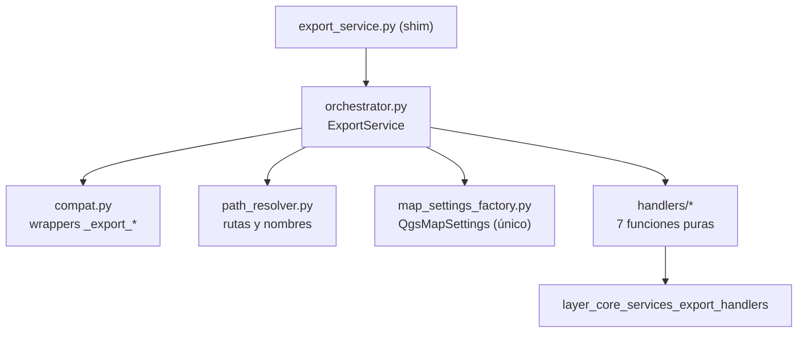

# `core/services/export/` — Export Orchestration

> [!abstract] Resumen en una línea
> Paquete que descompone la exportación monolítica en un orquestador, un resolutor de rutas, una factory de `QgsMapSettings` y un mixin de compatibilidad.

**Ruta**: `core/services/export/` (5 módulos, ~439 líneas)
**Capa**: Core (QGIS-agnóstico)
**Tags**: #secinterp #layer #core

---

## 🎯 Rol de la capa

Coordina la exportación de todos los datos del perfil. `ExportService` valida opciones, resuelve capas y enruta hacia los handlers por tipo de dato, sin escribir ficheros él mismo.

| Aspecto | Detalle |
|---------|---------|
| Entrada | `output_folder`, `PreviewParams` y datos de perfil/geología/estructuras/sondeos/interpretaciones |
| Salida | Lista de mensajes con las rutas escritas |
| Dependencia dura | `qgis.core.QgsMapSettings` **solo** en `map_settings_factory.py` |
| Estado | Stateless salvo `controller` y `AccessControlService` inyectados |

> [!important] Reglas de la capa
> Core = QGIS-agnóstico, thread-safe, `from __future__ import annotations`, tipado estricto.

## 🧬 Mapa de capas / subcapas

## 🧱 Inventario de módulos

| Módulo | Rol |
|--------|-----|
| `__init__.py` | Re-exporta `ExportService`, `create_map_settings`, `get_profile_name`, `resolve_export_path` |
| `orchestrator.py` | `ExportService`: valida opciones, deriva formato y despacha con dict de routing `exp_*` |
| `path_resolver.py` | `get_profile_name()` sanea `/` y `\`; `resolve_export_path()` aplica `naming_pattern` y decide GPKG vs carpeta |
| `map_settings_factory.py` | Único import de `QgsMapSettings`; `create_map_settings()` |
| `compat.py` | Mixin con wrappers legacy `_export_*` y `_get_export_path` para tests |

## 🏛️ Patrones de diseño presentes

| Patrón | Dónde | Propósito |
|--------|-------|-----------|
| **Facade / Orchestrator** | `ExportService` | Una API sobre 7 handlers |
| **Factory** | `create_map_settings` | Aísla el import de QGIS en un solo módulo |
| **Registry / routing dict** | `_orchestrate_exports` | Despacho declarativo por opción `exp_*` |
| **Backward-compat shim** | `compat.py` + `export_service.py` | No romper imports ni tests existentes |

## 🔗 Notas relacionadas

- [[Index]]
- [[layer_core_services]] — capa padre
- [[layer_core_services_export_handlers]] — handlers por tipo de dato
- [[export_package]] — vista del paquete completo
- [[export_service]] — shim de compatibilidad del monolito

---

*Nota de la bóveda SecInterp Code Walkthrough — v3.8.0*
