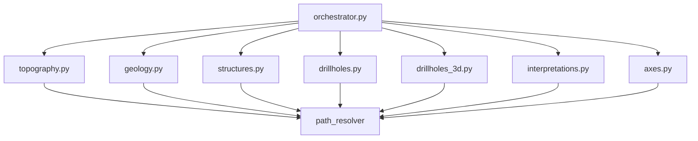

# `core/services/export/handlers/` — Export Handlers

> [!abstract] Resumen en una línea
> Siete funciones puras, una por tipo de dato, que escriben CSV/vector usando los exporters y **sin importar `qgis`**.

**Ruta**: `core/services/export/handlers/` (8 módulos, ~490 líneas)
**Capa**: Core (QGIS-agnóstico)
**Tags**: #secinterp #layer #core

---

## 🎯 Rol de la capa

Cada handler recibe datos ya extraídos, resuelve su ruta con `path_resolver` e invoca al exporter correspondiente. Es el punto donde el orquestador delega y donde se concentra la lógica de "qué archivos genera cada tipo de dato".

| Handler | Salida |
|---------|--------|
| `topography` | CSV `topo_profile` + vector `profile_line` |
| `geology` | CSV `geol_profile` + polígonos |
| `structures` | CSV `structural_profile` + medidas |
| `drillholes` | Trazas + intervalos 2D |
| `drillholes_3d` | 4 tareas real/proyectado |
| `interpretations` | 2D siempre, 3D gateado |
| `axes` | `profile_axes` |

> [!important] Reglas de la capa
> Core = QGIS-agnóstico, thread-safe, `from __future__ import annotations`, tipado estricto.

## 🧬 Mapa de capas / subcapas

## 🧱 Inventario de módulos

| Módulo | Rol |
|--------|-----|
| `__init__.py` | Vacío: paquete namespace sin re-exports |
| `topography.py` → [[export_package]] | `export_topography` → CSV + `ProfileLineVectorExporter` |
| `geology.py` → [[export_package]] | `export_geology` → CSV + `GeologyVectorExporter` |
| `structures.py` → [[export_package]] | `export_structures` → CSV + `StructureVectorExporter` (usa `rasterUnitsPerPixelX`) |
| `drillholes.py` → [[export_package]] | `export_drillholes` → trazas e intervalos 2D |
| `drillholes_3d.py` → [[export_package]] | `export_drillholes_3d` → tabla declarativa de 4 tareas |
| `interpretations.py` → [[export_package]] | `export_interpretations` → 2D + 3D gateado por `AccessControlService` |
| `axes.py` → [[export_package]] | `export_axes` → `AxesVectorExporter` |

## 🏛️ Patrones de diseño presentes

| Patrón | Dónde | Propósito |
|--------|-------|-----------|
| **Strategy por tipo de dato** | cada `export_*` | Una firma uniforme por dominio |
| **Lazy import** | imports de `sec_interp.exporters` dentro de cada función | Evita cargar exporters al importar el paquete |
| **Pure functions** | todos los módulos | Sin estado, testeables sin QGIS |

## 🔗 Notas relacionadas

- [[Index]]
- [[layer_core_services_export]] — capa padre
- [[export_package]] — vista del paquete completo
- [[base_exporter]] — contrato que implementan los exporters invocados

---

*Nota de la bóveda SecInterp Code Walkthrough — v3.8.0*
