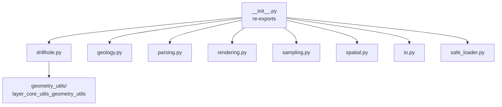

# `core/utils/` — Core Utilities

> [!abstract] Resumen en una línea
> Caja de herramientas de helpers puros (cálculo geológico, parseo, muestreo, I/O y carga segura) que da soporte a los servicios del core.

**Ruta**: `core/utils/` (11 módulos, ~1183 líneas)
**Capa**: Core (QGIS-agnóstico)
**Tags**: #secinterp #layer #core

---

## 🎯 Rol de la capa

Reúne utilidades transversales sin estado que los servicios reutilizan. La mayoría son matemática pura; dos módulos (`i18n.py`, `io.py`) tocan APIs de QGIS/Qt en una zona gris deliberada.

| Grupo | Módulos |
|-------|---------|
| Cálculo geológico | `geology.py`, `drillhole.py` |
| Geometría / muestreo | `spatial.py`, `sampling.py` |
| Parseo | `parsing.py` |
| Render / bounds | `rendering.py` |
| I/O y metadatos | `io.py`, `metadata_reader.py` |
| Infraestructura | `safe_loader.py`, `i18n.py`, `__init__.py` |

> [!important] Reglas de la capa
> Core = QGIS-agnóstico, thread-safe, `from __future__ import annotations`, tipado estricto.

> [!note] Zona gris
> `i18n.py` importa `QCoreApplication` e `io.py` importa `qgis.core` (`QgsVectorFileWriter`). Son integraciones acotadas que no contaminan al resto de helpers puros.

## 🧬 Mapa de capas / subcapas

## 🧱 Inventario de módulos

| Módulo | Rol |
|--------|-----|
| `__init__.py` | Re-exporta la API pública de utils |
| `metadata_reader.py` | `read_plugin_metadata()` desde `metadata.txt` con caché |
| `rendering.py` | `calculate_bounds`, `create_coordinate_transform`, `calculate_interval` |
| `parsing.py` | `parse_strike`, `parse_dip`, `cardinal_to_azimuth`, `extract_feature_attributes` |
| `safe_loader.py` | `SafeLoader`: import diferido y tolerante a fallos |
| `i18n.py` | `TranslatableMixin`: `tr()` sin heredar de `QObject` |
| `io.py` | `create_vector_writer` para SHP/GPKG/DXF |
| `spatial.py` | `calculate_line_azimuth` (matemática pura) |
| `drillhole.py` | Trayectorias, proyección a sección e interpolación de intervalos |
| `geology.py` | `calculate_apparent_dip` |
| `sampling.py` | `interpolate_elevation` |

## 🏛️ Patrones de diseño presentes

| Patrón | Dónde | Propósito |
|--------|-------|-----------|
| **Facade de paquete** | `__init__.py` | API plana sobre módulos temáticos |
| **Static Service** | `SafeLoader` | Helper sin estado |
| **Mixin** | `TranslatableMixin` | `tr()` reutilizable |
| **Pure functions** | `spatial`, `sampling`, `geology` | Matemática testeable sin QGIS |
| **Cache / Singleton de datos** | `_metadata_cache` | Evita releer `metadata.txt` |

## 🔗 Notas relacionadas

- [[Index]]
- [[layer_core]] — capa padre
- [[layer_core_utils_geometry_utils]] — subcapa de geometría
- [[safe_loader]] — carga tolerante a fallos
- [[i18n]] — mixin de traducción

---

*Nota de la bóveda SecInterp Code Walkthrough — v3.8.0*
