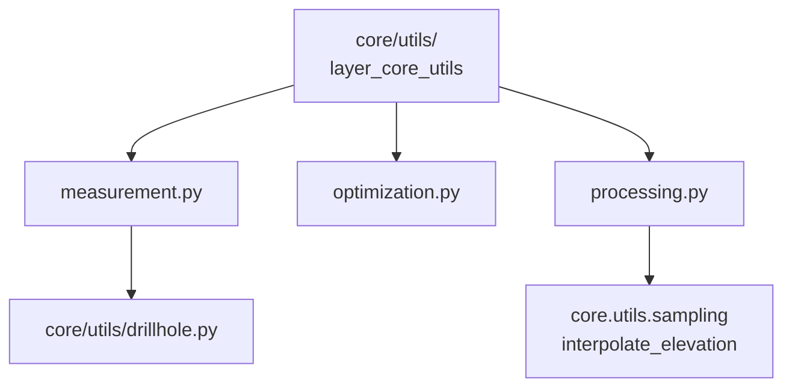

# `core/utils/geometry_utils/` — Geometry Utilities

> [!abstract] Resumen en una línea
> Subcapa de matemática geométrica pura: medición, simplificación de polilíneas y densificación/interpolación.

**Ruta**: `core/utils/geometry_utils/` (4 módulos, ~416 líneas)
**Capa**: Core (QGIS-agnóstico)
**Tags**: #secinterp #layer #core

---

## 🎯 Rol de la capa

Proporciona primitivas geométricas 2D sin dependencias de QGIS, consumidas por el core (`drillhole.py`, servicios) y por la optimización del preview.

| Módulo | Aporta |
|--------|--------|
| `measurement.py` | Proyección punto-polilínea y métricas de perfil |
| `optimization.py` | Douglas-Peucker, curvatura y muestreo adaptativo |
| `processing.py` | Densificación e interpolación de segmentos |

> [!important] Reglas de la capa
> Core = QGIS-agnóstico, thread-safe, `from __future__ import annotations`, tipado estricto.

## 🧬 Mapa de capas / subcapas

## 🧱 Inventario de módulos

| Módulo | Rol |
|--------|-----|
| `__init__.py` | Docstring del paquete, sin re-exports |
| `measurement.py` | `project_point_onto_polyline`, `calculate_polyline_metrics` |
| `optimization.py` | `PreviewOptimizer` (decimate, calculate_curvature, adaptive_sample) + `_douglas_peucker` |
| `processing.py` | `densify_line_points`, `interpolate_segment_points` |

## 🏛️ Patrones de diseño presentes

| Patrón | Dónde | Propósito |
|--------|-------|-----------|
| **Static utility class** | `PreviewOptimizer` | Agrupa la optimización LOD sin estado |
| **Recursive divide & conquer** | `_douglas_peucker` | Simplificación de polilíneas |
| **Pure functions** | `measurement`, `processing` | Matemática testeable y thread-safe |
| **Strategy de tolerancia** | `decimate` / `adaptive_sample` | Simplificación fija vs. según curvatura |

## 🔗 Notas relacionadas

- [[Index]]
- [[layer_core_utils]] — capa padre
- [[projection_engine]] — consume proyección punto-polilínea
- [[preview_renderer]] — usa la optimización LOD

---

*Nota de la bóveda SecInterp Code Walkthrough — v3.8.0*
