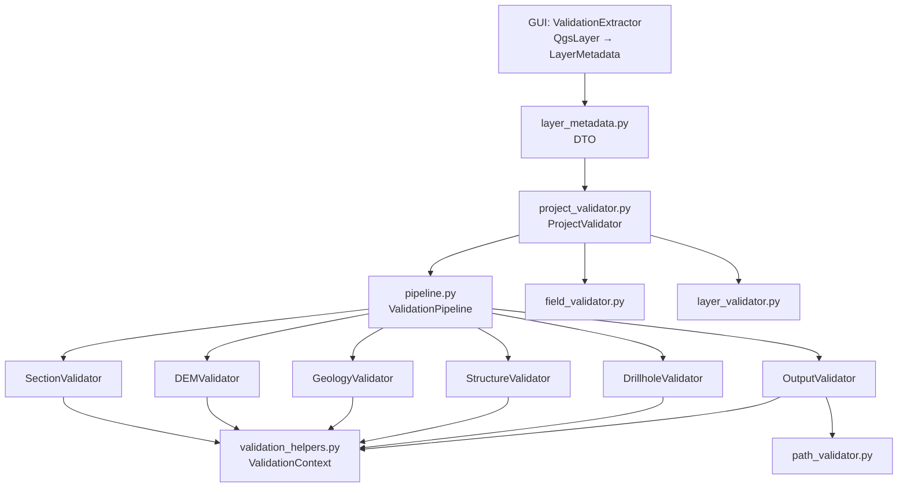

# `core/validation/` — Validation Framework

> [!abstract] Resumen en una línea
> Framework de validación QGIS-agnóstico de 3 niveles (Tipo, Esquema, Negocio) que acumula errores y trabaja sobre el DTO `LayerMetadata`.

**Ruta**: `core/validation/` (11 módulos, ~1481 líneas)
**Capa**: Core (QGIS-agnóstico)
**Tags**: #secinterp #layer #core

---

## 🎯 Rol de la capa

Centraliza la validación que de otro modo viviría dispersa en el diálogo. La GUI extrae `LayerMetadata` (vía `ValidationExtractor`) y este paquete valida sin tocar objetos QGIS.

| Nivel | Foco | Módulos |
|-------|------|---------|
| **1 · Tipo** | Tipos y rangos de entrada | `field_validator.py`, `validators.py` |
| **2 · Esquema** | Coherencia entre campos/capas | `layer_validator.py`, `validation_helpers.py` |
| **3 · Negocio** | Consistencia externa del proyecto | `project_validator.py`, `project_validators.py` |

> [!important] Reglas de la capa
> Core = QGIS-agnóstico, thread-safe, `from __future__ import annotations`, tipado estricto.

> [!note] Acumulación, no fallo rápido
> `ValidationContext` recoge todos los errores y advertencias; `raise_if_errors()` lanza un único `ValidationError` al final del pipeline.

## 🧬 Mapa de capas / subcapas

## 🧱 Inventario de módulos

| Módulo | Rol |
|--------|-----|
| `__init__.py` | Re-exporta validadores de campo, capa, ruta y `ProjectValidator` |
| `base_validator.py` | `IValidator` (ABC) con `validate(params, context)` |
| `pipeline.py` | `ValidationPipeline`: ejecuta validadores en secuencia |
| `layer_metadata.py` | DTO `LayerMetadata` y constantes de geometría/tipo |
| `field_validator.py` | Validación de campos y entradas numéricas/enteras/ángulos |
| `layer_validator.py` | Features, geometría, bandas, requisitos y CRS |
| `path_validator.py` | `validate_safe_output_path` con protección de traversal |
| `project_validator.py` | `ProjectValidator` y `ValidationParams` |
| `project_validators.py` | `Section/DEM/Geology/Structure/Drillhole/OutputValidator` |
| `validation_helpers.py` | `ValidationContext`, `RichValidationError`, `DependencyRule` |
| `validators.py` | Validadores componibles para dataclasses (`FieldValidator`) |

## 🏛️ Patrones de diseño presentes

| Patrón | Dónde | Propósito |
|--------|-------|-----------|
| **Pipeline / Chain** | `ValidationPipeline` | Orquesta validadores en secuencia |
| **Strategy** | `IValidator` | Una regla por dominio |
| **Context Object** | `ValidationContext` | Acumula errores sin fallar rápido |
| **DTO / Bridge** | `LayerMetadata` | Desacopla QGIS del core |
| **Composite** | `FieldValidator` | Encadena validadores componibles |

## 🔗 Notas relacionadas

- [[Index]]
- [[layer_core]] — capa padre
- [[validation]] — nota detallada del pipeline
- [[validation_extractor]] — adapter GUI que produce `LayerMetadata`

---

*Nota de la bóveda SecInterp Code Walkthrough — v3.8.0*
