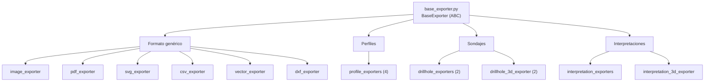

---
tags:
  - secinterp
  - code-walkthrough
  - layer
  - exporters
aliases:
  - exporters/
  - Exporters layer
cssclass: secinterp-layer
---

# `exporters/` — Exporters

> [!abstract] Resumen en una línea
> Capa de **estrategias de formato**: cada exporter implementa `BaseExporter` y escribe un tipo de dato en SHP/GPKG/DXF/CSV/PNG/PDF/SVG.

**Ruta**: `exporters/` (13 módulos, ~2.215 líneas)
**Capa**: Exporters
**Tags**: #secinterp #layer #exporters

---

## 🎯 Rol de la capa

| Problema | Solución |
|----------|----------|
| Cada formato repetía la validación de rutas y la escritura | `BaseExporter` concentra la validación y el contrato |
| Añadir un formato obligaba a tocar la orquestación | `get_exporter(ext)` selecciona la estrategia |
| Geología, 2D y 3D requieren geometrías y campos distintos | Exporters especializados por dominio |
| Riesgo de path traversal en las rutas de salida | `validate_export_path()` en la clase base |

> [!important] Reglas de la capa
> - ✅ Todo exporter hereda de `[[base_exporter]]` e implementa `export()` y `get_supported_extensions()`
> - ✅ La salida es `pathlib.Path`; nunca strings sueltos
> - ✅ Devuelven `bool` (éxito/fallo) y registran la excepción, no la propagan
> - ✅ Consumida por `core/services/export/` y por la factory `get_exporter()`
> - ⚠️ `exporters/` sí usa QGIS (`QgsVectorFileWriter`, `QgsMapSettings`); no es core puro

---

## 🧬 Mapa de capas / subcapas

---

## 🧱 Inventario de módulos

| Módulo | Rol |
|--------|-----|
| `base_exporter.py` | ABC con `export()`, `validate_export_path()` y `validate_path()` |
| `vector_exporter.py` | Genérico SHP/GPKG/DXF a partir de `features_data` |
| `csv_exporter.py` | Tablas `headers`/`rows` a CSV |
| `dxf_exporter.py` | Escritura DXF dedicada |
| `image_exporter.py` | Render a PNG/JPG con `QgsMapRendererCustomPainterJob` |
| `pdf_exporter.py` | Render a PDF con `QPdfWriter` |
| `svg_exporter.py` | Render a SVG con `QSvgGenerator` |
| `profile_exporters.py` | `ProfileLine`, `Geology`, `Structure` y `Axes` (4 clases) |
| `drillhole_exporters.py` | Trazas e intervalos 2D de sondajes |
| `drillhole_3d_exporter.py` | Trazas e intervalos 3D (`LineStringZ`) |
| `interpretation_exporters.py` | Polígonos de interpretación 2D |
| `interpretation_3d_exporter.py` | Polígonos 3D (`PolygonZ`) + estilo QML |
| `__init__.py` | Fachada y factory `get_exporter(extension, settings)` |

---

## 🏛️ Patrones de diseño presentes

| Patrón | Dónde | Propósito |
|--------|-------|-----------|
| **Strategy** | Cada `*Exporter` | Intercambiar formato sin cambiar el llamador |
| **Template Method** | `BaseExporter` | Validación común + `export()` abstracto |
| **Factory** | `get_exporter()` | Resolver la estrategia por extensión |
| **Facade** | `__init__.py` | Superficie de import estable |
| **Specialization** | `profile_exporters`, `*_3d_exporter` | Geometrías y campos por dominio |

---

## 🔗 Notas relacionadas

- [[Index]] — índice de la bóveda
- [[base_exporter]] · [[vector_exporter]] · [[csv_exporter]] · [[dxf_exporter]]
- [[image_exporter]] · [[pdf_exporter]] · [[svg_exporter]]
- [[profile_exporters]] · [[drillhole_exporters]] · [[drillhole_3d_exporter]]
- [[interpretation_exporters]] · [[interpretation_3d_exporter]]
- [[export_package]] — orquestador core que los consume
- [[layer_core]] — DTOs de entrada

---

*Nota de la bóveda SecInterp Code Walkthrough — v3.8.0*
