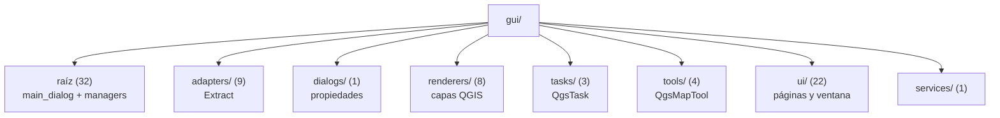

---
tags:
  - secinterp
  - code-walkthrough
  - layer
  - gui
aliases:
  - gui/
  - GUI layer
cssclass: secinterp-layer
---

# `gui/` — GUI

> [!abstract] Resumen en una línea
> Capa de interacción con QGIS que solo **extrae** datos a DTOs y **presenta** resultados; todo cálculo de negocio vive en `core/`.

**Ruta**: `gui/` (80 módulos, ~10.410 líneas)
**Capa**: GUI
**Tags**: #secinterp #layer #gui

---

## 🎯 Rol de la capa

| Problema | Solución |
|----------|----------|
| Diálogos monolíticos mezclaban UI, negocio y persistencia | **Manager Pattern**: un manager por responsabilidad |
| Tests imposibles sin QGIS | La GUI solo extrae/presenta; el core es testeable |
| UI congelada en procesos pesados | `QgsTask` para operaciones > 100 ms con datos serializados |
| Señales duplicadas y fugas de memoria | `SignalManager` conectar/desconectar idempotente |

> [!important] Reglas de la capa
> - ❌ Lógica de negocio en clases GUI
> - ❌ I/O de archivos directa en clases GUI
> - ❌ Pasar objetos QGIS vivos (`QgsVectorLayer`, `QgsFeature`) a un `QgsTask`
> - ✅ `QgsTask` para operaciones > 100 ms (extraer a WKT/dict antes)
> - ✅ `iface.messageBar()` **solo** dentro de `gui/`
> - ✅ Solo fases **Extract** y **Present**; el **Compute** delega al core

> [!info] Refactor 2026-09-20 — descomposición en mixins
> El **2026-09-20** se fragmentaron los monolitos (`main_dialog`, `dialog_preview_manager`, `interpretation_manager`) en mixins y managers especializados para cumplir el *Module Size Gate* (< 300 líneas).

---

## 🧬 Mapa de capas / subcapas

---

## 🧱 Inventario de módulos

| Módulo | Rol |
|--------|-----|
| `main_dialog.py` | `SecInterpDialog`: composición de managers, mixins y ventana |
| `dialog_*_manager.py` | `PreviewManager`, `ExportManager`, `InputManager`, `InterpretationManager`, `SignalManager`, `StateManager`, `ToolManager` |
| `dialog_*_mixin.py` | Ciclo de vida, mensajes y fachada del diálogo |
| `preview_*.py` | Renderizado, estado, hashing, orquestación de tareas y leyenda |
| `interpretation_*_mixin.py` | Persistencia (proyecto/capa) e herencia de atributos |
| `layer_notification_manager.py` | Invalida la caché core al cambiar capas |
| `ui_status_manager.py` | Indicadores y habilitación de botones |
| `adapters/` (9) | `[[layer_gui_adapters]]`: extracción de QGIS a DTOs |
| `dialogs/` (1) | `[[layer_gui_dialogs]]`: diálogo de propiedades de interpretación |
| `renderers/` (8) | `[[layer_gui_renderers]]`: render especializado por dominio |
| `tasks/` (3) | `[[layer_gui_tasks]]`: `QgsTask` en segundo plano |
| `tools/` (4) | `[[layer_gui_tools]]`: herramientas de mapa |
| `ui/` (22) | `[[layer_gui_ui]]`: páginas y ventana principal |
| `services/` (1) | Fachada de servicios GUI |

---

## 🏛️ Patrones de diseño presentes

| Patrón | Dónde | Propósito |
|--------|-------|-----------|
| **Manager** | `dialog_*_manager.py` | Delegar responsabilidades del diálogo |
| **Mixin / Composition** | `dialog_*_mixin.py`, `preview_*` | Reutilizar comportamiento sin herencia profunda |
| **Adapter (Extract)** | `gui/adapters/` | Convertir QGIS → DTO/WKT |
| **Observer** | `SignalManager` | Cablear widgets a managers |
| **Callback injection** | `PreviewManager` / `InterpretationManager` | Desacoplar managers entre sí |
| **Task Orchestration** | `PreviewTaskOrchestrator` | `QgsTask` + callbacks de progreso |

---

## 🔗 Notas relacionadas

- [[Index]] — índice de la bóveda
- [[layer_gui_adapters]] · [[layer_gui_dialogs]] · [[layer_gui_renderers]] · [[layer_gui_tasks]] · [[layer_gui_tools]] · [[layer_gui_ui]]
- [[main_dialog]] · [[dialog_mixins]] · [[dialog_preview_manager]] · [[preview_mixins]]
- [[interpretation_manager]] · [[interpretation_mixins]] · [[signal_manager]] · [[state_manager]]
- [[input_manager]] · [[tool_manager]] · [[layer_notification_manager]] · [[preview_renderer]] · [[preview_state]] · [[ui_pages]]
- [[layer_core]] — lógica de negocio que esta capa invoca

---

*Nota de la bóveda SecInterp Code Walkthrough — v3.8.0*
