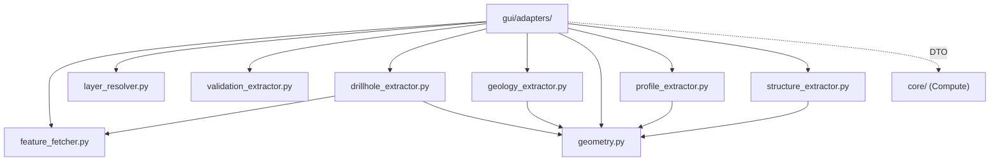

# `gui/adapters/` — Adaptadores GUI (Extract)

> [!abstract] Resumen en una línea
> Convierten objetos QGIS vivos (capas, features, rasters) en DTOs y primitivas QGIS-agnósticas: la fase **Extract** del patrón Extract-then-Compute.

**Ruta**: `gui/adapters/` (9 módulos, ~1522 líneas)
**Capa**: GUI
**Tags**: #secinterp #layer #gui

---

## 🎯 Rol de la capa

| Responsabilidad | Detalle |
|-----------------|---------|
| Resolver capas | ID/nombre/objeto → `QgsMapLayer` con caché |
| Leer features | `QgsFeatureRequest`, filtros por bbox/expresión, CRS destino |
| Transformar | Buffers, densificación, vértices, muestreo ráster |
| Detachar | Empaquetar todo en DTOs (`*Context`, `ProfileData`, `LayerMetadata`) |

> [!important] Reglas de la capa
> GUI = solo Extract/Present; sin lógica de negocio; `QgsTask` para >100ms; nunca pasar objetos QGIS vivos a hilos.

## 🧬 Mapa de capas / subcapas

## 🧱 Inventario de módulos

| Módulo | Rol |
|--------|-----|
| `__init__.py` | Documenta el contrato de la fase Extract |
| `feature_fetcher.py` → [[adapters]] | `DataFetcher`: lectura masiva de survey/interval en una pasada |
| `layer_resolver.py` → [[adapters]] | `LayerResolver`: resuelve y cachea capas; wrapper `resolve_layer` |
| `validation_extractor.py` → [[validation_extractor]] | `LayerMetadata` detachado y `build_validation_params` |
| `drillhole_extractor.py` → [[drillhole_extractor]] | `DrillholeExtractor` → `DrillholeContext` |
| `geology_extractor.py` → [[geology_extractor]] | `GeologyExtractor` → `GeologyContext` |
| `geometry.py` → [[adapters]] | Helpers QGIS de geometría y muestreo ráster |
| `profile_extractor.py` → [[adapters]] | `ProfileExtractor` → `ProfileData` topográfico |
| `structure_extractor.py` → [[structure_extractor]] | `StructureExtractor` → `SectionContext` |

## 🏛️ Patrones de diseño presentes

| Patrón | Dónde | Propósito |
|--------|-------|-----------|
| **Adapter** | Toda la capa | Traducir QGIS → dominio puro |
| **DTO / Detached context** | `*Context`, `ProfileData`, `LayerMetadata` | Datos serializables para hilos |
| **Facade** | `DrillholeExtractor.extract_context` | Una llamada sobre muchos pasos |
| **Cache (class-level)** | `LayerResolver._cache` | Evitar `project.mapLayer()` repetidos |
| **Factory de requests** | `_prepare_feature_request` | Bbox + CRS destino centralizados |

## 🔗 Notas relacionadas

- [[Index]] — índice de la bóveda
- [[layer_gui]] — capa padre
- [[adapters]] — nota del paquete/arquitectura
- [[drillhole_extractor]] — extracción de sondajes
- [[geology_extractor]] — extracción geológica
- [[structure_extractor]] — extracción estructural
- [[validation_extractor]] — metadatos de validación

---

*Nota de la bóveda SecInterp Code Walkthrough — v3.8.0*
