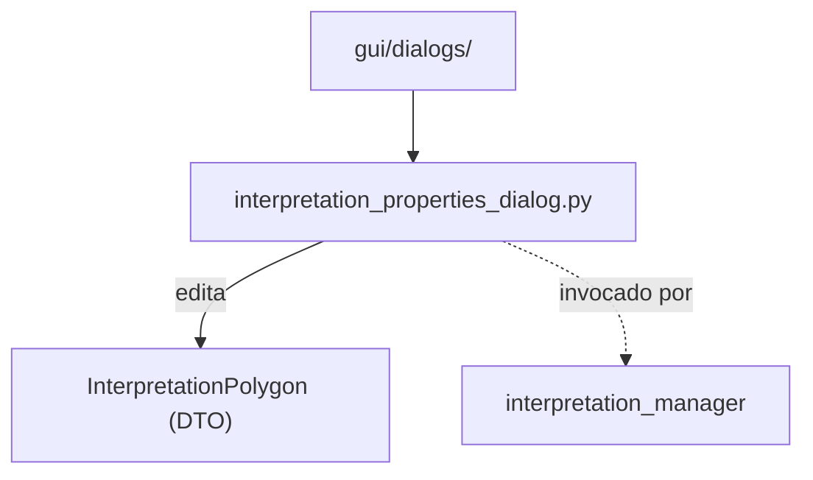

# `gui/dialogs/` — Diálogos GUI

> [!abstract] Resumen en una línea
> Sublayer de diálogos modales; hoy contiene el editor de propiedades de una interpretación geológica.

**Ruta**: `gui/dialogs/` (1 módulo, ~149 líneas)
**Capa**: GUI
**Tags**: #secinterp #layer #gui

---

## 🎯 Rol de la capa

| Responsabilidad | Detalle |
|-----------------|---------|
| Capturar entrada | Nombre, tipo, color y atributos personalizados |
| Validar de forma ligera | Solo campos de UI; la lógica vive en core |
| Mutar el DTO | Escribe sobre `InterpretationPolygon` en `accept()` |
| Ciclo de vida | `disconnect_signals()` al cerrar para evitar fugas |

> [!important] Reglas de la capa
> GUI = solo Extract/Present; sin lógica de negocio; `QgsTask` para >100ms; nunca pasar objetos QGIS vivos a hilos.

## 🧬 Mapa de capas / subcapas

## 🧱 Inventario de módulos

| Módulo | Rol |
|--------|-----|
| `interpretation_properties_dialog.py` | `InterpretationPropertiesDialog`: edición de nombre, tipo, color y campos custom |

## 🏛️ Patrones de diseño presentes

| Patrón | Dónde | Propósito |
|--------|-------|-----------|
| **Dialog / Form** | `_setup_ui` | Formulario `QFormLayout` + botones OK/Cancel |
| **Observer (Qt signals)** | `button_box` | `accept`/`reject` del diálogo |
| **Explicit teardown** | `disconnect_signals` | Evitar fugas de memoria al cerrar |
| **Color picker** | `_pick_color` | `QColorDialog` sobre el color de la interpretación |

## 🧾 Resumen de la API

| Símbolo | Firma / Hereda | Uso típico |
|---------|----------------|------------|
| `InterpretationPropertiesDialog` | `QDialog` | Editor modal de propiedades |
| `_setup_ui()` | privado | Construye el `QFormLayout` y los botones |
| `_pick_color()` | privado | Abre `QColorDialog` y actualiza la vista previa |
| `accept()` | override | Vuelca los widgets al DTO y cierra |
| `disconnect_signals()` | público | Desconecta señales antes de cerrar |

## 🔗 Notas relacionadas

- [[Index]] — índice de la bóveda
- [[layer_gui]] — capa padre
- [[interpretation_manager]] — abre y consume el diálogo

---

*Nota de la bóveda SecInterp Code Walkthrough — v3.8.0*
