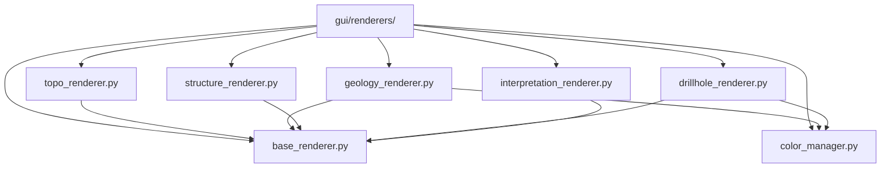

# `gui/renderers/` — Renderizadores de vista previa

> [!abstract] Resumen en una línea
> Aplican simbología QGIS a las capas de la vista previa, con una estrategia por tipo de dato.

**Ruta**: `gui/renderers/` (8 módulos, ~301 líneas)
**Capa**: GUI
**Tags**: #secinterp #layer #gui

---

## 🎯 Rol de la capa

| Responsabilidad | Detalle |
|-----------------|---------|
| Estilizar capas | `apply_style(layer, **kwargs)` sobre `QgsVectorLayer` |
| Unificar color | `ColorManager` asigna color estable por unidad |
| Categorizar | Símbolos por unidad geológica o por interpretación |
| Etiquetar | `DrillholeRenderer` etiqueta `hole_id` en trazas |

> [!important] Reglas de la capa
> GUI = solo Extract/Present; sin lógica de negocio; `QgsTask` para >100ms; nunca pasar objetos QGIS vivos a hilos.

## 🧬 Mapa de capas / subcapas

## 🧱 Inventario de módulos

| Módulo | Rol |
|--------|-----|
| `__init__.py` | Paquete de renderizadores |
| `base_renderer.py` → [[renderers]] | `BasePreviewRenderer` (ABC) + `build_categorized_line_style` |
| `color_manager.py` → [[renderers]] | `ColorManager`: color estable por nombre de unidad |
| `topo_renderer.py` → [[renderers]] | `TopoRenderer`: polícromía de elevación graduada |
| `geology_renderer.py` → [[renderers]] | `GeologyRenderer`: líneas categorizadas por unidad |
| `structure_renderer.py` → [[renderers]] | `StructureRenderer`: línea roja simple para dips |
| `drillhole_renderer.py` → [[renderers]] | `DrillholeRenderer`: traza vs intervalo + etiquetas |
| `interpretation_renderer.py` → [[renderers]] | `InterpretationRenderer`: rellenos por color de interpretación |

## 🏛️ Patrones de diseño presentes

| Patrón | Dónde | Propósito |
|--------|-------|-----------|
| **Strategy** | Clases `*Renderer` | Una estrategia de estilo por tipo de dato |
| **Template / ABC** | `BasePreviewRenderer` | Contrato `apply_style` común |
| **Factory Method** | `build_categorized_line_style` | Construir renderers categorizados |
| **Flyweight / cache** | `ColorManager._active_units` | Reutilizar colores por unidad |

## 🔗 Notas relacionadas

- [[Index]] — índice de la bóveda
- [[layer_gui]] — capa padre
- [[renderers]] — nota del paquete/arquitectura
- [[preview_renderer]] — consumidor de los estilos

---

*Nota de la bóveda SecInterp Code Walkthrough — v3.8.0*
