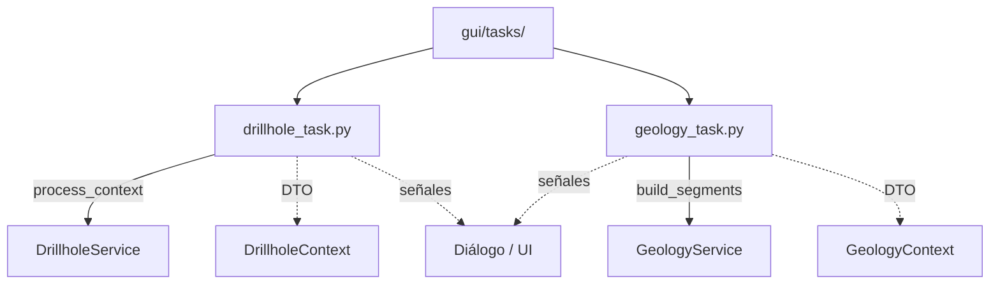

# `gui/tasks/` — Tareas en segundo plano

> [!abstract] Resumen en una línea
> `QgsTask`s que ejecutan los servicios de core con DTOs detachados, emitiendo señales de progreso, resultado y error.

**Ruta**: `gui/tasks/` (3 módulos, ~208 líneas)
**Capa**: GUI
**Tags**: #secinterp #layer #gui

---

## 🎯 Rol de la capa

| Responsabilidad | Detalle |
|-----------------|---------|
| Ejecutar en hilo | `run()` llama al servicio con el `*Context` |
| Mantener hilo seguro | Solo DTOs; nunca objetos QGIS vivos |
| Reportar progreso | `setProgress` reemite `progress_changed` |
| Entregar resultado | `finished()` emite `finished_with_results` diferido |

> [!important] Reglas de la capa
> GUI = solo Extract/Present; sin lógica de negocio; `QgsTask` para >100ms; nunca pasar objetos QGIS vivos a hilos.

## 🧬 Mapa de capas / subcapas

## 🧱 Inventario de módulos

| Módulo | Rol |
|--------|-----|
| `__init__.py` | Paquete de tareas |
| `drillhole_task.py` | `DrillholeGenerationTask`: proyecta e intersecta sondajes |
| `geology_task.py` | `GeologyGenerationTask`: construye segmentos geológicos |

## 🏛️ Patrones de diseño presentes

| Patrón | Dónde | Propósito |
|--------|-------|-----------|
| **Command / Task** | Subclases de `QgsTask` | Encapsular trabajo de fondo cancelable |
| **Observer (signals)** | `finished_with_results`, `error_occurred` | Comunicar hilo → UI |
| **Deferred emission** | `QTimer.singleShot(0, ...)` | Evitar carreras con el render |
| **Feedback object** | `feedback=self` | `isCanceled`/`setProgress` al servicio |

## 🔗 Notas relacionadas

- [[Index]] — índice de la bóveda
- [[layer_gui]] — capa padre
- [[tasks]] — nota del paquete/arquitectura
- [[preview_service]] — orquesta la creación de tareas

---

*Nota de la bóveda SecInterp Code Walkthrough — v3.8.0*
