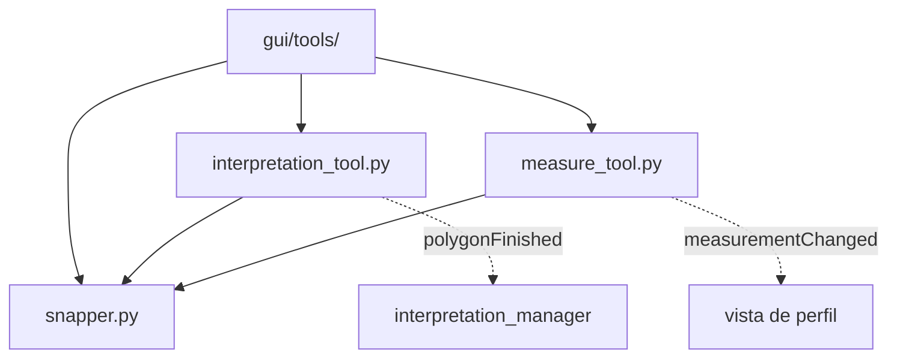

# `gui/tools/` — Herramientas de mapa interactivas

> [!abstract] Resumen en una línea
> `QgsMapTool`s del lienzo de perfil para medir distancias y dibujar polígonos de interpretación, con snapping compartido.

**Ruta**: `gui/tools/` (4 módulos, ~714 líneas)
**Capa**: GUI
**Tags**: #secinterp #layer #gui

---

## 🎯 Rol de la capa

| Responsabilidad | Detalle |
|-----------------|---------|
| Capturar eventos | Clicks, movimiento y teclado sobre el canvas |
| Dibujar feedback | `QgsRubberBand` + `QgsVertexMarker` |
| Medir | `calculate_polyline_metrics` (core) desde puntos extraídos |
| Emitir resultados | Señales Qt hacia el gestor de herramientas |

> [!important] Reglas de la capa
> GUI = solo Extract/Present; sin lógica de negocio; `QgsTask` para >100ms; nunca pasar objetos QGIS vivos a hilos.

## 🧬 Mapa de capas / subcapas

## 🧱 Inventario de módulos

| Módulo | Rol |
|--------|-----|
| `__init__.py` | Paquete de herramientas de mapa |
| `interpretation_tool.py` → [[interpretation_tool]] | `ProfileInterpretationTool`: dibuja polígonos de interpretación |
| `measure_tool.py` → [[measure_tool]] | `ProfileMeasureTool`: mide distancia, desnivel y pendiente |
| `snapper.py` | `ProfileSnapper`: snapping compartido a vértice/borde |

## 🏛️ Patrones de diseño presentes

| Patrón | Dónde | Propósito |
|--------|-------|-----------|
| **MapTool** | Subclases de `QgsMapToolEmitPoint` | Integrarse con el canvas de QGIS |
| **Delegation** | `ProfileSnapper` | Reutilizar snapping entre herramientas |
| **Observer (signals)** | `measurementChanged`, `polygonFinished` | Notificar al gestor/UI |
| **State machine** | flag `finalized` | Congelar la medición tras finalizar |

## 🔗 Notas relacionadas

- [[Index]] — índice de la bóveda
- [[layer_gui]] — capa padre
- [[measure_tool]] — herramienta de medición
- [[interpretation_tool]] — herramienta de interpretación
- [[tool_manager]] — activa/desactiva y conecta señales

---

*Nota de la bóveda SecInterp Code Walkthrough — v3.8.0*
