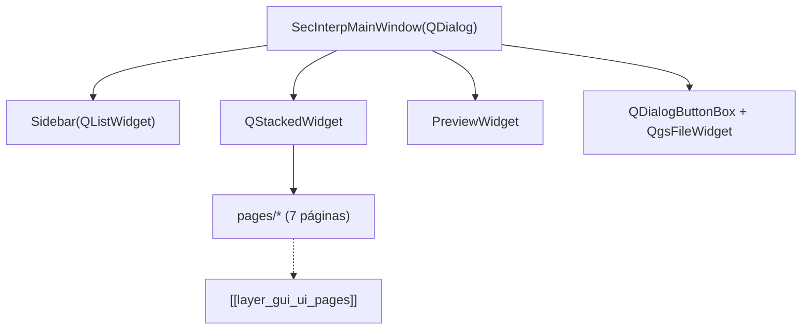

# `gui/ui/` — UI Programática

> [!abstract] Resumen en una línea
> Ensambla la ventana principal de SecInterp (`SecInterpMainWindow`) con barra lateral, stack de páginas y previsualización, todo construido en código (sin archivos `.ui`).

**Ruta**: `gui/ui/` (3 módulos, ~228 líneas)
**Capa**: GUI
**Tags**: #secinterp #layer #gui

---

## 🎯 Rol de la capa

| Aspecto | Detalle |
|---------|---------|
| Responsabilidad | Componer la ventana: `Sidebar` + `QStackedWidget` (7 páginas) + `PreviewWidget` |
| Entrada | `iface` de QGIS (opcional) y `parent` |
| Salida | `QDialog` listo con `output_widget` (`QgsFileWidget`) y `button_box` |
| No hace | Lógica de negocio, I/O de archivos ni llamadas a `core/` |

> [!important] Reglas de la capa
> GUI = solo Extract/Present; UI programática (sin `.ui`); sin lógica de negocio.

---

## 🧬 Mapa de capas / subcapas

> [!tip] Cómo leer
> Flecha sólida = composición/importa; punteada = subcapa delegada.

---

## 🧱 Inventario de módulos

| Módulo | Rol |
|--------|-----|
| `__init__.py` (7) | Docstring del paquete UI |
| `main_window.py` → [[ui_pages]] (158) | `SecInterpMainWindow`: splitter, stack, preview y botones |
| `sidebar.py` → [[ui_pages]] (63) | `Sidebar`: navegación con iconos de tema QGIS vía `add_item()` |

---

## 🏛️ Patrones de diseño presentes

| Patrón | Dónde | Propósito |
|--------|-------|-----------|
| **Programmatic UI** | `main_window.py` | Sin `.ui`; control total y estilos inline |
| **Composition root** | `SecInterpMainWindow.__init__` | Instancia sidebar, stack, preview y páginas |
| **Stacked navigation** | `Sidebar` + `QStackedWidget` | Wizard de una página visible a la vez |
| **Observer** | `_connect_signals` | `currentRowChanged → setCurrentIndex` |

---

## 🔗 Notas relacionadas

- [[Index]]
- [[layer_gui]] — capa padre
- [[layer_gui_ui_pages]] — subcapa de páginas
- [[ui_pages]] — catálogo de páginas
- [[main_dialog]] — orquesta esta ventana

---

*Nota de la bóveda SecInterp Code Walkthrough — v3.8.0*
