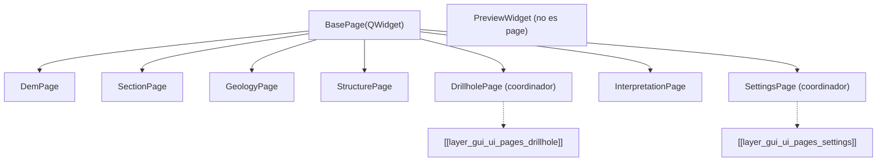

# `gui/ui/pages/` — Páginas de Configuración

> [!abstract] Resumen en una línea
> Contrato `BasePage` + 8 páginas de formulario que exponen `get_data()`/`validate()` y alimentan el stack del diálogo.

**Ruta**: `gui/ui/pages/` (10 módulos, ~1483 líneas)
**Capa**: GUI
**Tags**: #secinterp #layer #gui

---

## 🎯 Rol de la capa

| Aspecto | Detalle |
|---------|---------|
| Responsabilidad | Un `QWidget` por dominio (DEM, sección, geología, estructura, sondajes, interpretación, settings) |
| Contrato | `get_data()`, `validate()`, `dump()/load()/reset()`, `connect_signals()/disconnect_signals()` |
| Coordinadores | `DrillholePage` y `SettingsPage` componen tabs y delegan |
| Excepción | `PreviewWidget` no hereda de `BasePage`: es el visor lateral |

> [!important] Reglas de la capa
> GUI = solo Extract/Present; UI programática (sin `.ui`); sin lógica de negocio.

---

## 🧬 Mapa de capas / subcapas

> [!tip] Cómo leer
> Flecha sólida = herencia/composición; punteada = subcapa de tabs.

---

## 🧱 Inventario de módulos

| Módulo | Rol |
|--------|-----|
| `__init__.py` (7) | Re-exporta `SettingsPage` |
| `base_page.py` (105) | `BasePage` + helper `set_combo_layer()` |
| `dem_page.py` (222) | `DemPage` — DEM/raster y banda |
| `section_page.py` (117) | `SectionPage` — línea de sección y buffer |
| `geology_page.py` (120) | `GeologyPage` — contactos/outcrops |
| `structure_page.py` (166) | `StructurePage` — mediciones estructurales |
| `drillhole_page.py` (130) | `DrillholePage` — coordinador de tabs |
| `interpretation_page.py` (230) | `InterpretationPage` — atributos de interpretación |
| `settings_page.py` (124) | `SettingsPage` — coordinador de settings |
| `preview_page.py` (262) | `PreviewWidget` — canvas, resultados y LOD |

---

## 🏛️ Patrones de diseño presentes

| Patrón | Dónde | Propósito |
|--------|-------|-----------|
| **Page Object** | cada `*Page` | Encapsula el formulario de un dominio |
| **Template Method** | `BasePage._setup_ui` | Esqueleto común; subclases completan |
| **Composite / coordinator** | `DrillholePage`, `SettingsPage` | Un page posee varios tabs |
| **Observer** | `dataChanged` / `changed` | Reemisión de cambios al diálogo |
| **Persistence protocol** | `dump()/load()/reset()` | Estado serializable por página |

---

## 🔗 Notas relacionadas

- [[Index]]
- [[layer_gui]] — capa padre
- [[layer_gui_ui]] — capa contenedora
- [[layer_gui_ui_pages_drillhole]] — tabs de sondajes
- [[layer_gui_ui_pages_settings]] — tabs de settings
- [[ui_pages]] — catálogo de páginas
- [[drillhole_page]] / [[settings_page]] — coordinadores

---

*Nota de la bóveda SecInterp Code Walkthrough — v3.8.0*
