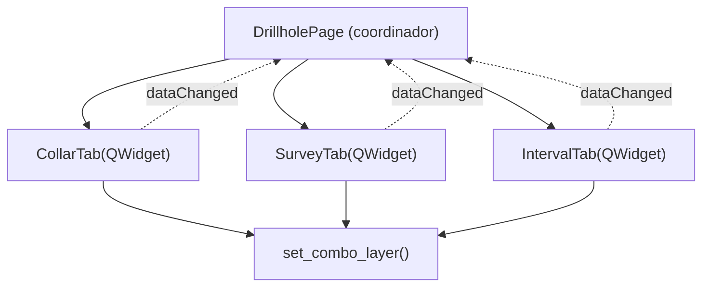

# `gui/ui/pages/drillhole/` — Tabs de Sondajes

> [!abstract] Resumen en una línea
> Paquete de tabs del formulario de sondajes (`CollarTab`, `SurveyTab`, `IntervalTab`), descompuesto el **2026-09-20** del antiguo `drillhole_page.py`.

**Ruta**: `gui/ui/pages/drillhole/` (4 módulos, ~477 líneas)
**Capa**: GUI
**Tags**: #secinterp #layer #gui

---

## 🎯 Rol de la capa

| Aspecto | Detalle |
|---------|---------|
| Responsabilidad | Un `QWidget` por formulario de sondaje: collar, survey e intervalos |
| Entrada | Capas y campos seleccionados por el usuario |
| Salida | `get_data()` con claves `collar_*`, `survey_*`, `interval_*` |
| Persistencia | `dump()/load()/reset()` con claves `dh_*` |
| Señal | `dataChanged` reemitida al coordinador `DrillholePage` |

> [!important] Reglas de la capa
> GUI = solo Extract/Present; UI programática (sin `.ui`); sin lógica de negocio.

---

## 🧬 Mapa de capas / subcapas

> [!tip] Cómo leer
> Flecha sólida = composición/importa; punteada = señal reemitida al coordinador.

---

## 🧱 Inventario de módulos

| Módulo | Rol |
|--------|-----|
| `__init__.py` (9) | Exporta `CollarTab`, `IntervalTab`, `SurveyTab` |
| `collar_tab.py` (180) | `CollarTab` — capa collar, ID, X/Y/Z, profundidad total |
| `survey_tab.py` (144) | `SurveyTab` — capa survey, ID, depth, azimuth, inclination |
| `interval_tab.py` (144) | `IntervalTab` — capa interval, ID, from/to depth, litología |

---

## 🏛️ Patrones de diseño presentes

| Patrón | Dónde | Propósito |
|--------|-------|-----------|
| **Widget decomposition / Composite** | `DrillholePage` | Un coordinador + 3 tabs |
| **Observer** | `dataChanged` | Cada tab reemite cambios al page |
| **Protocol (dump/load/reset)** | tabs + page | Persistencia vía dialog persistence |
| **Adapter (compat)** | `setFilters` try/except | Soporta API de filtros moderna y legacy |

> [!warning] Punto de atención
> `_toggle_xy_fields(True)` se invoca al conectar; el estado inicial deshabilita X/Y cuando se usa la geometría.

---

## 🔗 Notas relacionadas

- [[Index]]
- [[layer_gui_ui_pages]] — capa padre
- [[drillhole_tabs]] — nota del paquete
- [[drillhole_page]] — coordinador `DrillholePage`

---

*Nota de la bóveda SecInterp Code Walkthrough — v3.8.0*
