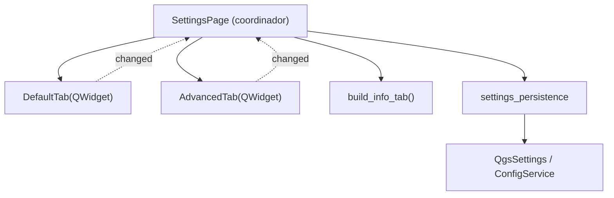

# `gui/ui/pages/settings/` — Tabs de Configuración

> [!abstract] Resumen en una línea
> Paquete de tabs de configuración (`DefaultTab`, `AdvancedTab`, `info_tab`) más la persistencia aislada, descompuesto el **2026-09-20** del antiguo `settings_page.py`.

**Ruta**: `gui/ui/pages/settings/` (5 módulos, ~416 líneas)
**Capa**: GUI
**Tags**: #secinterp #layer #gui

---

## 🎯 Rol de la capa

| Aspecto | Detalle |
|---------|---------|
| Responsabilidad | Formularios de exportación, opciones 3D e información del plugin |
| Persistencia | `settings_persistence` aísla `QgsSettings` y `ConfigService` |
| Entrada | Selección del usuario en checkboxes, combo de formato y naming |
| Salida | `get_data()` con claves `exp_*`, `enable_3d`, `drill_3d_*` |
| Señal | `changed` reemitida al coordinador `SettingsPage` |

> [!important] Reglas de la capa
> GUI = solo Extract/Present; UI programática (sin `.ui`); sin lógica de negocio.

---

## 🧬 Mapa de capas / subcapas

> [!tip] Cómo leer
> Flecha sólida = composición/importa; punteada = señal `changed` reemitida al coordinador.

---

## 🧱 Inventario de módulos

| Módulo | Rol |
|--------|-----|
| `__init__.py` (9) | Exporta `AdvancedTab`, `DefaultTab`, `build_info_tab` |
| `default_tab.py` (178) | `DefaultTab` — selección de export + formato y naming |
| `advanced_tab.py` (106) | `AdvancedTab` — 3D y opciones de drillhole |
| `info_tab.py` (48) | `build_info_tab()` — metadatos de solo lectura |
| `settings_persistence.py` (75) | `load_settings()` / `save_settings()` |

---

## 🏛️ Patrones de diseño presentes

| Patrón | Dónde | Propósito |
|--------|-------|-----------|
| **Widget decomposition** | `SettingsPage` | Coordinador + 3 tabs |
| **Facade** | `SettingsPage` | API única sobre los tabs |
| **Adapter** | `settings_persistence` | Aísla `QgsSettings`/`ConfigService` |
| **Observer** | `changed` | Reemisión de cambios al page |
| **Protocol (dump/load/reset)** | tabs | Persistencia vía dialog persistence |

> [!warning] Punto de atención
> Los *aliases* (`self.chk_enable_3d = self.advanced_tab.chk_enable_3d`) duplican referencias: mantener sincronía al añadir widgets.

---

## 🔗 Notas relacionadas

- [[Index]]
- [[layer_gui_ui_pages]] — capa padre
- [[settings_tabs]] — nota del paquete
- [[settings_page]] — coordinador `SettingsPage`
- [[config]] — `ConfigService` de persistencia

---

*Nota de la bóveda SecInterp Code Walkthrough — v3.8.0*
