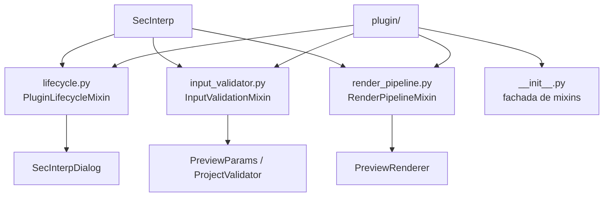

---
tags:
  - secinterp
  - code-walkthrough
  - layer
  - plugin
aliases:
  - plugin/
  - Plugin layer
cssclass: secinterp-layer
---

# `plugin/` — Plugin

> [!abstract] Resumen en una línea
> Conjunto de **mixins** que la clase `SecInterp` compone para gestionar el ciclo de vida QGIS, validar entradas y ejecutar el pipeline de render.

**Ruta**: `plugin/` (4 módulos, ~386 líneas)
**Capa**: Plugin
**Tags**: #secinterp #layer #plugin

---

## 🎯 Rol de la capa

| Problema | Solución |
|----------|----------|
| `sec_interp_plugin.py` crecía con lifecycle + validación + render | Se dividió en 3 mixins cohesivos |
| El analizador QGIS exige `connect`/`disconnect` emparejados en el mismo módulo | `lifecycle.py` mantiene ambos |
| Los imports pesados rompían la carga del plugin | `SafeLoader` difiere la instanciación |

> [!important] Reglas de la capa
> - ✅ `SecInterp` hereda de `PluginLifecycleMixin`, `InputValidationMixin` y `RenderPipelineMixin`
> - ✅ Cada `connect_*` tiene su `disconnect_*` en el **mismo** módulo (requisito del analyzer)
> - ✅ La lógica de negocio se delega a `core/` y a la GUI; aquí solo se orquesta
> - ⚠️ Depende de `qgis.core`, `qgis.PyQt` e `iface`, por lo que no es testeable como core

---

## 🧬 Mapa de capas / subcapas

---

## 🧱 Inventario de módulos

| Módulo | Rol |
|--------|-----|
| `lifecycle.py` | `add_action`, `initGui`, `run`, `unload` y `disconnect_signals` |
| `input_validator.py` | `_get_and_validate_inputs` construye `PreviewParams` y arma las notificaciones de capa |
| `render_pipeline.py` | `draw_preview` filtra datos por visibilidad y delega en `PreviewRenderer` |
| `__init__.py` | Re-exporta los tres mixins con `__all__` |

---

## 🏛️ Patrones de diseño presentes

| Patrón | Dónde | Propósito |
|--------|-------|-----------|
| **Mixin / Composition** | `SecInterp` | Combinar comportamiento sin jerarquía rígida |
| **Facade** | `__init__.py` | Import único de los mixins |
| **Delegation** | `process_data`, `save_profile_line` | Reenviar a managers del diálogo |
| **Safe Loading** | `[[safe_loader]]` | Tolerar fallos de import en runtime |

---

## 🔗 Notas relacionadas

- [[Index]] — índice de la bóveda
- [[plugin_mixins]] · [[sec_interp_plugin]] · [[safe_loader]]
- [[main_dialog]] — diálogo orquestado por el lifecycle
- [[preview_renderer]] — destino del pipeline de render
- [[layer_core]] · [[layer_gui]] — capas a las que delega

---

*Nota de la bóveda SecInterp Code Walkthrough — v3.8.0*
