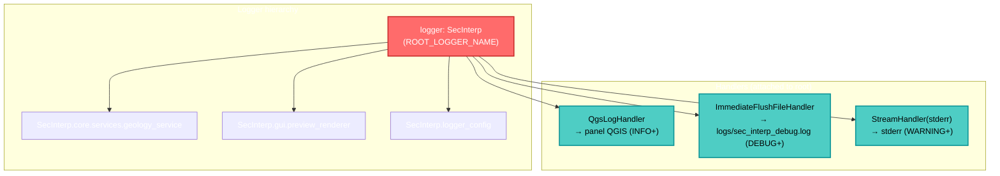

---
tags:
  - secinterp
  - code-walkthrough
  - logging
  - observability
  - thread-safety
aliases:
  - logger_config.py
  - Logger Configuration
  - Logging SecInterp
cssclass: secinterp-note
---

# 03 — `logger_config.py`

> [!abstract] Resumen en una línea
> Configura el **logging centralizado** del plugin: tres handlers (QGIS, archivo con rotación, stderr), jerarquía `SecInterp.*`, y utilidades para sobrevivir a crashes de QGIS.

**Ruta**: `logger_config.py` (220 líneas)
**Clases**: `ImmediateFlushFileHandler`, `QgsLogHandler`
**Funciones**: `setup_logging`, `get_logger`, `log_critical_operation`
**Capa**: Infraestructura / Entry point
**Tags**: #secinterp #logging #observability #thread-safety

---

## 🎯 ¿Por qué existe este archivo?

QGIS puede **crashear silenciosamente** (segfaults en C++ por operaciones de canvas, rubber bands, hilos). El logging estándar de Python **bufferiza** y pierde las últimas líneas — justo las más importantes para diagnosticar el crash.

Este módulo resuelve tres problemas:

1. **Persistencia**: forzar `fsync()` para que el log esté en disco **antes** del crash.
2. **Visibilidad**: integrarse con el panel de mensajes de QGIS, no solo consola.
3. **Thread safety**: nunca tocar la UI desde hilos de fondo (evita segfaults).

> [!important] Regla clave del proyecto
> El logging se inicializa **primero**, antes que cualquier otra cosa (`setup_logging()` en `SecInterp.__init__`). Ver [[sec_interp_plugin]].

---

## 🧬 Arquitectura de logging



---

## 🧱 Componente 1 — `ImmediateFlushFileHandler`

```python
class ImmediateFlushFileHandler(RotatingFileHandler):
    """File handler that flushes immediately after each write."""

    def emit(self, record: logging.LogRecord) -> None:
        super().emit(record)
        self.flush()
        try:
            if hasattr(self.stream, "fileno"):
                os.fsync(self.stream.fileno())
        except (OSError, AttributeError):
            pass
```

| Característica | Detalle |
|----------------|---------|
| **Hereda de** | `RotatingFileHandler` (rotación por tamaño) |
| **Override** | `emit()` para flush + `fsync()` tras cada registro |
| **Tolerancia** | `suppress` implícito vía `try/except` si `fsync` falla |
| **Costo** | Lento (I/O sincrónico) pero **seguro ante crashes** |

> [!tip] ¿Por qué `os.fsync()`?
> `flush()` vacía el buffer de Python hacia el SO, pero el SO puede mantener el dato en caché.
> `fsync()` fuerza la escritura física a disco. Si QGIS crashea, el log ya está persistido.

> [!warning] Compromiso de rendimiento
> `fsync()` por cada línea es costoso. Es aceptable porque el plugin no escribe miles de logs por segundo.
> Si el volumen crece, considerar un buffer con flush periódico.

---

## 🧱 Componente 2 — `QgsLogHandler`

```python
class QgsLogHandler(logging.Handler):
    """Custom logging handler that writes to QGIS message log."""

    def __init__(self, tag: str = "SecInterp") -> None:
        super().__init__()
        self.tag = tag

    def emit(self, record: logging.LogRecord) -> None:
        try:
            from qgis.PyQt.QtCore import QCoreApplication, QThread
            msg = self.format(record)

            # Map Python levels → QGIS levels
            if record.levelno >= logging.ERROR:
                level = Qgis.MessageLevel.Critical
            elif record.levelno >= logging.WARNING:
                level = Qgis.MessageLevel.Warning
            elif record.levelno >= logging.INFO:
                level = Qgis.MessageLevel.Info
            else:
                level = Qgis.MessageLevel.Info

            instance = QCoreApplication.instance()
            if instance and QThread.currentThread() == instance.thread():
                QgsMessageLog.logMessage(msg, self.tag, level)
            else:
                sys.stderr.write(f"[{self.tag}] (BG) {msg}\n")
        except Exception:
            self.handleError(record)
```

### Mapeo de niveles

| Python `logging` | QGIS `MessageLevel` |
|------------------|---------------------|
| `ERROR`+ | `Critical` |
| `WARNING` | `Warning` |
| `INFO` | `Info` |
| `DEBUG` | `Info` (QGIS no tiene Debug) |

> [!important] El guard de hilo (crítico)
> ```python
> if instance and QThread.currentThread() == instance.thread():
>     QgsMessageLog.logMessage(...)   # hilo principal → seguro
> else:
>     sys.stderr.write(f"[{self.tag}] (BG) {msg}\n")  # hilo de fondo → stderr
> ```
> **Tocar la UI de QGIS desde un hilo de fondo provoca segfaults.**
> Este handler detecta si está en el hilo principal; si no, redirige a `stderr`.
> Es una de las razones por las que SecInterp llegó a **cero crashes de threading**.

---

## 🔧 Componente 3 — `setup_logging()`

```python
def setup_logging(level: int = logging.DEBUG) -> logging.Logger:
    root_logger = logging.getLogger(ROOT_LOGGER_NAME)

    if not root_logger.handlers:          # idempotente
        root_logger.setLevel(level)

        # 1. QGIS handler (UI)
        qgis_handler = QgsLogHandler(tag=ROOT_LOGGER_NAME)
        qgis_handler.setLevel(logging.INFO)
        qgis_handler.setFormatter(logging.Formatter("%(levelname)s - %(message)s"))
        root_logger.addHandler(qgis_handler)

        # 2. File handler (crash analysis)
        try:
            log_dir = Path(__file__).parent / "logs"
            log_dir.mkdir(exist_ok=True)
            log_file = log_dir / "sec_interp_debug.log"
            file_handler = ImmediateFlushFileHandler(
                log_file, maxBytes=10 * 1024 * 1024, backupCount=5, encoding="utf-8"
            )
            file_handler.setLevel(logging.DEBUG)
            file_handler.setFormatter(logging.Formatter(
                "%(asctime)s | %(levelname)-8s | %(name)s | "
                "%(funcName)s:%(lineno)d | Thread-%(thread)d | %(message)s",
                datefmt="%Y-%m-%d %H:%M:%S",
            ))
            root_logger.addHandler(file_handler)

            # 3. stderr backup
            stderr_handler = logging.StreamHandler(sys.stderr)
            stderr_handler.setLevel(logging.WARNING)
            stderr_handler.setFormatter(file_formatter)
            root_logger.addHandler(stderr_handler)
        except Exception as e:
            QgsMessageLog.logMessage(
                f"Warning: Could not initialize file logging: {e}",
                ROOT_LOGGER_NAME, Qgis.MessageLevel.Warning,
            )

        root_logger.propagate = True

    return root_logger
```

### Los tres handlers

| # | Handler | Destino | Nivel mínimo | Formato |
|---|---------|---------|:------------:|---------|
| 1 | `QgsLogHandler` | Panel de mensajes QGIS | INFO | `LEVEL - mensaje` |
| 2 | `ImmediateFlushFileHandler` | `logs/sec_interp_debug.log` | DEBUG | timestamp completo + thread |
| 3 | `StreamHandler(stderr)` | stderr | WARNING | igual al de archivo |

### Detalles clave

| Detalle | Valor | Razón |
|---------|-------|-------|
| **Idempotencia** | `if not root_logger.handlers` | Evita handlers duplicados al reinicializar |
| **Rotación** | `maxBytes=10MB`, `backupCount=5` | Evita logs infinitos (máx. ~60MB) |
| **Encoding** | `utf-8` | Soporta caracteres no-ASCII (nombres, geología) |
| **Ubicación** | `Path(__file__).parent / "logs"` | Relativo al plugin |
| **Tolerancia** | `try/except` alrededor del file handler | Si falla el disco, sigue con QGIS+stderr |
| **Propagación** | `propagate = True` | Hijos propagan al root |

> [!note] `ROOT_LOGGER_NAME = "SecInterp"`
> Nombre del logger raíz del plugin. Todos los módulos cuelgan de él: `SecInterp.gui.*`, `SecInterp.core.*`.

---

## 🔧 Componente 4 — `get_logger()`

```python
def get_logger(name: str | None = None) -> logging.Logger:
    if name is None or name == ROOT_LOGGER_NAME:
        return logging.getLogger(ROOT_LOGGER_NAME)

    full_name = name if name.startswith(ROOT_LOGGER_NAME + ".") else f"{ROOT_LOGGER_NAME}.{name}"
    logger = logging.getLogger(full_name)

    root = logging.getLogger(ROOT_LOGGER_NAME)
    if not root.handlers and name != ROOT_LOGGER_NAME:
        setup_logging()          # auto-init para tests/standalone

    return logger
```

### Uso típico en un módulo

```python
from sec_interp.logger_config import get_logger

logger = get_logger(__name__)    # → "SecInterp.<module>"
logger.debug("...")
logger.exception("...")          # incluye traceback
```

| Característica | Detalle |
|----------------|---------|
| **Jerarquía** | Prefija con `SecInterp.` si no lo tiene |
| **Auto-init** | Si el root no tiene handlers, llama `setup_logging()` |
| **Fallback** | `None` → devuelve el root |

> [!tip] Por qué auto-inicializar
> Permite usar `get_logger` en **tests** o scripts standalone sin llamar explícitamente a `setup_logging()`.

---

## 🔧 Componente 5 — `log_critical_operation()`

```python
def log_critical_operation(logger: logging.Logger, operation_name: str, **context: Any) -> None:
    msg = f"CRITICAL_OP: {operation_name}"
    if context:
        ctx_str = ", ".join(f"{k}={v}" for k, v in context.items())
        msg += f" | {ctx_str}"

    logger.debug(msg)

    # Escribe directamente a stderr, saltando TODO el buffering
    timestamp = datetime.datetime.now().strftime("%Y-%m-%d %H:%M:%S.%f")[:-3]
    sys.stderr.write(f"[{timestamp}] {msg}\n")
    sys.stderr.flush()

    try:
        if hasattr(sys.stderr, "fileno"):
            os.fsync(sys.stderr.fileno())
    except (OSError, AttributeError):
        pass
```

> [!important] Doble canal de salida
> Escribe por el logger normal **y** directamente a `stderr` con `flush()` + `fsync()`.
> Es un "cinturón y tirantes" para operaciones que pueden tumbar QGIS (canvas, rubber bands, tools).
> El prefijo `CRITICAL_OP:` permite grepear estos eventos en el log.

| Cuándo usar | Ejemplo |
|-------------|---------|
| Antes de operaciones de canvas | `log_critical_operation(logger, "rubber_band_clear")` |
| Antes de activar tools | `log_critical_operation(logger, "tool_activate", tool="measure")` |
| Antes de manipular capas | `log_critical_operation(logger, "layer_add", name=...)` |

---

## 🏛️ Patrones de diseño presentes

| Patrón | Dónde | Propósito |
|--------|-------|-----------|
| **Singleton (implícito)** | `getLogger(ROOT_LOGGER_NAME)` | Una sola configuración global |
| **Hierarchical Logger** | `SecInterp.*` | Control granular por módulo |
| **Decorator/Handler Chain** | 3 handlers en el root | Múltiples destinos simultáneos |
| **Fail-safe / Graceful Degradation** | `try/except` en file handler | Si falla el disco, sigue funcionando |
| **Idempotent Init** | `if not root_logger.handlers` | Seguro de llamar múltiples veces |
| **Thread Guard** | `QThread.currentThread()` | Evita segfaults por UI desde hilos |

---

## 🧾 Resumen de la API

| Símbolo | Tipo | Responsabilidad |
|---------|------|-----------------|
| `ROOT_LOGGER_NAME` | const | `"SecInterp"` |
| `ImmediateFlushFileHandler` | clase | Rotación + fsync por línea |
| `QgsLogHandler` | clase | Puente Python logging → QGIS, thread-safe |
| `setup_logging(level)` | función | Configura los 3 handlers (idempotente) |
| `get_logger(name)` | función | Logger jerárquico con auto-init |
| `log_critical_operation(...)` | función | Log de máxima persistencia |

---

## 👀 Observaciones y notas

> [!success] Fortalezas
> - **Anti-crash**: fsync por línea garantiza logs ante segfaults.
> - **Thread-safe**: el guard de hilo evita el clásico crash de QGIS por UI desde background.
> - **Degradación elegante**: si falla el archivo, siguen QGIS y stderr.
> - **Idempotente**: seguro de invocar varias veces.

> [!warning] Puntos de atención
> - `QgsLogHandler.emit` importa `qgis.PyQt.QtCore` **dentro** del método; correcto para evitar acoplar, pero se repite en cada log (cacheable).
> - `log_critical_operation` importa `datetime` dentro de la función (micro-optimización discutible).
> - El nivel por defecto es `DEBUG`, lo que en producción puede generar mucho volumen (mitigado por rotación).
> - La ruta de logs (`<plugin>/logs/`) puede no ser escribible en instalaciones de sistema; el `try/except` lo cubre.

> [!question] Preguntas abiertas
> - ¿Debería el nivel por defecto ser `INFO` y subir a `DEBUG` solo en modo desarrollador?
> - ¿Conviene exponer un flag de configuración para desactivar el file handler?

---

## 🔗 Notas relacionadas

- [[Index]] — índice de la bóveda
- [[sec_interp_plugin]] — donde se llama `setup_logging()`
- [[__init__]] — entry point que precede a la inicialización
- [[safe_loader]] — otro patrón de tolerancia a fallos

---

*Nota 03 de la bóveda SecInterp Code Walkthrough — v3.8.0*
