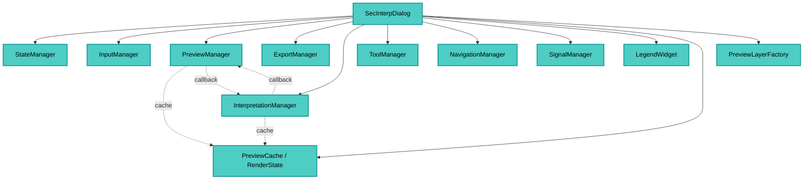

---
tags:
  - secinterp
  - code-walkthrough
  - gui
  - main-dialog
  - orchestrator
aliases:
  - main_dialog.py
  - SecInterpDialog
cssclass: secinterp-note
---

# `gui/main_dialog.py`

> [!abstract] Resumen en una línea
> Es el **diálogo principal** (thin orchestrator): compone la UI de `SecInterpMainWindow` y **delega** en 7 managers especializados — no contiene lógica de negocio.

> [!info] Refactor 2026-09-20
> Este archivo de 480 líneas se descompuso en mixins ([[dialog_mixins]]); `SecInterpDialog` es ahora una **raíz de composición de 193 líneas**.

**Ruta**: `gui/main_dialog.py` (193 líneas; antes 480)
**Clase**: `SecInterpDialog(SecInterpMainWindow)`
**Capa**: GUI
**Tags**: #secinterp #gui #main-dialog #orchestrator

---

## 🎯 ¿Por qué existe este archivo?

El diálogo no debe ser un "god object". Aquí solo **orquesta**:

| Responsabilidad | Delegado a |
|-----------------|------------|
| Estado y persistencia | `StateManager` |
| Señales/slots | `SignalManager` |
| Entradas de capas | `InputManager` |
| Preview y render | `PreviewManager` |
| Export | `ExportManager` |
| Interpretaciones | `InterpretationManager` |
| Herramientas de mapa | `ToolManager` + `NavigationManager` |
| Leyenda | `LegendWidget` |
| Caché/render | `PreviewCache` + `RenderState` + `PreviewLayerFactory` |

> [!important] La UI programática vive en `ui/main_window.py` (`SecInterpMainWindow`). Este archivo **no construye widgets**: solo los cablea.

---

## 🧬 Arquitectura — managers



---

## 🧱 `__init__(iface, plugin_instance, parent)`

```python
def __init__(self, iface, plugin_instance, parent=None):
    super().__init__(iface, parent)
    self.iface = iface
    self.plugin_instance = plugin_instance
    self.project = QgsProject.instance()
    self.messagebar = iface.messageBar() if iface else _NoOpMessageBar()

    self._init_managers()
    self.legend_widget = LegendWidget(self.preview_widget.canvas)
    self.render_state = RenderState()
    self.clear_cache_btn = QPushButton(self.tr("Clear Cache"))
    self.reset_defaults_btn = QPushButton(self.tr("Reset Defaults"))
    self.button_box.addButton(self.clear_cache_btn, ActionRole)
    self.button_box.addButton(self.reset_defaults_btn, ActionRole)

    self.tool_manager.initialize_tools()

    self.signal_manager = SignalManager(
        self, self.preview_manager, self.export_manager,
        self.tool_manager, self.state_manager,
    )
    self.signal_manager.connect_all()

    self.state_manager.update_all()
    self.state_manager.load_settings()
    self._save_on_close = True
```

### `_init_managers()` — composition root del diálogo

```python
preview_cache = PreviewCache()
pages = Pages(
    dem=self.page_dem, section=self.page_section, geology=self.page_geology,
    structure=self.page_struct, drillhole=self.page_drillhole, settings=self.page_settings
)

self.input_manager   = InputManager(pages, self.output_widget, self.tr)
self.state_manager   = StateManager(self)
self.preview_manager = PreviewManager(self, PreviewService(self.plugin_instance.controller), cache=preview_cache)
self.export_manager  = ExportManager(self)
self.state_manager.setup_indicators()
self.interpretation_manager = InterpretationManager(self, cache=preview_cache)
self.interpretation_manager.load_interpretations()
self.tool_manager  = ToolManager(self.preview_widget.canvas, self.preview_widget, self.tr,
                                 self.on_interpretation_finished, self.update_measurement_display)
self.navigation_manager = NavigationManager(self.preview_widget.canvas)
self.layer_factory = PreviewLayerFactory()

# Decoupled callbacks
self.preview_manager.set_interpretations_cleared_handler(self.interpretation_manager.clear_interpretations)
self.interpretation_manager.set_preview_update_handler(self.preview_manager.update_from_checkboxes)
```

> [!tip] Cache compartida
> `PreviewCache` es **inyección compartida** entre `PreviewManager` e `InterpretationManager` — una sola fuente de verdad para topografía/geología/estructuras.

> [!note] `StateManager` en dos fases
> Se crea, luego `setup_indicators()` y más tarde `update_all()` / `load_settings()`.

---

## 🧱 Mensajes y errores

```python
def push_message(self, title, message, level=Qgis.MessageLevel.Info, duration=5, show_in_plugin=True):
    if self.messagebar:
        self.messagebar.pushMessage(title, message, level=level, duration=duration)
    if show_in_plugin:
        icon, color = {"Success": ("✓", "#28a745"), "Warning": ("⚠", "#ffc107"), ...}[level.name]
        self.preview_widget.results_text.append(
            f'<span style="color: {color};">{icon} {title}:</span> {message}'
        )

def handle_error(self, error: Exception, title: str = "Error") -> None:
    if isinstance(error, SecInterpError):
        logger.warning(f"{title}: {msg} - Details: {error.details}")
        self.show_dialog(title, msg, level="warning")
    else:
        logger.error(f"{title}: {msg}\n{traceback.format_exc()}")
        self.show_dialog(title, self.tr("{}\n\nPlease check the logs for details.").format(msg), level="critical")
```

| Método | Destino |
|--------|---------|
| `push_message` | Barra QGIS **y** panel de resultados (HTML coloreado) |
| `show_dialog` | `gui/utils.show_user_message` (QMessageBox) |
| `handle_error` | Decide `warning` (SecInterpError) vs `critical` (inesperado) |

---

## 🧱 Ciclo de vida y limpieza

```python
def wheelEvent(self, event):   # delega a NavigationManager
def closeEvent(self, event):
    if self._save_on_close:
        self.state_manager.save_settings()
    self._cleanup_resources()
    super().closeEvent(event)

def _cleanup_resources(self):
    self._cleanup_map_tools()        # measure/interp reset
    self._cleanup_managers()         # save_interpretations + preview cleanup
    self._cleanup_signals_and_components() # signal_manager.disconnect_all + legend cleanup
```

> [!important] `_save_on_close`
> Flag para tests: evita I/O en `QSettings` cuando no hace falta.

---

## 🧱 Delegación de UI

Los `toggle_*` y proxies son **thin wrappers** hacia los managers:

```python
def toggle_measure_tool(self, checked: bool):        self.tool_manager.toggle_measure_tool(checked)
def toggle_interpretation_tool(self, checked: bool): self.tool_manager.toggle_interpretation_tool(checked)
def on_interpretation_finished(self, polygon):       self.interpretation_manager.handle_interpretation_finished(polygon)
@property def interpretations(self):                  return self.interpretation_manager.interpretations
def update_preview_checkbox_states(self):            self.state_manager.update_preview_checkbox_states()
```

---

## 🏛️ Patrones de diseño presentes

| Patrón | Dónde | Propósito |
|--------|-------|-----------|
| **Thin Dialog / Orchestrator** | clase completa | Evita god object |
| **Manager (decomposition)** | 7 managers | Responsabilidad única |
| **Shared Cache (DI)** | `PreviewCache` | Fuente única topografía/geol |
| **Observer (signals)** | `SignalManager.connect_all` | Cableado centralizado |
| **No-op / Null Object** | `_NoOpMessageBar` | Tests sin `iface` |

---

## 🧾 Resumen de la API (extracto)

| Método | Rol |
|--------|-----|
| `__init__` | Compone managers + leyenda + botones |
| `_init_managers` | Fabrica cache, pages, managers y callbacks cruzados |
| `push_message` / `show_dialog` / `handle_error` | Mensajería unificada |
| `wheelEvent` / `closeEvent` | Navegación y persistencia |
| `open_help` | Abre `help/html/<locale>/index.html` con fallback |
| `toggle_*` | Delegación a `ToolManager` |

---

## 👀 Observaciones y notas

> [!success] Fortalezas
> - Diálogo **fino** sin lógica de negocio.
> - Managers desacoplados y testeables.
> - Limpieza exhaustiva (tools, managers, señales, leyenda).

> [!warning] Puntos de atención
> - `self.interpretation_manager` se usa **antes** de asignarse (render_state comentado duplica el punto).
> - Dos fases de `StateManager` (`setup_indicators` + `update_all`/`load_settings`) acopladas al diálogo.
> - `_NoOpMessageBar.pushMessage` ignora args → silencia mensajes en tests sin advertir.

---

## 🔗 Notas relacionadas

- [[Index]] — índice de la bóveda
- [[sec_interp_plugin]] — composition root que crea el diálogo
- [[controller]] — controller inyectado vía `PreviewService`
- [[adapters]] — adapters inyectados indirectamente
- `gui/ui/main_window.py` — UI programática

---

*Nota de la bóveda SecInterp Code Walkthrough — v3.8.0*
