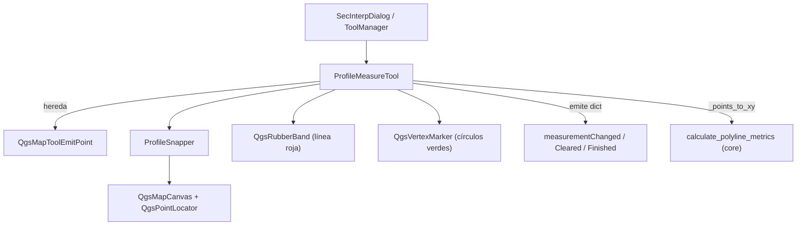

---
tags:
  - secinterp
  - code-walkthrough
  - gui
  - tools
aliases:
  - measure_tool.py
  - ProfileMeasureTool
cssclass: secinterp-note
---

# `gui/tools/measure_tool.py`

> [!abstract] Resumen en una línea
> `QgsMapTool` de medición **multi-punto** en el preview: acumula vértices con snap, dibuja la polilínea en un `QgsRubberBand` y emite métricas calculadas por core (`calculate_polyline_metrics`).

**Ruta**: `gui/tools/measure_tool.py` (330 líneas)
**Clase**: `ProfileMeasureTool(QgsMapToolEmitPoint)`
**Capa**: GUI · Tools
**Tags**: #secinterp #gui #tools

---

## 🎯 ¿Por qué existe este archivo?

| Problema | Solución |
|----------|----------|
| Medir distancias/desniveles exige interacción | `QgsMapToolEmitPoint` sobre el canvas del preview |
| El cálculo no debe vivir en la GUI | `calculate_polyline_metrics` (core, math pura) recibe `(x, y)` |
| El snapping es complejo y repetible | Se delega en `ProfileSnapper` |
| Cerrar el diálogo dejaba gráficos huérfanos | `cleanup_finalized()` los remueve de la escena |
| Tras finalizar, la medición debía quedar visible | `finalized` + `finalized_points` congelan el resultado |

> [!important] Frontera Core
> El tool solo **extrae** puntos (`_points_to_xy`) y **presenta**; la aritmética la hace `core/utils/geometry_utils/measurement.py`.

---

## 🧬 Diagrama de relaciones



> [!tip] Cómo leer
> Flecha sólida = importa/compone; `SIG` lo consume el preview. El tool nunca importa widgets.

---

## 📦 Imports — lectura arquitectónica

```python
import contextlib
from qgis.core import QgsPointXY, QgsWkbTypes
from qgis.gui import (
    QgsMapCanvas, QgsMapToolEmitPoint, QgsMapToolPan,
    QgsRubberBand, QgsVertexMarker,
)
from qgis.PyQt.QtCore import Qt, pyqtSignal
from qgis.PyQt.QtGui import QColor

from sec_interp.core.utils.geometry_utils.measurement import calculate_polyline_metrics
from sec_interp.gui.tools.snapper import ProfileSnapper
from sec_interp.logger_config import get_logger
```

| # | Observación |
|---|-------------|
| ① | `qgis.gui` completo: tool interactivo, capa GUI legítima. |
| ② | La única dependencia de `core` es la función pura de métricas. |
| ③ | `contextlib.suppress` tolera items ya borrados de la escena. |

---

## 🧱 Señales, estado y ciclo de vida

```python
class ProfileMeasureTool(QgsMapToolEmitPoint):
    measurementChanged = pyqtSignal(dict)   # métricas en vivo / finales
    measurementCleared = pyqtSignal()       # reset normal
    measurementFinished = pyqtSignal()      # medición finalizada

    def __init__(self, canvas: QgsMapCanvas) -> None:
        super().__init__(canvas)
        self.canvas = canvas
        self.points: list[QgsPointXY] = []
        self.finalized: bool = False
        self.finalized_points: list[QgsPointXY] = []
        self.rubber_band: QgsRubberBand | None = None
        self.vertex_markers: list[QgsVertexMarker] = []
        self.cursor = Qt.CursorShape.CrossCursor
        self.snapper = ProfileSnapper(canvas)

    def deactivate(self) -> None:
        # NO se llama reset(): la medición se conserva visible
        super().deactivate()
```

| Miembro | Rol |
|---------|-----|
| `points` | Vértices en construcción (se vacían al finalizar/reset). |
| `finalized` | Bloquea `canvasReleaseEvent` y `canvasMoveEvent`. |
| `finalized_points` | Copia congelada para repintar la geometría final. |

> [!note] `deactivate` no borra
> A diferencia de [[interpretation_tool]], aquí no se hace `reset()` al desactivar: la medición persiste hasta que se inicie otra o se limpie.

---

## 🧱 `reset()` y `cleanup_finalized()`

```python
def reset(self) -> None:
    if self.finalized:
        # Conserva rubber band, markers y texto de resultados
        self.points = []
        self.finalized = False
        return
    self.points = []
    self.finalized = False
    self.finalized_points = []
    # remueve rubber_band + markers de la escena
    self.measurementCleared.emit()
```

| Rama | Efecto |
|------|--------|
| `finalized == True` | Solo limpia `points`; mantiene dibujo y no emite señal. |
| `finalized == False` | Remueve `rubber_band`/markers y emite `measurementCleared`. |

> [!warning] Cierre del diálogo
> `cleanup_finalized()` recorre `rubber_band` + `vertex_markers` con `contextlib.suppress`, los remueve de la escena y vacía `finalized_points`. Se invoca al cerrar para no dejar gráficos huérfanos.

---

## 🧱 Eventos de ratón y teclado

```python
def canvasReleaseEvent(self, event: Any) -> None:
    if event.button() == Qt.MouseButton.RightButton:
        self.reset()
        return
    if self.finalized:
        return
    self._add_point(self.snapper.snap(event.pos()))

def canvasMoveEvent(self, event: Any) -> None:
    if self.finalized or not self.points:
        return
    current_point = self.snapper.snap(event.pos())
    self._update_rubber_band(current_point)
    self._calculate_and_emit_preview(current_point)

def keyPressEvent(self, event: Any) -> None:
    if event.key() in (Qt.Key.Key_Return, Qt.Key.Key_Enter):
        if len(self.points) >= 2:          # MIN_MEASURE_POINTS
            self.finalize_measurement()
            event.accept()
        return
    if event.key() == Qt.Key.Key_Escape:
        self.reset()
        event.accept()
        return
    super().keyPressEvent(event)
```

| Entrada | Acción |
|---------|--------|
| Clic izquierdo | Añade punto con snap (`_add_point`). |
| Clic derecho | `reset()` (cancelar). |
| Enter / Return | Finaliza si hay ≥ 2 puntos. |
| Escape | `reset()`. |

> [!important] Evento correcto
> El punto se añade en **`canvasReleaseEvent`**, no en `canvasPressEvent` (error frecuente en notas antiguas).

---

## 🧱 `_add_point`, preview y `finalize_measurement()`

```python
def _add_point(self, point: QgsPointXY) -> None:
    self.points.append(point)
    self._ensure_rubber_band()
    self.rubber_band.addPoint(point, True)
    self._add_vertex_marker(point)
    if len(self.points) >= 2:              # MIN_RELEVANT_POINTS
        metrics = calculate_polyline_metrics(_points_to_xy(self.points))
        self.measurementChanged.emit(metrics)

def finalize_measurement(self) -> None:
    if len(self.points) < 2:               # MIN_RELEVANT_POINTS
        return
    self.finalized_points = self.points.copy()
    self.finalized = True
    metrics = calculate_polyline_metrics(_points_to_xy(self.points))
    self.measurementChanged.emit(metrics)
    if self.rubber_band:
        self.rubber_band.reset(QgsWkbTypes.GeometryType.LineGeometry)
        for point in self.finalized_points:
            self.rubber_band.addPoint(point, False)   # sin línea temporal
        self.rubber_band.show()
    pan_tool = QgsMapToolPan(self.canvas)
    self.canvas.setMapTool(pan_tool)       # vuelve a pan y preserva la medición
    self.measurementFinished.emit()
```

| Paso | Detalle |
|------|---------|
| 1 | `_points_to_xy()` convierte `QgsPointXY` en primitivas para core. |
| 2 | `finalize_measurement` guarda copia, marca `finalized` y emite métricas. |
| 3 | Repinta el rubber band solo con los puntos reales. |
| 4 | Cambia a `QgsMapToolPan` y emite `measurementFinished`. |

> [!tip] `_calculate_and_emit_preview`
> Añade el cursor como punto temporal (`[*self.points, target_point]`) y emite métricas en vivo.

---

## 🏛️ Patrones de diseño presentes

| Patrón | Dónde | Propósito |
|--------|-------|-----------|
| **State** | `finalized` / `finalized_points` | Alternar entre "midiendo" y "congelado". |
| **Strategy / Delegation** | `ProfileSnapper` | Aislar el algoritmo de snapping. |
| **Extract-then-Compute** | `_points_to_xy` → core | GUI sin matemáticas. |
| **Observer** | 3 `pyqtSignal` | Desacoplar el tool del preview. |
| **Fail-safe cleanup** | `contextlib.suppress` | Tolerar escena ya destruida. |

---

## 🧾 Resumen de la API

| Símbolo | Firma / Hereda | Uso típico |
|---------|----------------|------------|
| `measurementChanged` | `pyqtSignal(dict)` | Métricas en vivo y finales. |
| `measurementCleared` | `pyqtSignal()` | Reset normal. |
| `measurementFinished` | `pyqtSignal()` | El diálogo apaga el modo medición. |
| `ProfileMeasureTool` | `QgsMapToolEmitPoint` | Tool de medición del preview. |
| `reset()` | `() -> None` | Cancelar / limpiar (respeta finalizado). |
| `finalize_measurement()` | `() -> None` | Cerrar medición desde el botón UI. |
| `cleanup_finalized()` | `() -> None` | Limpieza total al cerrar el diálogo. |
| `disconnect_signals()` | `() -> None` | Evitar fugas de memoria. |

---

## 👀 Observaciones y notas

> [!success] Fortalezas
> - Estado `finalized` explícito: la medición queda visible y protegida tras cerrarla.
> - Snap delegado y cálculo en core: el tool es delgado y testeable.

> [!warning] Puntos de atención
> - `finalize_measurement()` instancia `QgsMapToolPan` sin conservar referencia; el canvas lo posee.
> - `_add_vertex_marker` crea un `QgsVertexMarker` por punto; mediciones largas acumulan items.

> [!question] Preguntas abiertas
> - ¿Conviene un límite máximo de vértices para evitar rubber bands muy densos?
> - ¿El botón "Finalizar" del diálogo llama a `finalize_measurement()` o solo a `deactivate()`?

---

## 🔗 Notas relacionadas

- [[Index]] — índice de la bóveda
- [[tool_manager]] — lo activa/desactiva según el botón del preview
- [[interpretation_tool]] — tool hermano de digitización de polígonos
- [[preview_renderer]] — canvas donde se mide
- [[layer_gui_tools]] — capa de tools de la GUI

---

*Nota de la bóveda SecInterp Code Walkthrough — v3.8.0*
