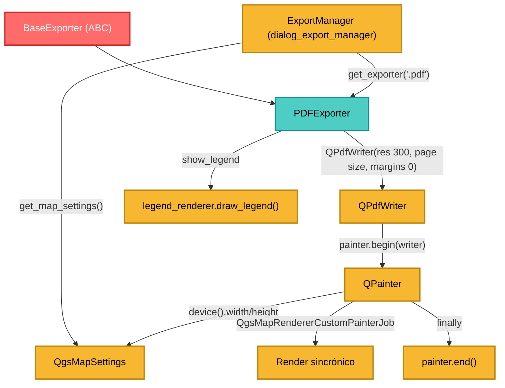

---
tags:
  - secinterp
  - code-walkthrough
  - exporters
  - pdf
  - vector
  - render
  - document
aliases:
  - pdf_exporter.py
  - PDFExporter
cssclass: secinterp-note
---

# `exporters/pdf_exporter.py`

> [!abstract] Resumen en una línea
> Exporta un `QgsMapSettings` a **PDF vectorial** con `QPdfWriter` (300 DPI) + `QgsMapRendererCustomPainterJob`, ajustando el tamaño y DPI de salida del mapa al dispositivo.

**Ruta**: `exporters/pdf_exporter.py` (79 líneas)
**Clase**: `PDFExporter(BaseExporter)`
**Capa**: Exporters (QGIS · Documento vectorial)
**Tags**: #secinterp #exporters #pdf #vector #render #document

---

## 🎯 ¿Por qué existe este archivo?

El PDF es el formato de entrega por excelencia para informes geológicos: vectorial (escalable), con tamaño de página controlado y leyenda. A diferencia de la imagen raster, el PDF se renderiza **directamente al dispositivo** `QPdfWriter`.

| Problema | Solución |
|----------|----------|
| Imagen rasterizada pierde calidad al imprimir | `QPdfWriter` genera vectores |
| Escala/DPI inconsistentes | `writer.setResolution(300)` + `map_settings.setOutputDpi()` |
| Márgenes no deseados | `writer.setPageMargins(QMarginsF(0, 0, 0, 0))` |
| El painter queda abierto si algo falla | `try/finally: painter.end()` |
| Fallo al inicializar el painter | `if not painter.begin(writer): return False` con log |

> [!important] Nota arquitectónica
> El PDF recibe `QgsMapSettings` ya configurado y **lo muta** (`setOutputSize`, `setOutputDpi`) para alinearlo con el dispositivo PDF. Es un caso legítimo de “ajuste al destino” antes de renderizar.

---

## 🧬 Diagrama de relaciones



---

## 📦 Imports — lectura arquitectónica

```python
from qgis.core import QgsMapRendererCustomPainterJob, QgsMapSettings
from qgis.PyQt.QtCore import QMarginsF, QRectF, QSize, QSizeF
from qgis.PyQt.QtGui import QPageSize, QPainter, QPdfWriter

from sec_interp.logger_config import get_logger
from .base_exporter import BaseExporter
```

| # | Observación |
|---|-------------|
| ① | `QSizeF` + `QPageSize` definen el tamaño de página en **puntos** |
| ② | `QMarginsF` permite márgenes fraccionarios (aquí cero) |
| ③ | `QgsMapRendererCustomPainterJob` es el mismo job que usan imagen y SVG |
| ④ | `QgsMapSettings` solo se importa para la anotación de tipo |

---

## 🧱 `export()` — escritura al dispositivo PDF

```python
def export(self, output_path: Path, map_settings: QgsMapSettings) -> bool:
    try:
        width = self.get_setting("width", 800)
        height = self.get_setting("height", 600)

        writer = QPdfWriter(str(output_path))
        writer.setResolution(300)  # Set DPI
        writer.setPageSize(QPageSize(QSizeF(width, height), QPageSize.Unit.Point))
        writer.setPageMargins(QMarginsF(0, 0, 0, 0))

        painter = QPainter()
        if not painter.begin(writer):
            logger.error(f"Failed to begin painting for PDF export to {output_path}")
            return False
        try:
            painter.setRenderHint(QPainter.RenderHint.Antialiasing)

            # Update map settings with actual writer device dimensions and DPI
            dev = painter.device()
            map_settings.setOutputSize(QSize(dev.width(), dev.height()))
            map_settings.setOutputDpi(writer.resolution())

            job = QgsMapRendererCustomPainterJob(map_settings, painter)
            job.start()
            job.waitForFinished()

            show_legend = self.get_setting("show_legend", True)
            legend_renderer = self.get_setting("legend_renderer")
            if legend_renderer and show_legend:
                legend_renderer.draw_legend(painter, QRectF(0, 0, dev.width(), dev.height()))
        finally:
            painter.end()
    except Exception:
        logger.exception(f"PDF export failed for {output_path}")
        return False
    else:
        return True
```

| Setting | Default | Rol |
|---------|---------|-----|
| `width` / `height` | `800` / `600` | Tamaño de página en puntos |
| `show_legend` | `True` | Activar/desactivar leyenda |
| `legend_renderer` | `None` | Objeto con `draw_legend(painter, rect)` |

Constantes fijas: `setResolution(300)` (calidad de impresión) y `setPageMargins(0,0,0,0)` (sin márgenes).

> [!important] Sincronización mapa ↔ dispositivo
> El PDF en puntos produce un dispositivo N×M px a 300 DPI. Si `map_settings` no se actualiza con `setOutputSize(dev.width(), dev.height())` y `setOutputDpi(writer.resolution())`, QGIS renderiza con las dimensiones/DPI del canvas y el mapa sale recortado o borroso.

> [!tip] `try/finally` garantiza `painter.end()`
> Incluso si el job de render lanza, el painter se cierra. Es la diferencia clave con [[image_exporter]]. Retorno: `begin()` fallido → `logger.error` + `False`; éxito → el `else` devuelve `True`; excepción → `logger.exception` + `False`.

---

## 🏛️ Patrones de diseño presentes

| Patrón | Dónde | Propósito |
|--------|-------|-----------|
| **Template Method** | `BaseExporter` | Contrato y settings |
| **Strategy** | `PDFExporter` | Estrategia PDF concreta |
| **Job / Command** | `QgsMapRendererCustomPainterJob` | Render sincrónico encapsulado |
| **RAII / try-finally** | `painter.end()` | Liberar el recurso pase lo que pase |
| **Fail-safe** | `try/except` + `logger.exception` | No propaga fallos |

---

## 🧾 Resumen de la API

| Símbolo | Firma / Hereda | Uso típico |
|---------|----------------|------------|
| `PDFExporter` | `class PDFExporter(BaseExporter)` | Exportador PDF |
| `get_supported_extensions()` | `-> [".pdf"]` | Validación de extensión |
| `export(output_path, map_settings)` | `-> bool` | Escribe el PDF |
| `get_setting(key, default)` | heredado | Acceso a settings |

> [!warning] Firma inconsistente con el contrato base
> Igual que [[image_exporter]] y [[svg_exporter]], `export` omite `layer_name`. Funciona por duck typing, pero no respeta estrictamente la firma abstracta de `BaseExporter.export`.

---

## 👀 Observaciones y notas

> [!success] Fortalezas
> - **Calidad de impresión**: 300 DPI y render vectorial.
> - **Limpieza garantizada** del painter con `try/finally`.
> - **Manejo explícito** del fallo de `painter.begin()` y **leyenda** opcional.

> [!warning] Puntos de atención
> - **Muta el `map_settings` recibido**: si se reutiliza para otra exportación, arrastra `outputSize`/`outputDpi`.
> - `except Exception` amplio que silencia errores de programación devolviendo `False`.
> - Render **sincrónico** (`waitForFinished`): bloquea el hilo llamante.
> - `legend_renderer` acopla el exporter a la GUI.
> - Ancho/alto se interpretan en puntos; valores heredados de un flujo de píxeles dan páginas inesperadas.

> [!question] Preguntas abiertas
> - ¿Copiar `map_settings` antes de mutarlo para evitar efectos colaterales?
> - ¿Permitir configurar resolución/página vía settings en lugar de constantes fijas?

---

## 🔗 Notas relacionadas

- [[Index]] — índice de la bóveda
- [[base_exporter]] — contrato abstracto
- [[image_exporter]] / [[svg_exporter]] — mismo job de render, distinto destino
- [[dialog_export_manager]] — construye `QgsMapSettings` y llama a `export()`
- [[export_package]] — `ExportService.get_map_settings()`
- [[controller]] — flujo de datos del preview

---

*Nota de la bóveda SecInterp Code Walkthrough — v3.8.0*
