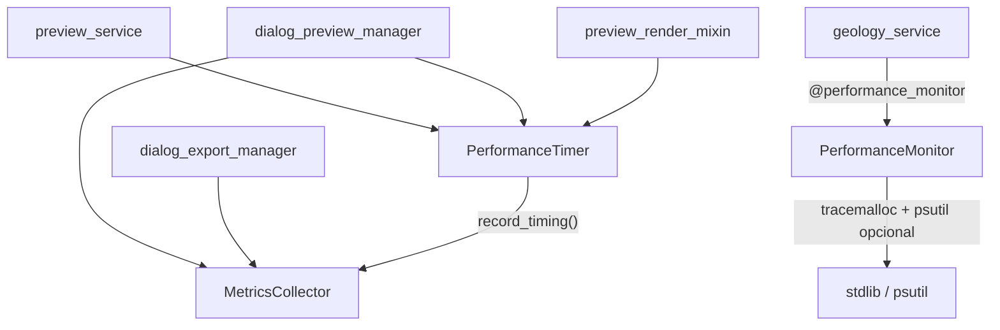

---
tags:
  - secinterp
  - code-walkthrough
  - core
  - performance
  - metrics
aliases:
  - performance_metrics.py
  - MetricsCollector
  - PerformanceTimer
cssclass: secinterp-note
---

# `core/performance_metrics.py`

> [!abstract] Resumen en una línea
> Instrumentación ligera: `MetricsCollector` acumula timings/conteos, `PerformanceTimer` los mide como context manager, y `@performance_monitor` / `PerformanceMonitor` miden tiempo y memoria.

**Ruta**: `core/performance_metrics.py` (321 líneas)
**Clases**: `MetricsCollector`, `PerformanceTimer`, `PerformanceMonitor`
**Decorador**: `performance_monitor` · **Función**: `format_duration`
**Capa**: Core · Performance (QGIS-agnóstico, sin Qt)
**Tags**: #secinterp #core #performance #metrics

---

## 🎯 ¿Por qué existe este archivo?

Cuando el preview "se siente lento", sin datos no se sabe qué fase domina. Este módulo aporta instrumentación basada **solo en stdlib** (más `psutil` opcional).

| Problema | Solución |
|----------|----------|
| No saber cuánto tarda cada fase | `PerformanceTimer("Topography Generation", metrics)` |
| Perder conteos (puntos, segmentos) | `MetricsCollector.record_count(...)` |
| Picos de memoria invisibles | `tracemalloc` en `PerformanceMonitor` |
| Duraciones poco legibles | `format_duration(seconds)` → `µs`/`ms`/`s` |
| Medir funciones sin editarlas | Decorador `@performance_monitor` |

> [!important] Frontera Core
> Sin `qgis`, sin `PyQt`, sin `QCoreApplication`. `tracemalloc` y `time` son stdlib; `psutil` es opcional y se importa dentro de `_get_memory_usage()`.

---

## 🧬 Diagrama de relaciones



> [!tip] Cómo leer
> Hay **dos sistemas**: (A) `MetricsCollector` + `PerformanceTimer` (preview/export); (B) `PerformanceMonitor` + `@performance_monitor` (`geology_service`). Comparten archivo, no estado.

---

## 🧱 `MetricsCollector` y `PerformanceTimer`

```python
class MetricsCollector:
    def __init__(self) -> None:
        self.timings: dict[str, float] = {}
        self.counts: dict[str, int] = {}
        self.metadata: dict[str, Any] = {}
        self._start_time = time.perf_counter()
    def record_timing(self, operation, duration) -> None: ...
    def record_count(self, metric, count) -> None: ...
    def add_metadata(self, key, value) -> None: ...
    def get_summary(self) -> dict[str, Any]: ...   # + total_duration
    def clear(self) -> None: ...

class PerformanceTimer:
    def __enter__(self) -> PerformanceTimer:
        self.start_time = time.perf_counter()
        return self
    def __exit__(self, exc_type, exc_val, exc_tb) -> None:
        self.duration = time.perf_counter() - self.start_time
        if self.collector:
            self.collector.record_timing(self.operation_name, self.duration)
        if self.logger_func:
            self.logger_func(f"{self.operation_name}: {self.duration:.3f}s")
```

> [!note] Uso real: `preview_service` mide `"Topography Generation"`; `dialog_preview_manager`, `"Total Preview Generation"`; `preview_render_mixin`, `"Rendering"`.

---

## 🧱 `format_duration()` y `PerformanceMonitor`

```python
def format_duration(seconds: float) -> str:
    if seconds < 0.001:  return f"{seconds * 1000000:.0f}µs"
    if seconds < 1.0:    return f"{seconds * 1000:.0f}ms"
    return f"{seconds:.1f}s"

class PerformanceMonitor:
    @contextmanager
    def measure_operation(self, operation_name, **metadata):
        start_time, start_memory = time.perf_counter(), self._get_memory_usage()
        tracemalloc.start()
        try:
            yield
        finally:
            end_time, end_memory = time.perf_counter(), self._get_memory_usage()
            try:
                _, peak = tracemalloc.get_traced_memory()
            except RuntimeError:
                _, peak = 0, 0
            tracemalloc.stop()
            self.logger.info(f"Performance: {{'operation': operation_name, ...}}")
            self.metrics.setdefault(operation_name, []).append(log_data)
```

| Aspecto | Detalle |
|---------|---------|
| `log_file` | **Ignorado**: `_setup_logger` devuelve `get_logger("performance")` |
| `_get_memory_usage` | `psutil` si está; si no, `0.0` |
| Pico | `tracemalloc` con guard `RuntimeError` (llamadas anidadas) |
| `get_operation_stats` | Media/min/max de duración y memoria por operación |

---

## 🧱 `performance_monitor` — decorador

```python
def performance_monitor(func: Callable) -> Callable:
    monitor = PerformanceMonitor()
    @wraps(func)
    def wrapper(*args, **kwargs):
        operation_name = f"{func.__module__}.{func.__name__}"
        with monitor.measure_operation(operation_name, args_count=len(args)):
            return func(*args, **kwargs)
    return wrapper
```

| Detalle | Valor |
|---------|-------|
| `operation_name` | `módulo.función` → único por función |
| Instancia | Una `PerformanceMonitor` por función decorada |
| Único uso actual | `geology_service` |

---

## 🏛️ Patrones de diseño presentes

| Patrón | Dónde | Propósito |
|--------|-------|-----------|
| **Context Manager** | `PerformanceTimer`, `measure_operation` | Medir con `with` |
| **Decorator** | `performance_monitor` | Instrumentar sin tocar el cuerpo |
| **Collector / Aggregator** | `MetricsCollector` | Acumular y resumir |
| **Optional Dependency** | `import psutil` en try/except | Degradar sin romper |

---

## 🧾 Resumen de la API

| Símbolo | Firma | Uso típico |
|---------|-------|------------|
| `MetricsCollector` | `class` | `self.metrics = MetricsCollector()` |
| `PerformanceTimer` | context manager | `with PerformanceTimer("Rendering", metrics):` |
| `format_duration` | `(seconds: float) -> str` | Formatear timings |
| `performance_monitor` | `(func) -> func` | `@performance_monitor` |

---

## 👀 Observaciones y notas

> [!success] Fortalezas
> - **Solo stdlib** para lo esencial; `psutil` opcional y tolerante.
> - **Dos granularidades**: métricas acumuladas y medición puntual.
> - **Integrado con el logger** centralizado; nombres únicos por función.

> [!warning] Puntos de atención
> - `PerformanceMonitor.__init__` acepta `log_file` pero `_setup_logger` **lo ignora**: parámetro muerto.
> - `tracemalloc` es global: llamadas anidadas pueden provocar `RuntimeError` (mitigado).
> - Sin `psutil`, `_get_memory_usage` devuelve `0.0` y `memory_mb` puede engañar.

> [!question] Preguntas abiertas
> - ¿Debería `PerformanceMonitor` escribir a `log_file` o eliminarse el parámetro, y unificar `MetricsCollector` y `PerformanceMonitor` en una sola API?

---

## 🔗 Notas relacionadas

- [[Index]] — índice de la bóveda
- [[preview_service]] — mide fases con `PerformanceTimer`
- [[dialog_preview_manager]] — `"Total Preview Generation"`
- [[geology_service]] — usa `@performance_monitor`
- [[logger_config]] — logger `performance` y jerarquía `SecInterp.*`

---

*Nota de la bóveda SecInterp Code Walkthrough — v3.8.0*
