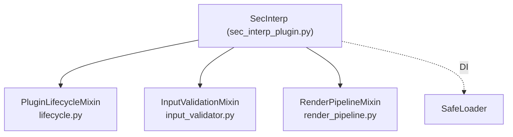

---
tags:
  - secinterp
  - code-walkthrough
  - entry-point
  - plugin-mixins
  - di
aliases:
  - plugin/ package
  - Paquete plugin
  - PluginLifecycleMixin
  - InputValidationMixin
  - RenderPipelineMixin
cssclass: secinterp-note
---

# `plugin/`

> [!abstract] Resumen en una línea
> Paquete de **mixins** que reparte el ciclo de vida, la validación de entradas y el render del preview fuera de la clase raíz `SecInterp`, que queda como fachada delgada.

**Ruta**: `plugin/` (paquete, 4 módulos · ~386 líneas)
**Clase principal**: `SecInterp` (fachada en `sec_interp_plugin.py`, 129 líneas)
**Capa**: Entry point / Root
**Tags**: #secinterp #entry-point #plugin-mixins #di

---

## 🎯 ¿Por qué existe este archivo?

El 2026-09-20 se dividió el antiguo `sec_interp_plugin.py` de **508 líneas**. Hoy la clase `SecInterp(TranslatableMixin, PluginLifecycleMixin, InputValidationMixin, RenderPipelineMixin)` es una **fachada de 129 líneas** que solo conserva `__init__` (DI vía `SafeLoader`), `_load_translator`, `process_data` y `save_profile_line`.

| Problema (antes) | Solución (`plugin/`) |
|------------------|----------------------|
| Un archivo con 3 responsabilidades y ~500 líneas | Un mixin por responsabilidad |
| Difícil de auditar señales Qt por archivo | `connect`/`disconnect` juntos en su módulo |
| Carga inicial mezclada con UI y render | `__init__` solo construye e inyecta |

> [!important] Composition Root
> `__init__` es el único punto donde "todo se conoce": construye e inyecta las dependencias vía `SafeLoader`.

---

## 🧬 Diagrama de relaciones

---

## 🔄 `lifecycle.py` — `PluginLifecycleMixin` (163 líneas)

| Método | Rol |
|--------|-----|
| `add_action(...)` | Crea `QAction`, conecta `triggered` y la registra en toolbar + menú |
| `initGui()` | Hook QGIS; crea el menú y `first_start = True` |
| `run()` | Conecta `dlg.accepted`, carga interpretaciones/settings y abre el diálogo |
| `process_data()` | Delega en `dlg.preview_manager.generate_preview()` |
| `unload()` | Desconecta señales y quita menú/toolbar |
| `disconnect_signals()` | `_disconnect_actions` + `_disconnect_dialog` + layer notifications |

---

## ✅ Otros mixins

| Módulo | Método | Rol |
|--------|--------|-----|
| `input_validator.py` (106) | `_get_and_validate_inputs()` | Construye `PreviewParams`, ejecuta `params.validate()` y `ProjectValidator.validate_all()`; errores críticos se re-lanzan |
| | `_collect_active_layers(params)` | Mapea `bucket → QgsMapLayer` vía `resolve_layer` |
| | `disconnect_layer_notifications()` | Corta el manager de cambios de capa |
| `render_pipeline.py` (108) | `draw_preview(...)` | Filtra datos, llama `preview_renderer.render()` y actualiza `render_state` + leyenda |
| | `_get_filtered_preview_data(...)` | Aplica flags `show_topo/geol/struct/drillholes/interpretations` |
| | `_calculate_dip_length(...)` | `rasterUnitsPerPixelX() * dip_scale`; `None` si no aplica |

---

## ⚠️ Nota arquitectónica clave

> [!important] `connect`/`disconnect` en el mismo módulo
> Cada par `connect`/`disconnect` y sus slots Qt viven en el **mismo archivo** que los conecta. Es deliberado: `qgis-analyzer` detecta *signal leaks* y *missing slots* **por archivo**, así que mantenerlos juntos permite auditar cada módulo de forma aislada.

---

## 🏛️ Patrones de diseño presentes

| Patrón | Dónde | Propósito |
|--------|-------|-----------|
| **Mixin composition** | `SecInterp(...)` | Repartir responsabilidades sin herencia profunda |
| **Composition Root** | `__init__` | Construir y cablear dependencias |
| **Dependency Injection** | `SafeLoader.lazy_load` | Inyectar adapters/controller/dialog |
| **Template Method (Qt)** | `initGui` / `unload` | Hooks de ciclo de vida de QGIS |

---

## 🔗 Notas relacionadas

- [[sec_interp_plugin]] — fachada y `__init__` en detalle
- [[safe_loader]] — DI tolerante a fallos
- [[i18n]] — `TranslatableMixin` (`_load_translator`)
- [[controller]] — `ProfileController` inyectado
- [[main_dialog]] / [[adapters]] — diálogo y extractores GUI
- [[Index]] — índice de la bóveda

---

*Nota de la bóveda SecInterp Code Walkthrough — v3.8.0*
