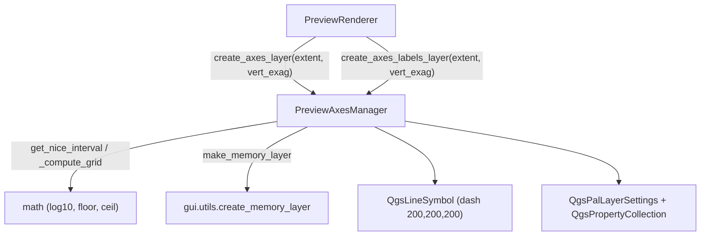

---
tags:
  - secinterp
  - code-walkthrough
  - gui
  - preview
aliases:
  - preview_axes_manager.py
  - PreviewAxesManager
cssclass: secinterp-note
---

# `gui/preview_axes_manager.py`

> [!abstract] Resumen en una línea
> Calcula intervalos "nice" (secuencia **1-2-5-10**) para la rejilla del preview y construye dos capas de memoria: líneas de ejes y puntos etiquetados para las coordenadas.

**Ruta**: `gui/preview_axes_manager.py` (204 líneas)
**Clase**: `PreviewAxesManager`
**Capa**: GUI · Preview
**Tags**: #secinterp #gui #preview

---

## 🎯 ¿Por qué existe este archivo?

La rejilla de un perfil debe ser legible a cualquier escala y con cualquier exageración vertical. Una rejilla con pasos "feos" (p. ej. 137.4 m) es ilegible; la secuencia 1-2-5-10 es la convención cartográfica.

| Problema | Solución |
|----------|----------|
| Intervalos arbitrarios según el rango de datos | `get_nice_interval()` redondea a 1/2/5/10 × 10ⁿ |
| La exageración vertical distorsiona la Y | `_compute_grid()` divide por `vert_exag` y reescala al dibujar |
| Las etiquetas deben colocarse en el lado correcto | Campo `quadrant` + `OffsetQuad` data-defined (7 = abajo, 3 = izquierda) |
| El ancho decide cuántas divisiones mostrar | Intervalos basados en `width/5` y `height/5` |

> [!important] Independiente del canvas
> El manager **no** toca el `QgsMapCanvas`: solo recibe una `extent` y devuelve capas. `PreviewRenderer` decide dónde ponerlas.

---

## 🧬 Diagrama de relaciones



---

## 📦 Imports — lectura arquitectónica

```python
import math

from qgis.core import (
    QgsFeature, QgsGeometry, QgsLineString, QgsLineSymbol,
    QgsMarkerSymbol, QgsPalLayerSettings, QgsPointXY, QgsProperty,
    QgsPropertyCollection, QgsSingleSymbolRenderer, QgsTextFormat,
    QgsVectorLayer, QgsVectorLayerSimpleLabeling,
)
from qgis.PyQt.QtGui import QColor

from sec_interp.gui.utils import create_memory_layer as make_memory_layer
```

| # | Observación |
|---|-------------|
| ① | `math` para `log10`/`floor`/`ceil`: toda la matemática de intervalos es pura. |
| ② | Se usan las clases de **simbología y etiquetado** de `qgis.core` (no hay lógica en el diálogo). |
| ③ | `make_memory_layer` reutiliza la creación de memoria + CRS del proyecto. |
| ④ | No se importa el canvas ni `QgsProject`: es puramente constructor de capas. |

---

## 🧱 `get_nice_interval()` — secuencia 1-2-5

```python
@staticmethod
def get_nice_interval(target_step: float) -> float:
    if target_step <= 0:
        return 100.0
    exponent = math.floor(math.log10(target_step))
    fraction = target_step / (10**exponent)
    THRESHOLD_QUARTER = 1.5
    THRESHOLD_HALF = 3.5
    THRESHOLD_FULL = 7.5
    if fraction < THRESHOLD_QUARTER:
        nice_fraction = 1.0
    elif fraction < THRESHOLD_HALF:
        nice_fraction = 2.0
    elif fraction < THRESHOLD_FULL:
        nice_fraction = 5.0
    else:
        nice_fraction = 10.0
    return nice_fraction * (10**exponent)
```

> [!note] Ejemplos: `137.4 → 100`, `2.7 → 2`, `6.0 → 5`, `8.1 → 10`; los umbrales 1.5 / 3.5 / 7.5 son puntos medios geométricos entre 1-2, 2-5 y 5-10. `target_step <= 0` cae al fallback `100.0`.

---

## 🧱 `_compute_grid()` — intervalos y offsets

```python
@classmethod
def _compute_grid(cls, extent, vert_exag):
    width, height = extent.width(), extent.height()
    x_interval = cls.get_nice_interval(width / 5)
    y_interval = cls.get_nice_interval((height / vert_exag) / 5)
    x_start = math.floor(extent.xMinimum() / x_interval) * x_interval
    y_min_orig = extent.yMinimum() / vert_exag
    y_max_orig = extent.yMaximum() / vert_exag
    y_start = math.floor(y_min_orig / y_interval) * y_interval
    return x_interval, y_interval, x_start, y_start, y_max_orig
```

| Retorno | Significado |
|---------|-------------|
| `x_interval` / `y_interval` | Paso "nice" en X y en Y (Y ya en unidades **originales**). |
| `x_start` / `y_start` | Origen alineado a la rejilla (`floor` al múltiplo). |
| `y_max_orig` | Máximo en Y sin exagerar; se reescala al dibujar. |

> [!important] Des-exagerar antes de calcular
> La Y se divide por `vert_exag` para elegir un intervalo legible en unidades reales; al construir las geometrías se vuelve a multiplicar. Así la rejilla sigue teniendo sentido geológico aunque la vista esté estirada.

---

## 🧱 `create_axes_layer()` — rejilla

```python
x_interval, y_interval, x_start, y_start, y_max_orig = cls._compute_grid(extent, vert_exag)
y_floor = y_start * vert_exag
y_ceil = (math.ceil(y_max_orig / y_interval) * y_interval) * vert_exag

x = x_start                                  # líneas verticales
while x <= extent.xMaximum() + 0.1:          # epsilon
    feat = QgsFeature()
    feat.setGeometry(QgsGeometry(QgsLineString([QgsPointXY(x, y_floor), QgsPointXY(x, y_ceil)])))
    features.append(feat)
    last_x = x
    x += x_interval

y = y_start                                  # líneas horizontales
while y <= y_max_orig + 0.1:
    y_draw = y * vert_exag
    ...
    y += y_interval

symbol = QgsLineSymbol.createSimple(
    {"color": "200,200,200", "width": "0.3", "line_style": "dash"}
)
layer.setRenderer(QgsSingleSymbolRenderer(symbol))
```

| Detalle | Valor |
|---------|-------|
| Capa | `make_memory_layer("LineString", "Axes")` |
| Color / grosor / estilo | `200,200,200` · `0.3` · `dash` |
| Epsilon | `+0.1` para incluir el borde superior/derecho |

---

## 🧱 `create_axes_labels_layer()` — etiquetas

```python
layer = make_memory_layer("Point?field=label:string&field=quadrant:integer", "Axes Labels")
...
feat.setAttribute("label", f"{x:.0f}"); feat.setAttribute("quadrant", 7)   # X: Below
...
feat.setAttribute("label", f"{y:.0f}"); feat.setAttribute("quadrant", 3)   # Y: Left

settings = QgsPalLayerSettings()
settings.fieldName = "label"
settings.placement = QgsPalLayerSettings.Placement.OverPoint
txt_format = QgsTextFormat(); txt_format.setColor(QColor(0, 0, 0)); txt_format.setSize(8)
settings.setFormat(txt_format)

props = QgsPropertyCollection()
props.setProperty(QgsPalLayerSettings.Property.OffsetQuad, QgsProperty.fromField("quadrant"))
props.setProperty(
    QgsPalLayerSettings.Property.LabelDistance,
    QgsProperty.fromExpression("IF(quadrant=3, 15, 8)"),
)
settings.setDataDefinedProperties(props)
settings.dist = 8.0
```

| Elemento | Rol |
|----------|-----|
| `quadrant` | 7 = etiqueta debajo (eje X); 3 = a la izquierda (eje Y) |
| `OffsetQuad` | Data-defined desde el campo `quadrant` |
| `LabelDistance` | Expresión: 15 px para Y, 8 px para X |
| `QgsMarkerSymbol.createSimple({"size": "0", ...})` | Punto invisible: solo interesa la etiqueta |

---

## 🏛️ Patrones de diseño presentes

| Patrón | Dónde | Propósito |
|--------|-------|-----------|
| **Pure function / Static utility** | `get_nice_interval()` | Matemática determinista y testeable sin QGIS |
| **Template Method** | `_compute_grid()` compartido | Evita duplicar la lógica de intervalos |
| **Data-defined properties** | `QgsPropertyCollection` | La posición depende del atributo `quadrant` |
| **Builder** | `create_axes_*` | Construyen capas complejas paso a paso |
| **Separation of concerns** | Manager sin canvas | El renderer decide la disposición |

---

## 🧾 Resumen de la API

| Símbolo | Firma | Uso típico |
|---------|-------|------------|
| `get_nice_interval(target_step)` | `@staticmethod -> float` | Redondeo 1-2-5-10 de un paso objetivo |
| `_compute_grid(extent, vert_exag)` | `@classmethod -> tuple[float, ...]` | Intervalos + origen alineado |
| `create_axes_layer(extent, vert_exag=1.0)` | `@classmethod -> QgsVectorLayer | None` | Rejilla discontinua gris |
| `create_axes_labels_layer(extent, vert_exag=1.0)` | `@classmethod -> QgsVectorLayer | None` | Puntos etiquetados con `label`/`quadrant` |

---

## 👀 Observaciones y notas

> [!success] Fortalezas
> - **Rejilla legible siempre**: la secuencia 1-2-5-10 es el estándar cartográfico.
> - **Correcta con exageración** y **API limpia**: solo `extent` + `vert_exag`, sin estado global.

> [!warning] Puntos de atención
> - El epsilon fijo `+0.1` asume unidades métricas; con grados o pies podría omitir el último borde.
> - Los bucles `while` podrían iterar de más si `x_interval` es `0` o muy pequeño.
> - `settings.dist = 8.0` es un fallback redundante frente a la propiedad data-defined.

---

## 🔗 Notas relacionadas

- [[preview_renderer]] — orquestador que usa este manager
- [[preview_layer_factory]] — capas del perfil sobre las que se dibuja la rejilla
- [[preview_state]] — destino del canvas renderizado
- [[layer_gui]] — capa GUI a la que pertenece
- [[Index]] — índice de la bóveda

---

*Nota de la bóveda SecInterp Code Walkthrough — v3.8.0*
