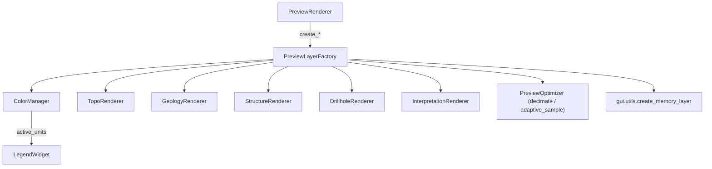

---
tags:
  - secinterp
  - code-walkthrough
  - gui
  - preview
  - factory
aliases:
  - preview_layer_factory.py
  - PreviewLayerFactory
cssclass: secinterp-note
---

# `gui/preview_layer_factory.py`

> [!abstract] Resumen en una línea
> Factory que crea **capas de memoria** temporales para el preview (topo, relleno, geología, estructuras, sondajes, interpretaciones), les asigna geometría con exageración vertical y las estiliza con renderers especializados.

**Ruta**: `gui/preview_layer_factory.py` (471 líneas)
**Clase**: `PreviewLayerFactory`
**Capa**: GUI · Preview
**Tags**: #secinterp #gui #preview #factory

---

## 🎯 ¿Por qué existe este archivo?

El preview no reutiliza capas del proyecto: construye capas efímeras en memoria y les aplica simbología. Ese trabajo es repetitivo y distinto por tipo de dato.

| Problema | Solución |
|----------|----------|
| Crear memoria layers + estilos dispersa lógica QGIS | Una factory con un método `create_*` por tipo de dato |
| El color de cada unidad debe ser **consistente** entre renders | `ColorManager` con paleta fija y hash del nombre |
| Las líneas pueden tener miles de puntos | `PreviewOptimizer.decimate` / `adaptive_sample` (LOD) |
| Los datos pueden venir como DTO o como tuplas legadas | `_extract_trace_data` / `_collect_all_segments` normalizan ambos |

> [!important] Color por unidad
> `ColorManager.GEOLOGY_COLORS` define **16 colores**. `get_color(name)` calcula `sum(ord(c) for c in name) % 16`, lo cachea en `_active_units` y devuelve el mismo color para la misma unidad en todos los renders. La propiedad `active_units` de la factory es un proxy a ese diccionario.

---

## 🧬 Diagrama de relaciones



> [!tip] Cómo leer
> La factory no conoce el canvas: solo devuelve `QgsVectorLayer`. `PreviewRenderer` decide su orden y ciclo de vida.

---

## 📦 Imports — lectura arquitectónica

```python
import math
from typing import TYPE_CHECKING, Any

from qgis.core import QgsFeature, QgsGeometry, QgsPointXY, QgsVectorLayer
from qgis.PyQt.QtGui import QColor

from sec_interp.core.domain import (
    DrillholeProjection, GeologyData, ProfileData, StructureData,
)
from sec_interp.core.domain.entities import InterpretationPolygon
from sec_interp.core.utils.geometry_utils.optimization import PreviewOptimizer
from sec_interp.gui.utils import create_memory_layer as make_memory_layer
```

| # | Observación |
|---|-------------|
| ① | `math` se usa para `radians`, `cos`, `sin` al dibujar las líneas de dip. |
| ② | Los renderers se importan **dentro de `__init__`** (lazy) para evitar ciclos; en `TYPE_CHECKING` solo para anotar. |
| ③ | `PreviewOptimizer` viene del core: la simplificación geométrica es QGIS-agnóstica. |
| ④ | `create_memory_layer` se reutiliza de `gui.utils` (asigna el CRS del proyecto). |

---

## 🧱 Topografía

```python
# create_topo_layer: un feature por par de puntos, campo elev
for i in range(len(render_data) - 1):
    p1, p2 = render_data[i], render_data[i + 1]
    line_points = self._to_qgs_points(self._apply_exaggeration([p1, p2], vert_exag))
    feat = QgsFeature(layer.fields())
    feat.setGeometry(QgsGeometry.fromPolylineXY(line_points))
    avg_elev = (p1[1] + p2[1]) / 2.0      # color por segmento
    feat.setAttribute("elev", avg_elev)
```

Un feature por par de puntos con el campo `elev` permite polychromy (degradado por elevación). El LOD usa `adaptive_sample` si `use_adaptive_sampling`, si no `decimate`.

```python
# create_topo_fill_layer: polígono "cortina" bajo el perfil
elevs = [p[1] for p in topo_data]
if base_elevation is None:
    base_elevation = min(elevs) - (max(elevs) - min(elevs)) * 0.2
```

> [!warning] Reutilización de estilo
> El fill usa `self.struct_renderer.apply_style(layer)` (comentario en el código: "Simple fill style could be here too, but for now reuse"). Es deuda técnica reconocida.

---

## 🧱 Geología, estructuras e interpretaciones

| Método | Geometría | Campo | Renderer |
|--------|-----------|-------|----------|
| `create_geol_layer(geol_data, ...)` | `LineString` por segmento (decimado) | `unit:string` | `GeologyRenderer.apply_style(unique_units=...)` |
| `create_struct_layer(struct_data, reference_data, ...)` | `LineString` de dip | — | `StructureRenderer` |
| `create_interp_layer(interp_data, ...)` | `Polygon` cerrado | `id:string`, `name:string` | `InterpretationRenderer.apply_style(interp_data=...)` |

```python
# Longitud de las líneas de dip
if dip_line_length is not None and dip_line_length > 0:
    line_length = dip_line_length
else:
    e_range = max(elevs) - min(elevs) if reference_data else 100
    line_length = e_range * 0.1

rad_dip = math.radians(abs(app_dip))
dx = line_length * math.cos(rad_dip)
dy = line_length * math.sin(rad_dip)
if app_dip < 0:
    dx = -dx
```

```python
# create_interp_layer: cierre obligatorio del anillo
MIN_POLYGON_POINTS = 3
points = [QgsPointXY(x, y * vert_exag) for x, y in interp.vertices_2d]
if points[0] != points[-1]:
    points.append(points[0])
```

---

## 🧱 Sondajes

| Método | Rol |
|--------|-----|
| `create_drillhole_trace_layer(data, exag)` | Traza del pozo (`field=hole_id:string`) |
| `create_drillhole_interval_layer(data, exag)` | Intervalos por unidad (`field=unit:string`) |
| `_extract_trace_data(hole_data)` | Soporta `DrillholeProjection` o tupla `(id, points)` |
| `_create_trace_feature(...)` | `MIN_TRACE_POINTS = 2`; lee `dist_along`/`z` con `getattr` |
| `_collect_all_segments(data)` | `MIN_HOLE_DATA_FOR_SEGMENTS = 3`; acepta DTO o lista |
| `_create_interval_features(...)` | `MIN_SEGMENT_POINTS = 2`; acumula `unique_units` |

```python
dist = getattr(p, "dist_along", p[0] if isinstance(p, list | tuple) else 0.0)
z = getattr(p, "z", p[1] if isinstance(p, list | tuple) else 0.0)
```

> [!tip] Tolerancia a formatos
> La factory normaliza DTOs nuevos y tuplas legadas en el mismo camino de render, sin romper tests ni flujos antiguos.

---

## 🏛️ Patrones de diseño presentes

| Patrón | Dónde | Propósito |
|--------|-------|-----------|
| **Factory Method** | `create_*_layer()` | Una construcción por tipo de dato |
| **Strategy** | `decimate` vs `adaptive_sample` | LOD según el modo elegido |
| **Lazy initialization** | imports dentro de `__init__` | Rompe ciclos de importación |
| **Compatibility shim** | `_extract_trace_data`, `_collect_all_segments` | Aceptan DTO y tuplas |

---

## 🧾 Resumen de la API

| Símbolo | Firma | Uso típico |
|---------|-------|------------|
| `active_units` | `@property` / `@setter` | Proxy a `ColorManager._active_units`; la leyenda lo lee |
| `get_color_for_unit(name)` | `-> QColor` | Color determinista por unidad |
| `create_memory_layer(geometry_type, name, fields=None)` | `-> (QgsVectorLayer | None, provider)` | Helper común |
| `create_topo_layer` / `create_topo_fill_layer` | `-> QgsVectorLayer | None` | Perfil y cortina |
| `create_geol_layer` / `create_struct_layer` | `-> QgsVectorLayer | None` | Geología y dips |
| `create_drillhole_trace_layer` / `create_drillhole_interval_layer` | `-> QgsVectorLayer | None` | Sondajes |
| `create_interp_layer` | `-> QgsVectorLayer | None` | Polígonos de interpretación |

---

## 👀 Observaciones y notas

> [!success] Fortalezas
> - **Color consistente**: hash de nombre + paleta fija garantiza que una unidad no cambie de color.
> - **LOD en dos modos** y **defensivo**: constantes `MIN_*` evitan geometrías degeneradas; devuelve `None` en vez de lanzar.

> [!warning] Puntos de atención
> - El fill topográfico reutiliza `struct_renderer.apply_style`: si el estilo de estructuras cambia, la cortina se ve afectada.
> - `active_units` setter **solo** resetea si el valor es falsy; un dict no vacío no hace nada.
> - `ColorManager` usa `QColor` de Qt; la factory no es testeable en `tests/core/`.

> [!question] Preguntas abiertas
> - ¿Debería `create_topo_fill_layer` tener su propio renderer de relleno?

---

## 🔗 Notas relacionadas

- [[preview_renderer]] — orquestador que consume esta factory
- [[renderers]] — `TopoRenderer`, `GeologyRenderer`, `StructureRenderer`, `DrillholeRenderer`, `InterpretationRenderer`
- [[preview_axes_manager]] — otro componente especializado del preview
- [[preview_state]] — destino de las capas resultantes (`RenderState`)
- [[layer_gui_renderers]] — capa de renderers GUI
- [[Index]] — índice de la bóveda

---

*Nota de la bóveda SecInterp Code Walkthrough — v3.8.0*
