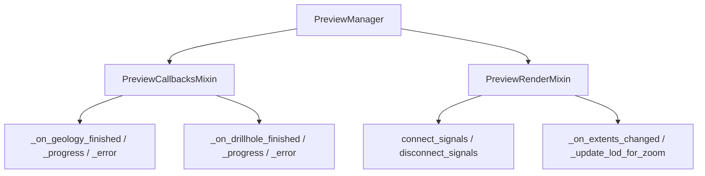

---
tags:
  - secinterp
  - code-walkthrough
  - gui
  - preview-manager
  - mixins
aliases:
  - preview_callbacks_mixin.py
  - preview_render_mixin.py
  - PreviewManager
cssclass: secinterp-note
---

# `gui/dialog_preview_manager.py` — mixins

> [!abstract] Resumen en una línea
> El antiguo `dialog_preview_manager.py` de 435 líneas se descompuso (2026-09-20); `PreviewManager` conserva 231 líneas con `generate_preview`, `_process_preview_data`, `_handle_geometric_changes` y `_update_crs_label`.

**Ruta**: `gui/dialog_preview_manager.py` (231 líneas) + `gui/preview_callbacks_mixin.py` (119), `gui/preview_render_mixin.py` (109)
**Clase**: `PreviewManager(TranslatableMixin, PreviewCallbacksMixin, PreviewRenderMixin)`
**Capa**: GUI · Managers
**Tags**: #secinterp #gui #preview-manager #mixins

---

## 🎯 ¿Por qué existe este archivo?

| Problema | Solución |
|----------|----------|
| Un archivo de 435 líneas con callbacks async, render y LOD | Dos mixins + la orquestación central |
| Señales conectadas lejos de sus slots | `connect_signals`/`disconnect_signals` viven junto a sus slots |
| Re-render por zoom con spam | Debounce con `QTimer` en el mixin de render |

> [!important] Regla qgis-analyzer
> El cableado de señales permanece en el mismo módulo que sus slots (`PreviewRenderMixin`), satisfaciendo las reglas de signal-leak/missing-slot por archivo.

---

## 🧬 Diagrama de relaciones

---

## 🧱 `PreviewCallbacksMixin` — callbacks async

| Método | Rol |
|--------|-----|
| `_on_geology_finished` | Guarda `cached_data["geol"]`, re-render y `orchestrator.remove_task` |
| `_on_geology_progress` / `_on_geology_error` | Texto de progreso / `ProcessingError` vía `handle_error` |
| `_on_drillhole_finished` / `_progress` / `_error` | Equivalentes para sondajes (desempaqueta tupla) |
| `_update_results_display` | Reconstruye `PreviewResult` y formatea con `PreviewReporter` |
| `_get_buffer_distance` | `page_section.buffer_spin.value()` |

---

## 🧱 `PreviewRenderMixin` — render y LOD

| Método | Rol |
|--------|-----|
| `connect_signals` / `disconnect_signals` | Conecta `debounce_timer.timeout` y `canvas.extentsChanged` (idempotente) |
| `_run_render_pipeline` | Valida `plugin_instance` y cronometra el render |
| `_render_cached_data` | Re-render con opciones actuales; `preserve_extent` evita mover el canvas |
| `update_from_checkboxes` | Re-render si hay `last_result` |
| `_on_extents_changed` / `_update_lod_for_zoom` | Arranca el `QTimer` y re-renderiza con `preserve_extent=True` |

---

## 🏛️ Patrones de diseño presentes

| Patrón | Dónde | Propósito |
|--------|-------|-----------|
| **Mixin composition** | Dos bases | Separar callbacks de render |
| **Observer** | Señales Qt (`extentsChanged`) | Reaccionar al zoom |
| **Debounce** | `QTimer` + `ZOOM_DEBOUNCE_MS` | LOD sin spam |
| **Cache** | `PreviewCache` compartida | Evitar recomputar |

---

## 👀 Observaciones y notas

> [!success] Fortalezas
> - Manager de 435 → 231 líneas; señales junto a sus slots.
> - Debounce y caché mantienen el render fluido.

> [!warning] Puntos de atención
> - Los callbacks dependen de `self.orchestrator` y `self.cached_data` del manager.
> - `_update_results_display` y `_update_ui_state` duplican el formateo de mensajes.

---

## 🔗 Notas relacionadas

- [[Index]] — índice de la bóveda
- [[dialog_preview_manager]] — la clase que compone los mixins
- [[preview_state]] — `PreviewCache` compartida
- [[preview_renderer]] — render de bajo nivel
- [[main_dialog]] — crea el manager

---

*Nota de la bóveda SecInterp Code Walkthrough — v3.8.0*
