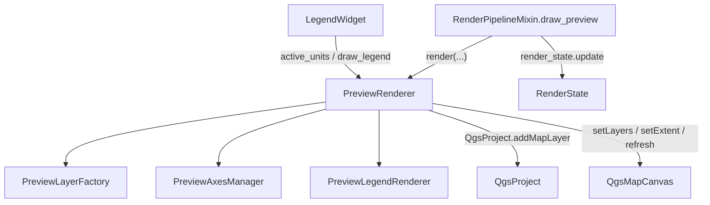

---
tags:
  - secinterp
  - code-walkthrough
  - gui
  - preview
  - renderer
aliases:
  - preview_renderer.py
  - PreviewRenderer
cssclass: secinterp-note
---

# `gui/preview_renderer.py`

> [!abstract] Resumen en una línea
> Orquestador del render del preview: limpia capas previas, pide las capas a `PreviewLayerFactory`, añade ejes/etiquetas, las registra en el proyecto y configura el `QgsMapCanvas`.

**Ruta**: `gui/preview_renderer.py` (306 líneas)
**Clase**: `PreviewRenderer`
**Capa**: GUI · Preview
**Tags**: #secinterp #gui #preview #renderer

---

## 🎯 ¿Por qué existe este archivo?

Renderizar el preview mezcla creación de capas, extensión, ejes, leyenda y el ciclo de vida de objetos C++ de QGIS. Sin un orquestador, esa lógica acabaría en el diálogo.

| Problema | Solución |
|----------|----------|
| La creación de capas es variada y compleja | Delega en `PreviewLayerFactory` |
| Los ejes/rejilla tienen su propia matemática | Delega en `PreviewAxesManager` |
| La leyenda necesita un `QPainter` | Delega en `PreviewLegendRenderer` |
| Reentradas de render (zoom + checkbox) causan crashes | Guard `is_rendering` |
| Las capas transitorias deben liberarse | `_cleanup_layers()` + `_cleanup_rubber_bands()` |

> [!important] Capas en el proyecto (QGIS 4)
> El código comenta que en QGIS 4 las capas deben estar en un `QgsProject` para renderizarse de forma fiable. Por eso se registran con `addMapLayer(layer, False)` (sin leyenda) y se eliminan al inicio del siguiente render.

---

## 🧬 Diagrama de relaciones



> [!tip] Cómo leer
> `PreviewRenderer` es la única clase que toca `QgsProject` y el canvas; los componentes especializados no conocen el canvas.

---

## 📦 Imports — lectura arquitectónica

```python
import contextlib
from typing import Any

from qgis.core import QgsProject, QgsWkbTypes
from qgis.gui import QgsMapCanvas
from qgis.PyQt.QtCore import QRectF
from qgis.PyQt.QtGui import QPainter

from sec_interp.core.domain import (
    GeologyData, InterpretationPolygon, ProfileData, StructureData,
)
from .preview_axes_manager import PreviewAxesManager
from .preview_layer_factory import PreviewLayerFactory
from .preview_legend_renderer import PreviewLegendRenderer
```

| # | Observación |
|---|-------------|
| ① | Importa los **DTOs de dominio** solo para anotar tipos; no procesa negocio. |
| ② | `QgsWkbTypes` se usa en `_cleanup_rubber_bands` para resetear el rubber band a polígono. |
| ③ | `contextlib.suppress` protege `extent.scale(1.1)` de extensiones parciales. |
| ④ | Los tres componentes especializados viven en el mismo paquete `gui/`. |

---

## 🧱 `render()` — el método central

```python
def render(self, topo_data: ProfileData, geol_data=None, struct_data=None,
           vert_exag: float = 1.0, dip_line_length: float | None = None,
           max_points: int = 1000, preserve_extent: bool = False,
           use_adaptive_sampling: bool = False, drillhole_data: list | None = None,
           interp_data: list[InterpretationPolygon] | None = None,
           ) -> tuple[QgsMapCanvas | None, list]:
```

### Secuencia del pipeline

| Paso | Acción | Código clave |
|:----:|--------|--------------|
| 0 | **Guard de reentrada** | `if self.is_rendering: return None, []` |
| 1 | Limpia capas y flags | `self._cleanup_layers(); self.has_topography = False` |
| 2 | Recoge capas de datos | `data_layers = self._collect_data_layers(...)` |
| 3 | Sin capas → salir | `if not data_layers: return None, []` |
| 4 | Ejes y etiquetas | `extent = self._calculate_extent(...)` |
| 5 | Ordena y registra | `layers = [labels_layer, *data_layers, axes_layer]` |
| 6 | Configura el canvas | `self._setup_canvas(layers, extent, preserve_extent)` |

```python
try:
    self.is_rendering = True
    ...
    return self.canvas, layers
finally:
    self.is_rendering = False       # el lock SIEMPRE se libera
```

> [!note] Orden Z
> La lista final es `[labels, *datos, axes]`. Dentro de `_collect_data_layers` el orden es `[struct, geol, topo, topo_fill, *drill, interp]`.

---

## 🧱 `_collect_data_layers()` — composición

```python
topo_layer = self.layer_factory.create_topo_layer(topo_data, vert_exag, max_points, use_adaptive)
if topo_layer:
    self.has_topography = True
topo_fill = self.layer_factory.create_topo_fill_layer(topo_data, vert_exag, max_points)
geol_layer = self.layer_factory.create_geol_layer(geol_data, vert_exag, max_points)
struct_layer = self._add_struct_layer(struct_data, topo_data, geol_data, vert_exag, dip_len)
drill_layers = self._add_drillhole_layers(drill_data, vert_exag)
interp_layer = self.layer_factory.create_interp_layer(interp_data, vert_exag)
```

`_add_struct_layer` elige la **referencia de elevación**: la topografía si existe; si no, aplana los puntos de geología. Esto alimenta la longitud de las líneas de dip.

---

## 🧱 `_setup_canvas()` y limpieza

```python
if not self.canvas or not extent:
    return
self.canvas.setLayers(layers)
if not preserve_extent:
    padded_extent = extent
    with contextlib.suppress(AttributeError, TypeError, RuntimeError):
        padded_extent.scale(1.1)          # 10% de margen
    self.canvas.setExtent(padded_extent)
self.canvas.refresh()
if self.canvas.scene():
    self.canvas.scene().update()          # repaint forzado en Qt6
```

| Método | Rol |
|--------|-----|
| `_cleanup_layers(layers=None)` | `removeMapLayers(valid_ids)`, resetea `active_units` y rubber bands |
| `_get_valid_layer_ids(layers)` | Filtra objetos C++ muertos (`RuntimeError`/`AttributeError`) |
| `_cleanup_rubber_bands()` | `hide()`, `reset(PolygonGeometry)`, `scene.removeItem(rb)` |
| `_calculate_extent(layers)` | `combineExtentWith` de todas las capas |

> [!warning] Memoria C++
> `_cleanup_rubber_bands` es defensivo a propósito: resetear y quitar del `scene` libera objetos C++ que, de otro modo, provocan fugas o segfaults.

---

## 🏛️ Patrones de diseño presentes

| Patrón | Dónde | Propósito |
|--------|-------|-----------|
| **Facade / Orchestrator** | `render()` | Coordina factory, ejes, leyenda y canvas |
| **Delegation** | `layer_factory`, `axes_manager`, `legend_renderer` | Cada componente hace una sola cosa |
| **Re-entrancy guard** | `is_rendering` + `try/finally` | Evita renders solapados (zoom + checkbox) |
| **Property proxy** | `active_units` | Expone el estado del factory a la leyenda |
| **Graceful degradation** | `contextlib.suppress`, `_get_valid_layer_ids` | Tolera objetos QGIS parciales o muertos |

---

## 🧾 Resumen de la API

| Símbolo | Firma | Uso típico |
|---------|-------|------------|
| `PreviewRenderer(canvas=None)` | `__init__` | Creado por el plugin con el canvas del diálogo |
| `active_units` | `@property -> dict[str, Any]` | Lo consume `LegendWidget` |
| `render(...)` | `-> tuple[QgsMapCanvas | None, list]` | Punto de entrada del render |
| `draw_legend(painter, rect)` | `-> None` | Delega en `PreviewLegendRenderer` |
| `_collect_data_layers(...)` | `-> list` | Crea y ordena capas de datos |
| `_setup_canvas(layers, extent, preserve_extent)` | `-> None` | Configura capas y extensión del canvas |
| `_cleanup_layers(layers=None)` | `-> None` | Libera capas y rubber bands |

---

## 👀 Observaciones y notas

> [!success] Fortalezas
> - **Anti-reentrada**: el lock `is_rendering` con `finally` evita renders concurrentes y crashes.
> - **Sin fugas**: limpieza defensiva de capas y rubber bands.
> - **Delegación limpia**: no sabe cómo se estiliza cada capa.

> [!warning] Puntos de atención
> - El docstring menciona `PreviewOptimizer`, pero el renderer no lo importa: vive en `PreviewLayerFactory`.
> - `is_rendering` es un booleano simple; no es thread-safe si el render se invocara desde un hilo.

---

## 🔗 Notas relacionadas

- [[preview_layer_factory]] — crea y estiliza las capas de datos
- [[preview_axes_manager]] — rejilla y etiquetas de ejes
- [[preview_state]] — `RenderState` guarda el `canvas`/`layers` resultantes
- [[renderers]] — renderers de capa que aplica la factory
- [[preview_mixins]] — `PreviewRenderMixin` llama a `draw_preview`
- [[Index]] — índice de la bóveda

---

*Nota de la bóveda SecInterp Code Walkthrough — v3.8.0*
