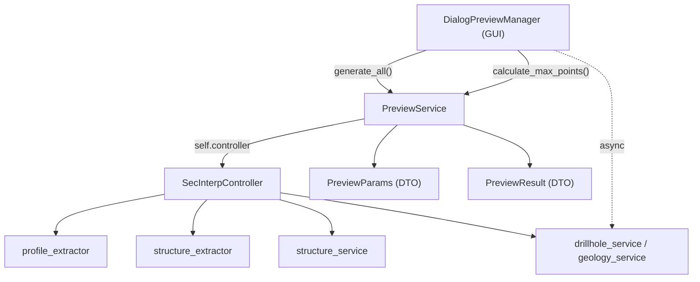

---
tags:
  - secinterp
  - code-walkthrough
  - core
  - preview-service
aliases:
  - preview_service.py
  - PreviewService
cssclass: secinterp-note
---

# `core/services/preview_service.py`

> [!abstract] Resumen en una línea
> Orquesta la **generación síncrona** del preview (topografía + estructuras) desde el controller, calcula el **LOD** del canvas y expone los servicios para las tareas asíncronas de geología/sondajes.

**Ruta**: `core/services/preview_service.py` (175 líneas)
**Clase**: `PreviewService`
**Capa**: Core · Services (QGIS-agnóstico)
**Tags**: #secinterp #core #preview-service

---

## 🎯 ¿Por qué existe este archivo?

El `DialogPreviewManager` (GUI) no debe conocer `profile_extractor`, `structure_extractor` ni `structure_service`. Necesita **una sola puerta** que devuelva un `PreviewResult` con métricas.

| Problema | Solución |
|----------|----------|
| La GUI encadenaría 3–4 servicios y construiría el DTO | `generate_all(params, transform_context)` hace el pipeline y devuelve `PreviewResult` |
| El número de puntos debe adaptarse al canvas y al zoom | `calculate_max_points()` (píxeles + boost `log10(ratio)`) |
| Geología y sondajes tardan y no deben bloquear la UI | Solo genera topo + estructuras; el resto se lanza async |

> [!important] Frontera Core
> 100 % QGIS-agnóstico: recibe `PreviewParams` (DTO) y un `transform_context` opaco. No importa nada de `qgis.*`.

---

## 🧬 Diagrama de relaciones



> [!tip] Cómo leer
> Flecha sólida = llamada/import; punteada = uso asíncrono. `PreviewService` es la única puerta del core al pipeline.

---

## 📦 Imports — lectura arquitectónica

```python
import math
from typing import Any

from sec_interp.core.domain import PreviewParams, PreviewResult
from sec_interp.core.exceptions import ProcessingError
from sec_interp.core.performance_metrics import PerformanceTimer
from sec_interp.logger_config import get_logger
```

| # | Observación |
|---|-------------|
| ① | `math` solo para `log10(ratio)` en el boost de LOD. |
| ② | `PreviewParams` / `PreviewResult` son el contrato tipado de entrada/salida. |
| ③ | `ProcessingError` se lanza si faltan capas obligatorias de topografía. |
| ④ | `PerformanceTimer` mide cada paso y acumula en `result.metrics`. |
| ⑤ | **Cero imports de QGIS** → testeable con mocks puros. |

---

## 🧱 `calculate_max_points()` — LOD adaptativo

```python
@staticmethod
def calculate_max_points(canvas_width, manual_max=1000, auto_lod=True, ratio=1.0) -> int:
    if auto_lod:
        base_points = max(200, int(canvas_width * 2))
        ZOOM_DETAIL_BOOST_THRESHOLD = 1.1
        if ratio > ZOOM_DETAIL_BOOST_THRESHOLD:
            detail_boost = 1.0 + (math.log10(ratio) * 0.5)
            return int(base_points * detail_boost)
        return base_points
    return manual_max
```

| Parámetro | Rol |
|-----------|-----|
| `canvas_width` | Ancho en píxeles; la base es `2×` (calidad retina). |
| `manual_max` | Techo del usuario; **solo si `auto_lod=False`**. |
| `ratio` | `full_extent / current_extent`; si `> 1.1` aplica `1 + log10(ratio)·0.5`. |
| **Retorno** | Mínimo 200 puntos para no degenerar la línea. |

> [!note] El umbral `1.1` evita recalcular por micro-zooms; `log10` hace el boost lento y acotado.

---

## 🧱 `generate_all()` — el pipeline síncrono

```python
def generate_all(self, params: PreviewParams, transform_context: Any) -> PreviewResult:
    params.validate()                                    # validación nativa del DTO
    result = PreviewResult(buffer_dist=params.buffer_dist)
    self.transform_context = transform_context
    self._generate_topography_step(params, result)       # Paso 1
    self._generate_structures_step(params, result)       # Paso 2
    return result
```

### Paso 1 — `_generate_topography_step()`

```python
with PerformanceTimer("Topography Generation", result.metrics):
    if not line_lyr or not raster_lyr:
        raise ProcessingError("Required layers for topography are missing.")
    interval = None
    if params.auto_lod:
        interval = self.controller.profile_extractor.calculate_lod_interval(
            line_lyr, params.canvas_width
        )
    result.topo = self.controller.profile_extractor.extract_profile(
        line_lyr, raster_lyr, params.band_num, interval=interval,
    )
    if result.topo:
        result.metrics.record_count("Topography Points", len(result.topo))
```

### Paso 2 — `_generate_structures_step()`

Solo si hay `struct_layer`, `dip_field` y `strike_field`. Extrae el contexto y proyecta con un **sampler** (closure sobre el raster):

```python
ctx = extractor.extract_section_and_structures(
    params.line_layer, struct_lyr, params.buffer_dist
)
if ctx is None:
    return

def elevation_sampler(x, y):
    return extractor.sample_elevation(raster_lyr, x, y, params.band_num)

result.struct = self.controller.structure_service.project_structures(
    line_points=ctx.line_points, struct_data=ctx.structures,
    elevation_sampler=elevation_sampler, line_az=ctx.line_azimuth,
    dip_field=params.dip_field, strike_field=params.strike_field,
)
```

> [!warning] La geología **no** se genera aquí
> `generate_all()` solo cubre topografía y estructuras. Geología y sondajes se lanzan como `QgsTask` desde `DialogPreviewManager._trigger_async_updates()`.

---

## 🏛️ Patrones de diseño presentes

| Patrón | Dónde | Propósito |
|--------|-------|-----------|
| **Facade / Orchestrator** | `generate_all()` | Una llamada sobre 3 servicios |
| **Template Method** | `_generate_*_step` | Separar fases y aislar errores |
| **Strategy / Callback** | `elevation_sampler` | Inyecta el muestreo sin acoplar |
| **DTO** | `PreviewParams` / `PreviewResult` | Frontera tipada GUI ↔ Core |

---

## 🧾 Resumen de la API

| Símbolo | Firma | Uso típico |
|---------|-------|------------|
| `PreviewService(controller)` | `__init__` | Construido en `main_dialog` |
| `drillhole_service` / `geology_service` / `structure_service` | `@property` | Consumidos por `PreviewTaskOrchestrator` |
| `calculate_max_points(...)` | `@staticmethod -> int` | LOD del canvas (`PreviewRenderMixin`) |
| `generate_all(params, transform_context)` | `-> PreviewResult` | Pipeline síncrono completo |
| `_generate_topography_step` / `_generate_structures_step` | `-> None` | Fases privadas |

---

## 👀 Observaciones y notas

> [!success] Fortalezas
> - **Cero QGIS**: testeable con `MagicMock` (`tests/core/test_preview_service.py`).
> - **Métricas integradas** y **LOD barato** (fórmula cerrada, sin estado).

> [!warning] Puntos de atención
> - `self.transform_context` se guarda pero **no se usa** (residuo de la migración CRS).
> - `_generate_structures_step` tiene tres `return` silenciosos sin aviso al usuario.

---

## 🔗 Notas relacionadas

- [[controller]] — provee extractores y servicios
- [[domain]] — define `PreviewParams` / `PreviewResult`
- [[preview_renderer]] — consume el `PreviewResult`
- [[dialog_preview_manager]] — llama a `generate_all()` y lanza las tareas async
- [[tasks]] — geología y sondajes asíncronos
- [[Index]] — índice de la bóveda

---

*Nota de la bóveda SecInterp Code Walkthrough — v3.8.0*
