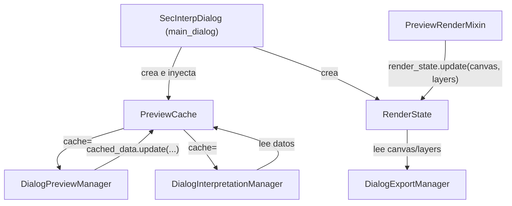

---
tags:
  - secinterp
  - code-walkthrough
  - gui
  - preview
aliases:
  - preview_state.py
  - PreviewCache
  - RenderState
cssclass: secinterp-note
---

# `gui/preview_state.py`

> [!abstract] Resumen en una línea
> Dos contenedores mutables **compartidos por inyección** entre los managers del diálogo: `PreviewCache` (datos `topo/geol/struct/drillhole`) y `RenderState` (canvas + capas renderizadas).

**Ruta**: `gui/preview_state.py` (57 líneas)
**Clases**: `PreviewCache`, `RenderState`
**Capa**: GUI · Estado compartido
**Tags**: #secinterp #gui #preview

---

## 🎯 ¿Por qué existe este archivo?

Antes, `PreviewManager`, `InterpretationManager` y `ExportManager` se pasaban el diálogo entero y leían atributos sueltos (`current_canvas`, `current_layers`), creando acoplamiento circular y estado disperso.

| Problema | Solución |
|----------|----------|
| `InterpretationManager` necesitaba los datos que generó `PreviewManager` | `PreviewCache` inyectado en ambos: ninguno alcanza al otro |
| El export dependía de atributos sueltos del diálogo | `RenderState` es la **fuente de verdad** de `canvas` + `layers` |
| Las claves del caché se escribían como strings sueltos y divergían | `_CACHE_KEYS` centraliza el contrato |

> [!important] Objeto compartido, no Singleton
> El `main_dialog` crea **una instancia** de cada clase y la inyecta por constructor. El estado queda por-diálogo y es fácil de testear.

---

## 🧬 Diagrama de relaciones



> [!tip] Cómo leer
> `PreviewCache` conecta a los dos managers sin que se conozcan; `RenderState` conecta el pipeline de render con el exportador.

---

## 📦 Imports — lectura arquitectónica

```python
from __future__ import annotations

from typing import Any

_CACHE_KEYS = ("topo", "geol", "struct", "drillhole")
```

| # | Observación |
|---|-------------|
| ① | Sin imports de `qgis`: es un módulo de **estado puro** (aunque vive en `gui/`). |
| ② | `Any` desacopla el contenedor de los DTOs de dominio (`ProfileData`, `GeologyData`...). |
| ③ | `_CACHE_KEYS` es la única definición del contrato de claves. |

---

## 🧱 `PreviewCache` — datos generados

```python
class PreviewCache:
    def __init__(self) -> None:
        self._data: dict[str, Any] = dict.fromkeys(_CACHE_KEYS)

    def get(self, key: str, default: Any = None) -> Any:
        return self._data.get(key, default)

    def update(self, other: dict[str, Any] | None = None, **kwargs: Any) -> None:
        if other:
            self._data.update(other)
        if kwargs:
            self._data.update(kwargs)

    def __getitem__(self, key: str) -> Any: ...
    def __setitem__(self, key: str, value: Any) -> None: ...
```

| Miembro | Comportamiento |
|---------|----------------|
| `__init__` | `dict.fromkeys(_CACHE_KEYS)` → las 4 claves existen con valor `None`. |
| `get(key, default)` | Acceso seguro sin `KeyError`. |
| `update(other, **kwargs)` | Acepta a la vez un mapping y kwargs (estilo `dict.update`). |
| `__getitem__` / `__setitem__` | Permite `cache["topo"]` además de `cache.get("topo")`. |

> [!note] Uso real
> `DialogPreviewManager._update_cache_and_metrics()` vuelca `result.topo/geol/struct/drillhole`; `PreviewRenderMixin` los lee con `self.cached_data["topo"]`.

---

## 🧱 `RenderState` — salida del render

```python
class RenderState:
    def __init__(self) -> None:
        self.canvas: Any = None
        self.layers: list = []

    def update(self, canvas: Any, layers: list) -> None:
        self.canvas = canvas
        self.layers = layers
```

| Miembro | Comportamiento |
|---------|----------------|
| `canvas` | `QgsMapCanvas` del preview (o `None` si aún no se renderizó). |
| `layers` | Lista de capas transitorias en orden Z. |
| `update(canvas, layers)` | Sobrescribe ambos de forma atómica. |

> [!warning] Escritura única
> Lo escribe `RenderPipelineMixin.draw_preview()` tras `preview_renderer.render()`; `DialogExportManager` lo lee en `dialog_export_manager.py:52` (`render_state.canvas`), `:58` (`.layers()`) y `:122` (`.extent()`).

---

## 🏛️ Patrones de diseño presentes

| Patrón | Dónde | Propósito |
|--------|-------|-----------|
| **Shared State / Blackboard** | `PreviewCache` | Coordinar managers sin acoplamiento directo |
| **Value holder / State object** | `RenderState` | Sustituir atributos sueltos por un objeto con contrato |
| **Dependency Injection** | constructores `cache=` | El diálogo decide la instancia |
| **DTO / Typed mapping** | `_CACHE_KEYS` + `dict[str, Any]` | Contrato de claves explícito |

---

## 🧾 Resumen de la API

| Símbolo | Firma | Uso típico |
|---------|-------|------------|
| `_CACHE_KEYS` | `tuple[str, ...]` | `("topo", "geol", "struct", "drillhole")` |
| `PreviewCache()` | `__init__` | Creado en `main_dialog._init_managers` |
| `PreviewCache.get(key, default=None)` | `-> Any` | Lectura segura en el render mixin |
| `PreviewCache.update(other=None, **kwargs)` | `-> None` | Volcado del `PreviewResult` |
| `RenderState()` | `__init__` | Creado en `main_dialog` |
| `RenderState.update(canvas, layers)` | `-> None` | Escrito por `draw_preview` |

---

## 👀 Observaciones y notas

> [!success] Fortalezas
> - **Bajo acoplamiento**: los managers comparten datos sin referenciarse mutuamente.
> - **Contrato explícito** (`_CACHE_KEYS`) y **testeable** sin QGIS.

> [!warning] Puntos de atención
> - `PreviewCache` no valida la clave: `cache["foo"]` crea la entrada sin error.
> - `RenderState.layers` es una lista mutable expuesta; no hay notificación/observador.

---

## 🔗 Notas relacionadas

- [[main_dialog]] — crea e inyecta ambas instancias
- [[dialog_preview_manager]] — escribe `PreviewCache`
- [[dialog_export_manager]] — lee `RenderState` para exportar
- [[preview_renderer]] — produce el `canvas`/`layers` que guarda `RenderState`
- [[preview_mixins]] — `PreviewRenderMixin` vuelca el resultado en `RenderState`
- [[Index]] — índice de la bóveda

---

*Nota de la bóveda SecInterp Code Walkthrough — v3.8.0*
