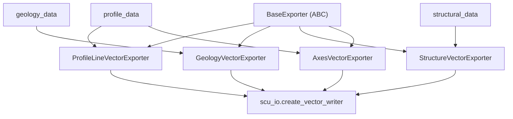

---
tags:
  - secinterp
  - code-walkthrough
  - exporters
  - profile
aliases:
  - profile_exporters.py
  - ProfileLineVectorExporter
cssclass: secinterp-note
---

# `exporters/profile_exporters.py`

> [!abstract] Resumen en una línea
> Fachada de **cuatro exporters vectoriales del perfil** — línea topográfica, geología, estructuras (con geometría de buzamiento) y ejes — que comparten `BaseExporter` y escriben SHP/GPKG/DXF vía `scu_io.create_vector_writer`.

**Ruta**: `exporters/profile_exporters.py` (362 líneas)
**Clases**: `ProfileLineVectorExporter`, `GeologyVectorExporter`, `StructureVectorExporter`, `AxesVectorExporter`
**Capa**: Exporters (QGIS · Estrategias de formato)
**Tags**: #secinterp #exporters #profile

---

## 🎯 ¿Por qué existe este archivo?

Todo lo que se dibuja en el perfil (topografía, geología, buzamientos, ejes) necesita salir a disco como vectores. Este módulo concentra esa responsabilidad en cuatro estrategias especializadas.

| Problema | Solución |
|----------|----------|
| La línea `(dist, elev)` no es un feature cualquiera | `ProfileLineVectorExporter` → `LineString` con campo `id` |
| La geología son segmentos con atributos heterogéneos | `GeologyVectorExporter` infiere campos del primer segmento |
| Las estructuras no son un punto: hay que dibujar el buzamiento | `StructureVectorExporter` calcula la geometría del dip |
| Los ejes del gráfico deben ser reproducibles | `AxesVectorExporter` genera Left/Right/Bottom con 5% de relleno |

> [!important] Frontera arquitectónica
> `exporters/` **sí depende de QGIS** (`QgsGeometry`, `QgsPointXY`, `QgsFields`). No es core puro: materializa en disco los DTOs que vienen de `core`.

---

## 🧬 Diagrama de relaciones



---

## 📦 Imports — lectura arquitectónica

`math` solo para el buzamiento; `QgsGeometry`/`QgsPointXY` construyen la geometría 2D; `scu_io` resuelve el driver por extensión; no se importa `QgsWkbTypes` porque `fromPolylineXY` ya fija `LineString`. Única constante: `MIN_REQUIRED_POINTS = 2`.

---

## 🧱 `ProfileLineVectorExporter` — la línea topográfica

```python
points = [QgsPointXY(d, e) for d, e in profile_data]
geom = QgsGeometry.fromPolylineXY(points)
fields = QgsFields()
fields.append(QgsField("id", QMetaType.Type.Int))
writer = scu_io.create_vector_writer(str(output_path), crs, fields, layer_name=layer_name)
feat = QgsFeature()
feat.setGeometry(geom)
feat.setAttributes([1])
writer.addFeature(feat)
```

| Aspecto | Detalle |
|---------|---------|
| Entrada | `data["profile_data"]` + `data["crs"]` |
| Geometría | `LineString` desde `(distancia, elevación)` |
| Salida | **Un solo feature** con `id = 1` |

---

## 🧱 `GeologyVectorExporter` — segmentos con atributos

Los campos se infieren del **primer** segmento (todos `QString`); cada segmento se descarta si tiene menos de 2 puntos:

```python
for key in geology_data[0].attributes:
    fields.append(QgsField(key, QMetaType.Type.QString))

def _create_geology_feature(self, segment, fields):
    if len(segment.points) < MIN_REQUIRED_POINTS:
        return None
    geom = QgsGeometry.fromPolylineXY([QgsPointXY(d, e) for d, e in segment.points])
    feat = QgsFeature(fields)
    feat.setGeometry(geom)
    for key, val in segment.attributes.items():
        idx = fields.indexOf(key)
        if idx >= 0:
            feat.setAttribute(idx, val)
    return feat
```

> [!note] Segmentos como líneas
> A pesar del nombre, el segmento se exporta como `LineString` (no polígono). La geometría viene de `segment.points`, ya en coordenadas de perfil.

---

## 🧱 `StructureVectorExporter` — dibujar el buzamiento

Añade tres campos calculados (`app_dip`, `dist`, `elev`, `Double`) y construye la línea del dip:

```python
def _calculate_dip_geometry(self, m: Any, line_length: float) -> QgsGeometry:
    rad_dip = math.radians(m.apparent_dip)
    dy = -line_length * math.sin(abs(rad_dip))
    dx = line_length * math.cos(abs(rad_dip))
    if m.apparent_dip < 0:
        dx = -dx
    p1 = QgsPointXY(m.distance, m.elevation)
    p2 = QgsPointXY(m.distance + dx, m.elevation + dy)
    return QgsGeometry.fromPolylineXY([p1, p2])
```

`line_length = raster_res * dip_scale_factor` (defaults `1.0` y `4`). `dy` es siempre negativo (el dip "cae") y `dx` invierte su signo si `apparent_dip < 0`.

---

## 🧱 `AxesVectorExporter` — los ejes del gráfico

Calcula el bounding box, lo rellena un 5% y emite tres líneas etiquetadas `Left`/`Right`/`Bottom`:

```python
e_range = max_e - min_e
min_e_padded = min_e - e_range * 0.05
max_e_padded = max_e + e_range * 0.05
lines = [
    [QgsPointXY(min_d, min_e_padded), QgsPointXY(min_d, max_e_padded)],
    [QgsPointXY(max_d, min_e_padded), QgsPointXY(max_d, max_e_padded)],
    [QgsPointXY(min_d, min_e_padded), QgsPointXY(max_d, min_e_padded)],
]
fields.append(QgsField("axis", QMetaType.Type.QString))
```

> [!warning] Degenerados protegidos
> Si `max_d == min_d` fuerza `+100`, y si `max_e == min_e` fuerza `+10`. Sin esa guarda, un perfil plano colapsaría el relleno del 5%.

---

## 🏛️ Patrones de diseño presentes

| Patrón | Dónde | Propósito |
|--------|-------|-----------|
| **Template Method** | `BaseExporter` | Contrato `export()` + validación de rutas |
| **Strategy** | Las 4 clases | Una estrategia por tipo de dato de perfil |
| **Schema inference** | `_create_*_fields` | Campos derivados del primer elemento |
| **Fail-safe** | `try/except/else` | Registra con `logger.exception` y devuelve `False` |

---

## 🧾 Resumen de la API

| Símbolo | Firma / Hereda | Uso típico |
|---------|----------------|------------|
| `ProfileLineVectorExporter` | `BaseExporter` | Línea topográfica → 1 feature `id=1` |
| `GeologyVectorExporter` | `BaseExporter` | Segmentos geológicos → polilíneas |
| `StructureVectorExporter` | `BaseExporter` | Mediciones → líneas de buzamiento |
| `AxesVectorExporter` | `BaseExporter` | 3 ejes (Left/Right/Bottom) |
| `get_supported_extensions()` | `-> list[str]` | `[".shp", ".gpkg", ".dxf"]` en las 4 |

---

## 👀 Observaciones y notas

> [!success] Fortalezas
> - El cálculo del buzamiento está aislado en `_calculate_dip_geometry`, fácil de testear.
> - Todos devuelven `bool` y nunca propagan un fallo de I/O.

> [!warning] Puntos de atención
> - El esquema se infiere del **primer** elemento; atributos solo presentes en segmentos posteriores se ignoran.
> - Los atributos de geología/estructura se declaran `QString`, aunque sean numéricos.

> [!question] Preguntas abiertas
> - ¿Debería la geología exportarse como polígono cuando el segmento cierra un área?

---

## 🔗 Notas relacionadas

- [[Index]] — índice de la bóveda
- [[base_exporter]] — contrato, validación y factory
- [[vector_exporter]] — homólogo genérico SHP/GPKG/DXF
- [[export_package]] — orquestador que invoca estos exporters
- [[profile_service]] · [[geology_service]] · [[structure_service]] — orígenes de los DTOs

---

*Nota de la bóveda SecInterp Code Walkthrough — v3.8.0*
