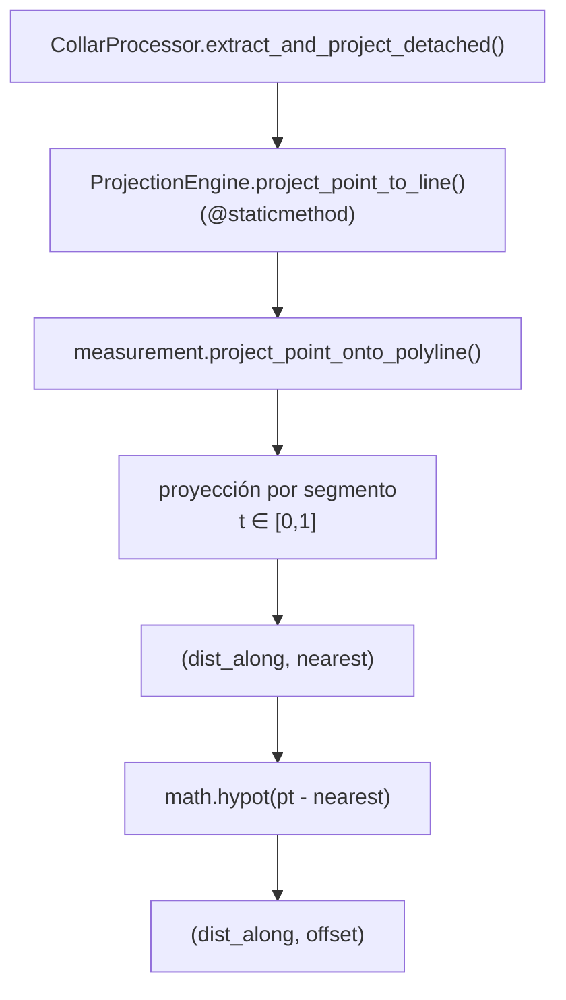

---
tags:
  - secinterp
  - code-walkthrough
  - core
  - drillhole
aliases:
  - projection_engine.py
  - ProjectionEngine
cssclass: secinterp-note
---

# `core/services/drillhole/projection_engine.py`

> [!abstract] Resumen en una línea
> Fachada estática que proyecta un punto `(x, y)` sobre una polilínea y devuelve `(dist_along, offset)` combinando `project_point_onto_polyline` con `math.hypot`.

**Ruta**: `core/services/drillhole/projection_engine.py` (30 líneas)
**Clase**: `ProjectionEngine`
**Capa**: Core · Drillhole (QGIS-agnóstico)
**Tags**: #secinterp #core #drillhole

---

## 🎯 ¿Por qué existe este archivo?

`CollarProcessor` necesita dos números: **a qué distancia a lo largo** de la sección cae un collar y **a qué distancia perpendicular** está de la línea. Esos dos valores vienen de dos fuentes distintas y conviene exponerlos juntos con una API semántica.

| Problema | Solución |
|----------|----------|
| `project_point_onto_polyline` devuelve `(dist_along, nearest)`, no el offset | `math.hypot` calcula la distancia al punto más cercano |
| El dominio de sondajes necesita una API estable | `ProjectionEngine.project_point_to_line` como fachada |
| La geometría pura no debe depender de sondajes | Se delega en `core/utils/geometry_utils` |

> [!important] Frontera Core
> Solo importa `math` y una utilidad pura. No toca QGIS, ni CRS, ni capas: es matemática plana.

---

## 🧬 Diagrama de relaciones



> [!tip] Cómo leer
> `ProjectionEngine` no reimplementa nada: **envuelve** una utilidad de `core/utils` y añade el cálculo del offset.

---

## 📦 Imports — lectura arquitectónica

```python
import math

from sec_interp.core.utils.geometry_utils.measurement import project_point_onto_polyline
```

| # | Observación |
|---|-------------|
| ① | `math` es stdlib puro: `hypot` evita `sqrt(dx² + dy²)` manual. |
| ② | La dependencia es un **módulo hoja** de `core/utils`; no se importa el paquete entero. |
| ③ | Sin `qgis`, sin `PyQt`, sin `core/domain`: la capa más independiente del árbol. |

---

## 🧱 `project_point_to_line()` — la única operación

```python
@staticmethod
def project_point_to_line(
    pt: tuple[float, float],
    line_points: list[tuple[float, float]],
) -> tuple[float, float]:
    """Project point to line and return (dist_along, offset)."""
    dist_along, nearest = project_point_onto_polyline(pt, line_points)
    offset = math.hypot(pt[0] - nearest[0], pt[1] - nearest[1])
    return dist_along, offset
```

| Parámetro | Rol |
|-----------|-----|
| `pt` | Punto a proyectar, normalmente el collar `(x, y)` |
| `line_points` | Vértices de la línea de sección `[(x, y), ...]` |
| **Retorno** | `(dist_along, offset)` — estación a lo largo y distancia perpendicular |

### Qué hace el delegado

`project_point_onto_polyline` (en `core/utils/geometry_utils/measurement.py`, 136 líneas) recorre cada segmento, calcula la proyección paramétrica `t`, la **recorta a `[0, 1]`**, y se queda con el segmento de distancia cuadrática mínima. Devuelve:

| Caso | Retorno |
|------|---------|
| Polilínea vacía | `(0.0, point)` |
| Un solo vértice | `(0.0, polyline[0])` |
| Caso general | `(distancia acumulada + t·seg_len, punto más cercano)` |

> [!note] `offset` como `hypot`
> La distancia al punto más cercano **es** la distancia perpendicular a la línea en el tramo proyectado. Para un punto cuya proyección cae fuera de los extremos, mide al vértice extremo (comportamiento correcto para un buffer de sección).

---

## 🏛️ Patrones de diseño presentes

| Patrón | Dónde | Propósito |
|--------|-------|-----------|
| **Facade** | `project_point_to_line` | API simple sobre una utilidad más detallada |
| **Static Utility** | `@staticmethod` | Sin estado; no requiere instancia |
| **Delegation** | `project_point_onto_polyline` | Reutilizar geometría ya probada |
| **Pure Function** | Todo el módulo | Determinista y thread-safe |

---

## 🧾 Resumen de la API

| Símbolo | Firma / Hereda | Uso típico |
|---------|----------------|------------|
| `ProjectionEngine` | `class` (sin herencia) | Contenedor de utilidades estáticas |
| `project_point_to_line` | `@staticmethod (pt: tuple[float, float], line_points: list[tuple[float, float]]) -> tuple[float, float]` | Proyectar collar a la sección |

---

## 👀 Observaciones y notas

> [!success] Fortalezas
> - **Mínimo y enfocado**: 30 líneas, una sola responsabilidad.
> - **Reutiliza** geometría ya existente en vez de duplicar la proyección.
> - **100 % puro**: sin QGIS, sin CRS, sin efectos laterales.

> [!warning] Puntos de atención
> - La matemática es **planar**: solo es válida en un CRS proyectado (el docstring de `measurement` lo advierte). Con coordenadas geográficas el resultado sería incorrecto.
> - No valida entradas (p. ej. `line_points` con `NaN`); delega esa robustez al utilitario.
> - El nombre `offset` sugiere perpendicularidad exacta; en los extremos es distancia al vértice.

> [!question] Preguntas abiertas
> - ¿Debería el motor de trayectoria reutilizar también esta fachada en lugar de `scu.project_trajectory_to_section`?
> - ¿Conviene exponer aquí un helper `point_within_buffer(...)` que unifique el filtro `offset <= buffer`?

---

## 🔗 Notas relacionadas

- [[Index]] — índice de la bóveda
- [[collar_processor]] — principal consumidor de esta fachada
- [[trajectory_engine]] — proyecta trayectorias por otra ruta (`scu`)
- [[layer_core_utils_geometry_utils]] — implementación de `project_point_onto_polyline`
- [[layer_core_services_drillhole]] — subcapa del pipeline

---

*Nota de la bóveda SecInterp Code Walkthrough — v3.8.0*
