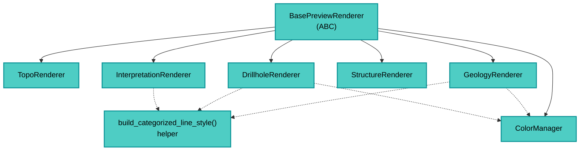

---
tags:
  - secinterp
  - code-walkthrough
  - gui
  - renderers
  - styling
aliases:
  - gui/renderers
  - Renderers
cssclass: secinterp-note
---

# `gui/renderers/`

> [!abstract] Resumen en una línea
> Es el **kit de estilado del preview**: 6 renderers especializados + `ColorManager` y helpers sybólicos — cada uno viste un tipo de capa.

**Ruta**: `gui/renderers/` (paquete · 8 archivos)
**Claves**: `BasePreviewRenderer`, `TopoRenderer`, `GeologyRenderer`, `DrillholeRenderer`, `StructureRenderer`, `InterpretationRenderer`, `ColorManager`
**Capa**: GUI · Renderers
**Tags**: #secinterp #gui #renderers #styling

---

## 🎯 ¿Por qué existe este paquete?

El preview crea **capas de memoria** (topografía, geología, sondajes, estructuras, interpretaciones). Sin estilo, todas se verían iguales. Este paquete resuelve:

| Problema | Solución |
|----------|----------|
| Colores consistentes por unidad geológica | `ColorManager` con paleta fija + hash |
| Estilos dispersos por el código | Un renderer por dominio (`apply_style(layer, **kwargs)`) |
| Helpers repetidos | `build_categorized_line_style` en `base_renderer.py` |

> [!important] GUI-only
> Usa `qgis.core` (`QgsSingleSymbolRenderer`, `QgsCategorizedSymbolRenderer`, etc.). Nunca va al core.

---

## 🧬 Mapa del paquete



---

## 🧱 `base_renderer.py` — base + helper

```python
class BasePreviewRenderer(ABC):
    @abstractmethod
    def apply_style(self, layer: QgsVectorLayer, **kwargs) -> None: ...

def build_categorized_line_style(
    color_manager, unique_units, field="unit", width="0.7", ...
) -> QgsCategorizedSymbolRenderer:
    categories = []
    for unit in unique_units:
        color = color_manager.get_color(unit)
        symbol = QgsLineSymbol.createSimple({"color": color.name(), "width": width, ...})
        categories.append(QgsRendererCategory(unit, symbol, unit))
    return QgsCategorizedSymbolRenderer(field, categories)
```

| Elemento | Rol |
|----------|-----|
| `BasePreviewRenderer` | Contrato `apply_style` para todos |
| `build_categorized_line_style` | Construye renderer categorizado por unidad |

---

## 🧱 `color_manager.py` — paleta

```python
class ColorManager:
    GEOLOGY_COLORS: ClassVar[list[QColor]] = [
        QColor(231,76,60), QColor(52,152,219), QColor(46,204,113), ...
    ]
    def get_color(self, unit: str) -> QColor:
        return self.GEOLOGY_COLORS[hash(unit) % len(GEOLOGY_COLORS)]
```

> [!tip] Hash consistente
> La misma unidad → mismo color en cada render. Sin estado.

---

## 🧱 Renderers especializados

| Renderer | Archivo | Estilo | Extra |
|----------|---------|--------|-------|
| `TopoRenderer` | `topo_renderer.py` (32 l.) | `QgsGraduatedSymbolRenderer` por elevación | Polychromy |
| `GeologyRenderer` | `geology_renderer.py` (29 l.) | `QgsCategorizedSymbolRenderer` por `unit` | Usa `ColorManager` |
| `DrillholeRenderer` | `drillhole_renderer.py` (71 l.) | Categorizado por unidad + labels `QgsPalLayerSettings` | Traces + intervalos |
| `StructureRenderer` | `structure_renderer.py` (18 l.) | `QgsSingleSymbolRenderer` rojo `#CC0000` | Dips |
| `InterpretationRenderer` | `interpretation_renderer.py` (43 l.) | `QgsCategorizedSymbolRenderer` por `id` + `interp.color` | Fill con transparencia |

> [!note] `InterpretationRenderer` usa `interp.color` directo (no la paleta). El usuario elige.

---

## 🏛️ Patrones de diseño presentes

| Patrón | Dónde | Propósito |
|--------|-------|-----------|
| **Strategy** | `BasePreviewRenderer` | Un estilo por dominio |
| **Palette** | `ColorManager` | Colores determinísticos |
| **Factory helper** | `build_categorized_line_style` | Crea renderers categorizados |

---

## 🔗 Notas relacionadas

- [[Index]] — índice de la bóveda
- [[main_dialog]] — orquesta el preview (crea el `PreviewRenderer` que usa estos)
- [[dialog_preview_manager]] — dispara el render
- [[adapters]] — producen los datos que estos visten

---

*Nota de la bóveda SecInterp Code Walkthrough — v3.8.0*
