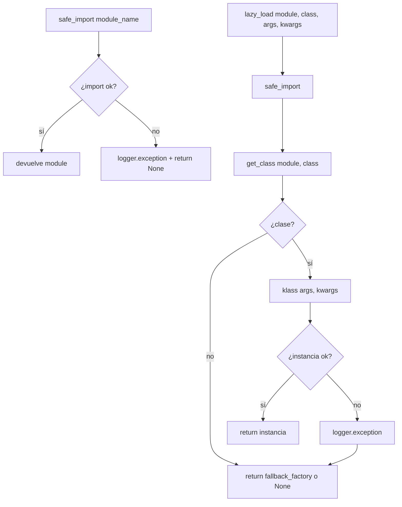
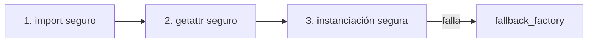

---
tags:
  - secinterp
  - code-walkthrough
  - core
  - utils
  - di
  - resilience
aliases:
  - safe_loader.py
  - SafeLoader
cssclass: secinterp-note
---

# 17 — `core/utils/safe_loader.py`

> [!abstract] Resumen en una línea
> Helper de **carga tolerante a fallos**: importa módulos y clases de forma segura y diferida, de modo que un componente roto **no tumba** el plugin.

**Ruta**: `core/utils/safe_loader.py` (79 líneas)
**Clase**: `SafeLoader`
**Capa**: Core · Utilities
**Tags**: #secinterp #core #utils #di #resilience

---

## 🎯 ¿Por qué existe este archivo?

El plugin ensambla muchos componentes (servicios, adapters, managers) en runtime. Si **un solo import falla** —por una dependencia ausente, un error de sintaxis en un módulo opcional, o una versión incompatible— un `import` normal abortaría la carga completa.

`SafeLoader` convierte esos imports en operaciones **seguras y observables**:

| Problema | Solución de `SafeLoader` |
|----------|--------------------------|
| Un import falla y rompe todo el plugin | Captura la excepción, la registra y devuelve `None` |
| Carga pesada al inicio | `lazy_load` importa + instancia bajo demanda |
| Necesitas el módulo y la clase por separado | `safe_import` + `get_class` |
| Quieres un fallback silencioso | `fallback_factory` |

> [!important] Rol en la arquitectura
> Es la pieza que hace posible el **Composition Root tolerante** de [[sec_interp_plugin]] y la construcción de servicios en [[controller]].

---

## 🧬 Diagrama de flujo



---

## 🧱 Método 1 — `safe_import()`

```python
@staticmethod
def safe_import(module_name: str, error_message: str | None = None) -> Any:
    try:
        return importlib.import_module(module_name)
    except (ImportError, Exception):
        msg = error_message or f"Failed to load optional module: {module_name}"
        logger.exception(msg)
        return None
```

| Detalle | Explicación |
|---------|-------------|
| **`importlib.import_module`** | Import dinámico por nombre (string) |
| **`except (ImportError, Exception)`** | `Exception` ya incluye `ImportError` → la tupla es redundante |
| **`logger.exception`** | Registra el **traceback** completo (no solo el mensaje) |
| **Retorno** | `None` en caso de fallo |

> [!warning] Nota sobre `(ImportError, Exception)`
> `Exception` cubre a `ImportError`, así que la tupla es redundante.
> Un equivalente más preciso sería `except ImportError:` para lo esperado
> y `except Exception:` para lo inesperado (mejor separados).

---

## 🧱 Método 2 — `get_class()`

```python
@staticmethod
def get_class(module: Any, class_name: str) -> type | None:
    if not module:
        return None
    return getattr(module, class_name, None)
```

- Si el módulo es `None` (porque `safe_import` falló) → devuelve `None`.
- `getattr(..., None)` evita `AttributeError` si la clase no existe.

> [!tip] Composable
> `safe_import` + `get_class` permiten obtener un símbolo de forma segura sin instanciarlo.
> Útil cuando la clase necesita argumentos que no están disponibles aún.

---

## 🧱 Método 3 — `lazy_load()` — el más usado

```python
@staticmethod
def lazy_load(
    module_name: str,
    class_name: str,
    fallback_factory: Callable[[], T] | None = None,
    *args: Any,
    **kwargs: Any,
) -> T | None:
    module = SafeLoader.safe_import(module_name)
    klass = SafeLoader.get_class(module, class_name)
    if klass:
        try:
            return klass(*args, **kwargs)
        except Exception:
            logger.exception(
                f"Failed to instantiate {class_name} from {module_name} "
                f"with args={args}, kwargs={kwargs}"
            )

    return fallback_factory() if fallback_factory else None
```

### Tres niveles de seguridad



| Nivel | Riesgo cubierto |
|-------|-----------------|
| 1. `safe_import` | Módulo inexistente / error de import |
| 2. `get_class` | Clase ausente en el módulo |
| 3. `try/except` | Error en el `__init__` (args/kwargs incorrectos) |
| 4. `fallback_factory` | Sustituto opcional si todo falla |

> [!important] Por qué DI + tolerancia encajan
> El Composition Root puede inyectar dependencias (`kwargs`) aunque un módulo opcional falle,
> porque `lazy_load` devuelve `None` en vez de lanzar. El plugin arranca en **modo degradado**.

### Uso en el proyecto

```python
# sec_interp_plugin.py
self.preview_renderer = SafeLoader.lazy_load(
    "sec_interp.gui.preview_renderer", "PreviewRenderer"
)
self.controller = SafeLoader.lazy_load(
    "sec_interp.core.controller", "ProfileController",
    data_fetcher=data_fetcher,
    structure_extractor=structure_extractor,
    ...
)
```

```python
# core/controller.py
self.collar_processor = SafeLoader.lazy_load(
    "sec_interp.core.services.drillhole.collar_processor", "CollarProcessor"
)
```

---

## 🧾 Resumen de la API

| Método | Tipo | Devuelve |
|--------|------|----------|
| `safe_import(module_name, error_message=None)` | static | módulo o `None` |
| `get_class(module, class_name)` | static | clase o `None` |
| `lazy_load(module, class, fallback_factory=None, *args, **kwargs)` | static | instancia, fallback o `None` |

---

## 🏛️ Patrones de diseño presentes

| Patrón | Dónde | Propósito |
|--------|-------|-----------|
| **Static Service** | todos los métodos | Helper sin estado |
| **Lazy Loading** | `lazy_load` | Import + instancia bajo demanda |
| **Fail-safe / Graceful Degradation** | `safe_import` | No crashear por un módulo roto |
| **Factory Function** | `fallback_factory` | Sustituto inyectable |
| **Composition helper** | `lazy_load` | Soporta el Composition Root |

---

## 👀 Observaciones y notas

> [!success] Fortalezas
> - Hace el plugin **robusto** ante módulos opcionales rotos.
> - Facilita el **DI** desde el composition root.
> - `logger.exception` deja trazabilidad completa.

> [!warning] Puntos de atención
> - `except (ImportError, Exception)` es redundante; conviene separarlos.
> - Un fallo de import queda **silenciado** a nivel de excepción (solo se loguea). Si un servicio crítico no carga, el síntoma aparece más tarde (p. ej. "Service failed to load" en el controller).
> - No hay una política de reintento ni de notificación al usuario.
> - `lazy_load` no distingue entre "módulo ausente" y "error de inicialización" en su valor de retorno (`None` en ambos).

> [!question] Preguntas abiertas
> - ¿Debería `lazy_load` registrar el fallo en un registro de diagnóstico consultable por la UI?
> - ¿Separar `except ImportError` de `except Exception` para mejor semántica?

---

## 🔗 Notas relacionadas

- [[Index]] — índice de la bóveda
- [[sec_interp_plugin]] — usa `lazy_load` en el Composition Root
- [[controller]] — usa `lazy_load` para construir servicios
- [[ARCHITECTURE_EN]] — arquitectura general

---

*Nota 17 de la bóveda SecInterp Code Walkthrough — v3.8.0*
