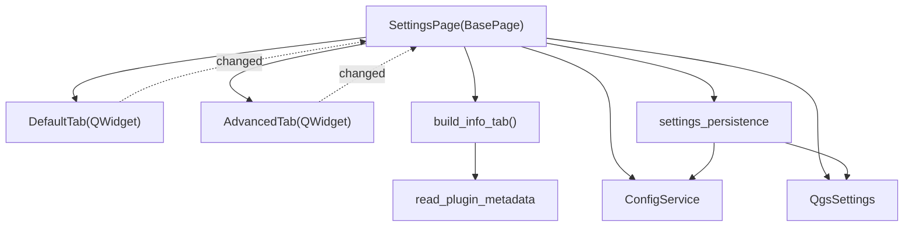

---
tags:
  - secinterp
  - code-walkthrough
  - gui
  - ui-pages
aliases:
  - settings_page.py
  - SettingsPage
cssclass: secinterp-note
---

# `gui/ui/pages/settings_page.py`

> [!abstract] Resumen en una línea
> Página de **configuración** que actúa como **coordinador**: monta los tabs Default/Advanced/Info de [[settings_tabs]], reexpone sus widgets por retrocompatibilidad y delega la persistencia en `settings_persistence` (`QgsSettings` + `ConfigService`).

> [!info] Refactor 2026-09-20
> Esta página de 416 líneas se descompuso en tabs ([[settings_tabs]]); `SettingsPage` es ahora un **coordinador de 124 líneas** con *aliases* retrocompatibles hacia los widgets de cada tab.

**Ruta**: `gui/ui/pages/settings_page.py` (124 líneas; antes 416)
**Clase**: `SettingsPage(BasePage)`
**Capa**: GUI · UI Pages
**Tags**: #secinterp #gui #ui-pages

---

## 🎯 ¿Por qué existe este archivo?

| Problema (antes) | Solución (hoy) |
|------------------|----------------|
| 416 líneas mezclando export, 3D, info y persistencia | Tabs en `gui/ui/pages/settings/` |
| La persistencia estaba acoplada a los widgets | `settings_persistence` aísla `QgsSettings`/`ConfigService` |
| La API pública de la página se rompía | El coordinador expone *aliases* (`self.chk_exp_topo = ...`) |
| Duplicación de `QgsSettings` en varios puntos | `load_settings` / `save_settings` centralizados |

> [!important] Coordinador + Facade
> `SettingsPage` posee el `QTabWidget`, reexpone los widgets y delega; **no** implementa la lógica de guardado ni construye checkboxes.

---

## 🧬 Diagrama de relaciones



> [!tip] Cómo leer
> Flecha sólida = composición/importa; punteada = señal `changed` reemitida al coordinador. La persistencia cruza por `settings_persistence`.

---

## 📦 Imports — lectura arquitectónica

```python
# settings_page.py
import contextlib
from typing import Any

from qgis.core import QgsSettings
from qgis.PyQt.QtCore import QCoreApplication
from qgis.PyQt.QtWidgets import QTabWidget, QVBoxLayout, QWidget

from sec_interp.core.config import ConfigService
from sec_interp.logger_config import get_logger

from .base_page import BasePage
from .settings import AdvancedTab, DefaultTab, build_info_tab
from .settings.settings_persistence import load_settings, save_settings
```

| # | Observación |
|---|-------------|
| ① | `QgsSettings` (lectura) y `ConfigService` (escritura) conviven: el page es el punto de unión. |
| ② | `build_info_tab` es una **función factory** (no una clase) que recibe `self.tr`. |
| ③ | `settings_persistence` se importa como módulo plano: funciones puras sobre widgets. |

---

## 🧱 `__init__` y estado

```python
class SettingsPage(BasePage):
    """Page for managing plugin settings and restricted features."""

    def __init__(self, parent: QWidget | None = None) -> None:
        self.settings = QgsSettings()
        self.config_service = ConfigService()
        super().__init__(
            QCoreApplication.translate("SettingsPage", "Plugin Settings"), parent
        )
```

| Miembro | Rol |
|---------|-----|
| `self.settings` | Store de lectura (`QgsSettings`). |
| `self.config_service` | Fachada de escritura (`ConfigService`). |
| `BasePage` | `group_box` + protocolo `get_data/validate/...`. |

> [!note] Orden de inicialización
> `self.settings` y `self.config_service` se crean **antes** de `super().__init__`, porque `_setup_ui()` (invocado por `BasePage`) llama a `_load_settings()`.

---

## 🧱 `_setup_ui()` — montar los 3 tabs

```python
def _setup_ui(self) -> None:
    super()._setup_ui()

    layout = self.group_box.layout()
    if layout is None:
        layout = QVBoxLayout(self.group_box)
        self.group_box.setLayout(layout)

    self.tab_widget = QTabWidget()
    layout.addWidget(self.tab_widget)

    self.default_tab = DefaultTab()
    self.tab_widget.addTab(self.default_tab, self.tr("Default"))

    self.advanced_tab = AdvancedTab()
    self.tab_widget.addTab(self.advanced_tab, self.tr("Advanced"))

    self.info_tab = build_info_tab(self.tr)
    self.tab_widget.addTab(self.info_tab, self.tr("Plugin Information"))

    self._expose_tab_widgets()
    self._load_settings()
```

| Tab | Contenido |
|-----|-----------|
| `default_tab` | Selección de exportación (topo/geol/struct/drill/interp), formato y patrón de nombres. |
| `advanced_tab` | Feature gate 3D + toggles de export 3D (traces/intervals/original/projected). |
| `info_tab` | Metadatos de solo lectura (`read_plugin_metadata`). |

> [!important] Carga en el setup
> `_load_settings()` se ejecuta al final de `_setup_ui()`: la página arranca ya sincronizada con `QgsSettings`.

---

## 🧱 `_expose_tab_widgets()` — aliases retrocompatibles

```python
def _expose_tab_widgets(self) -> None:
    self.chk_exp_topo = self.default_tab.chk_exp_topo
    self.chk_exp_geol = self.default_tab.chk_exp_geol
    self.chk_exp_struct = self.default_tab.chk_exp_struct
    self.chk_exp_drill = self.default_tab.chk_exp_drill
    self.chk_exp_interp = self.default_tab.chk_exp_interp
    self.combo_format = self.default_tab.combo_format
    self.txt_naming = self.default_tab.txt_naming
    self.btn_reset_export = self.default_tab.btn_reset_export

    self.chk_enable_3d = self.advanced_tab.chk_enable_3d
    self.chk_3d_traces = self.advanced_tab.chk_3d_traces
    self.chk_3d_intervals = self.advanced_tab.chk_3d_intervals
    self.chk_3d_original = self.advanced_tab.chk_3d_original
    self.chk_3d_projected = self.advanced_tab.chk_3d_projected
```

| Alias | Tab de origen |
|-------|---------------|
| `chk_exp_*` | `default_tab` |
| `combo_format`, `txt_naming`, `btn_reset_export` | `default_tab` |
| `chk_enable_3d`, `chk_3d_*` | `advanced_tab` |

> [!warning] Duplican referencias
> Los *aliases* apuntan a los mismos objetos widget: al añadir o renombrar widgets hay que actualizar esta lista para no romper el código que aún usa `page.chk_*`.

---

## 🧱 Persistencia — `_load_settings` / `_on_settings_changed`

```python
def _load_settings(self) -> None:
    load_settings(self.settings, self.default_tab, self.advanced_tab)

def _on_settings_changed(self) -> None:
    save_settings(self.config_service, self.default_tab, self.advanced_tab)

def _reset_export_defaults(self) -> None:
    self.default_tab.reset_to_defaults()
    self.advanced_tab.reset_to_defaults()
```

| Función | Origen | Destino |
|---------|--------|---------|
| `load_settings` | `QgsSettings` (`SecInterp/*`) | Widgets de los tabs |
| `save_settings` | Widgets de los tabs | `ConfigService.set(...)` |
| `_reset_export_defaults` | — | `reset_to_defaults()` en ambos tabs |

> [!note] `settings_persistence`
> `load_settings` lee claves como `SecInterp/enable_3d`, `SecInterp/exp_topo`, `SecInterp/export_format`; `save_settings` las reescribe vía `ConfigService`. Ver [[settings_tabs]].

---

## 🧱 `get_data()` / `validate()` y señales

```python
def get_data(self) -> dict[str, Any]:
    data = self.default_tab.get_data()
    data.update(self.advanced_tab.get_data())
    return data

def validate(self) -> tuple[bool, str]:
    return True, ""     # la página de settings no valida nada

def connect_signals(self) -> None:
    self.default_tab.changed.connect(self._on_settings_changed)
    self.advanced_tab.changed.connect(self._on_settings_changed)
    self.default_tab.connect_signals()
    self.advanced_tab.connect_signals()

def disconnect_signals(self) -> None:
    self.default_tab.disconnect_signals()
    self.advanced_tab.disconnect_signals()
    with contextlib.suppress(TypeError, RuntimeError):
        self.default_tab.changed.disconnect(self._on_settings_changed)
    with contextlib.suppress(TypeError, RuntimeError):
        self.advanced_tab.changed.disconnect(self._on_settings_changed)
```

| Método | Detalle |
|--------|---------|
| `get_data()` | Fusiona `exp_*`/formato de Default con `enable_3d`/`drill_3d_*` de Advanced. |
| `validate()` | Siempre `(True, "")`: no hay reglas que validar. |
| `connect_signals()` | Autoguarda en cada `changed` y conecta los widgets internos. |
| `disconnect_signals()` | Desconecta tabs y reenvíos con tolerancia. |

---

## 🏛️ Patrones de diseño presentes

| Patrón | Dónde | Propósito |
|--------|-------|-----------|
| **Facade / Coordinator** | `SettingsPage` | API única sobre 3 tabs + persistencia. |
| **Adapter** | `settings_persistence` | Aislar `QgsSettings`/`ConfigService`. |
| **Observer** | `changed` | Autoguardado en cada cambio. |
| **Backward-compat aliases** | `_expose_tab_widgets` | No romper consumidores antiguos. |
| **Factory Function** | `build_info_tab` | Tab de info sin estado. |

---

## 🧾 Resumen de la API

| Símbolo | Firma / Hereda | Uso típico |
|---------|----------------|------------|
| `SettingsPage` | `BasePage` | Página de configuración. |
| `_setup_ui()` | `() -> None` | Monta tabs, aliases y carga. |
| `_expose_tab_widgets()` | `() -> None` | Crea *aliases* retrocompatibles. |
| `_load_settings()` | `() -> None` | `load_settings(...)`. |
| `_on_settings_changed()` | `() -> None` | `save_settings(...)`. |
| `_reset_export_defaults()` | `() -> None` | Reset de ambos tabs. |
| `get_data()` | `() -> dict[str, Any]` | Ajustes actuales. |
| `validate()` | `() -> tuple[bool, str]` | Siempre válido. |
| `connect_signals()` / `disconnect_signals()` | `() -> None` | Autoguardado y limpieza. |

---

## 👀 Observaciones y notas

> [!success] Fortalezas
> - Coordinador de 124 líneas: lectura clara y persistencia desacoplada.
> - `settings_persistence` permite testear `load/save` sin instanciar la página.
> - Los *aliases* mantienen compatibilidad durante la migración a tabs.

> [!warning] Puntos de atención
> - `_reset_export_defaults()` no está conectado en `connect_signals()`; el reset real lo dispara `DefaultTab.btn_reset_export` → `reset_to_defaults()`. La función del page parece código muerto o reservado.
> - Los *aliases* duplican referencias: mantener sincronía al añadir widgets.
> - `get_data()` **no** incluye los campos de `info_tab` (son de solo lectura).

> [!question] Preguntas abiertas
> - ¿Debe eliminarse `_reset_export_defaults()` o conectarse al botón de reset?
> - ¿Conviene unificar lectura/escritura en `ConfigService` para no usar dos stores?

---

## 🔗 Notas relacionadas

- [[Index]] — índice de la bóveda
- [[settings_tabs]] — paquete de tabs (`DefaultTab`, `AdvancedTab`, `build_info_tab`)
- [[config]] — `ConfigService`
- [[access_control_service]] — gate 3D
- [[ui_pages]] — catálogo de páginas
- [[layer_gui_ui_pages]] — capa de páginas de la GUI

---

*Nota de la bóveda SecInterp Code Walkthrough — v3.8.0*
