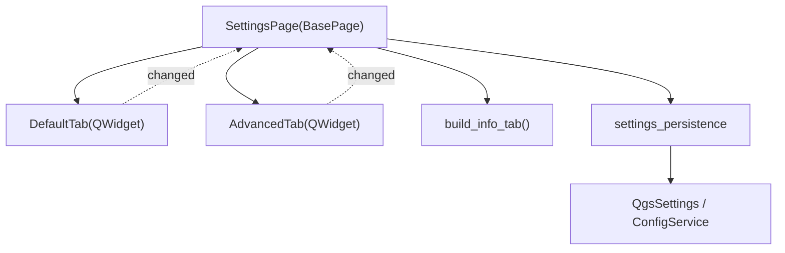

---
tags:
  - secinterp
  - code-walkthrough
  - gui
  - ui-pages
  - settings-tabs
aliases:
  - settings/
  - DefaultTab
  - AdvancedTab
cssclass: secinterp-note
---

# `gui/ui/pages/settings/`

> [!abstract] Resumen en una línea
> Paquete de tabs de **configuración**: `DefaultTab`, `AdvancedTab` e `info_tab`, descompuestos el **2026-09-20** del antiguo `settings_page.py` (417 líneas).

**Ruta**: `gui/ui/pages/settings/` (default_tab 178 · advanced_tab 106 · info_tab 48 · settings_persistence 75 · `__init__` 9 líneas)
**Clase principal**: `DefaultTab`, `AdvancedTab` (`QWidget`)
**Capa**: GUI · UI Pages
**Tags**: #secinterp #gui #ui-pages #settings-tabs

---

## 🎯 ¿Por qué existe este paquete?

| Problema | Solución |
|----------|----------|
| `settings_page.py` tenía 417 líneas mezclando export, 3D, info y persistencia | Descomposición Widget/Composite (2026-09-20) |
| La persistencia estaba acoplada a los widgets | `settings_persistence` aísla `QgsSettings`/`ConfigService` |
| La API pública de la página se rompía | El coordinador expone *aliases* retrocompatibles |

> [!important] Coordinador + Facade
> `SettingsPage` (124 líneas) posee el `QTabWidget`, reexpone widgets y delega; no implementa la lógica de guardado.

---

## 🧬 Diagrama de relaciones



> [!tip] Cómo leer
> Flecha sólida = composición/importa; punteada = señal `changed` reemitida al coordinador.

---

## 🧱 Sección principal — `DefaultTab`

```python
class DefaultTab(QWidget):
    changed = pyqtSignal()
```

| Símbolo | Rol |
|---------|-----|
| `chk_exp_*` | Selección de exportación (topo/geol/struct/drill/interp). |
| `combo_format` | Formato vectorial: Shapefile / GeoPackage / DXF. |
| `get_data()` / `reset_to_defaults()` | Lectura y reset de defaults. |

---

## 🧱 `AdvancedTab` e `info_tab`

- **`AdvancedTab`**: `chk_enable_3d` + toggles 3D (`chk_3d_traces/intervals/original/projected`), `get_data()` y `reset_to_defaults()`.
- **`info_tab`**: `build_info_tab(translate)` genera metadatos de solo lectura vía `read_plugin_metadata`.

---

## 🧱 `settings_persistence`

- `load_settings(settings, default_tab, advanced_tab)`: lee de `QgsSettings`.
- `save_settings(config_service, default_tab, advanced_tab)`: escribe vía `ConfigService.set(...)`.

---

## 🏛️ Patrones de diseño presentes

| Patrón | Dónde | Propósito |
|--------|-------|-----------|
| **Widget decomposition** | `SettingsPage` | Coordinador + tabs |
| **Facade** | `SettingsPage` | API única sobre 3 tabs |
| **Adapter** | `settings_persistence` | Aísla `QgsSettings`/`ConfigService` |
| **Observer** | `changed` | Reemisión de cambios |

> [!warning] Punto de atención
> Los *aliases* (`self.chk_enable_3d = self.advanced_tab.chk_enable_3d`) duplican referencias: mantener sincronía al añadir widgets.

---

## 🔗 Notas relacionadas

- [[settings_page]] — coordinador `SettingsPage`
- [[config]] — `ConfigService` de persistencia
- [[access_control_service]] — gate 3D
- [[ui_pages]] — catálogo de páginas
- [[Index]] — índice de la bóveda

---

*Nota de la bóveda SecInterp Code Walkthrough — v3.8.0*
