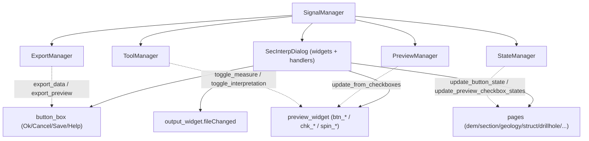

---
tags:
  - secinterp
  - code-walkthrough
  - gui
  - signals
aliases:
  - dialog_signal_manager.py
  - SignalManager
cssclass: secinterp-note
---

# `gui/dialog_signal_manager.py`

> [!abstract] Resumen en una línea
> Punto único de cableado **signal/slot** del diálogo: agrupa conexiones y desconexiones por dominio (botones, preview, páginas, tools) con simetría estricta e idempotencia.

**Ruta**: `gui/dialog_signal_manager.py` (354 líneas)
**Clase**: `SignalManager`
**Capa**: GUI · Managers
**Tags**: #secinterp #gui #signals

---

## 🎯 ¿Por qué existe este archivo?

Sin manager, `SecInterpDialog` acumularía decenas de `widget.clicked.connect(...)` dispersos y sería imposible garantizar que **cada conexión tenga su desconexión** (fuga de memoria Qt + ruido en el analizador).

| Problema | Solución |
|----------|----------|
| 50+ conexiones dispersas en el diálogo | Cuatro grupos `_connect_*` por dominio |
| Señales que sobreviven al cierre del diálogo | `disconnect_all()` espejo, ejecutado **antes** de reconectar |
| Doble conexión al reabrir el diálogo | `connect_all()` empieza con `disconnect_all()` (idempotente) |
| El analizador reporta señales "leaking" | Desconexión explícita por nombre + barrido secuencial |

> [!important] Regla Extract/Present y simetría
> Este módulo **no procesa datos**: solo conecta widgets con los managers (el trabajo QGIS vive en ellos). Para casi cada `X.connect(...)` existe su `X.disconnect(...)` bajo `contextlib.suppress`; esa simetría es deliberada y requerida por el análisis estático.

---

## 🧬 Diagrama de relaciones



Sólidas = el manager cablea hacia el destino; punteadas = el manager es el destino de la señal.

---

## 📦 Imports — lectura arquitectónica

```python
from __future__ import annotations
import contextlib
from typing import TYPE_CHECKING, Any
from qgis.PyQt.QtWidgets import QDialogButtonBox
from sec_interp.logger_config import get_logger
if TYPE_CHECKING:
    from .main_dialog import SecInterpDialog
```

Único import Qt: `QDialogButtonBox` (localizar botones estándar). Los cuatro managers llegan como `Any` por constructor (bajo acoplamiento); `TYPE_CHECKING` evita el ciclo con `main_dialog`.

---

## 🧱 Recorrido del código

### `__init__` y `connect_all()` — idempotencia primero

```python
self.dialog = dialog
self.preview_manager = preview_manager
self.export_manager = export_manager
self.tool_manager = tool_manager
self.state_manager = state_manager

def connect_all(self) -> None:
    self.disconnect_all()          # ← evita dobles conexiones
    self._connect_button_signals()
    self._connect_preview_signals()
    self._connect_page_signals()
    self._connect_tool_signals()
```

El manager no crea dependencias: las recibe (Dependency Injection). El diálogo aporta widgets/handlers; los managers, la lógica de destino.

### `disconnect_all()` — espejo exhaustivo

```python
def disconnect_all(self) -> None:
    self._disconnect_button_signals()
    self._disconnect_preview_signals()
    self._disconnect_page_signals()
    self._disconnect_tool_signals()
```

| Nivel 1 | Nivel 2 | Nivel 3 |
|---------|---------|---------|
| `_disconnect_button_signals` | `_disconnect_dialog_buttons` | Ok / Cancel / Save / `helpRequested` |
| | `_disconnect_custom_buttons` | `clear_cache_btn` / `reset_defaults_btn` |
| `_disconnect_preview_signals` | `_disconnect_preview_action_buttons` | `btn_preview` / `btn_export` / `btn_measure` / `btn_interpret` / `btn_finalize` |
| | `_disconnect_preview_options` | checkboxes + `chk_legend` / `spin_max_points` / `chk_auto_lod` / `chk_adaptive_sampling` |
| `_disconnect_page_signals` | `_disconnect_explicit_page_signals` | las 6 señales reportadas como "leaking" |
| | `_disconnect_sequential_pages` | barrido de 9 páginas/componentes |
| `_disconnect_tool_signals` | — | `tool_manager.disconnect_signals()` |

### Conexión — botones

```python
ok_btn = self.dialog.button_box.button(QDialogButtonBox.StandardButton.Ok)
if ok_btn:
    ok_btn.clicked.connect(self.dialog.accept_handler)
cancel_btn = self.dialog.button_box.button(QDialogButtonBox.StandardButton.Cancel)
if cancel_btn:
    cancel_btn.clicked.connect(self.dialog.reject_handler)
save_btn = self.dialog.button_box.button(QDialogButtonBox.StandardButton.Save)
if save_btn:
    save_btn.clicked.connect(self.export_manager.export_data)
self.dialog.button_box.helpRequested.connect(self.dialog.open_help)
self.dialog.clear_cache_btn.clicked.connect(self.dialog.clear_cache_handler)
self.dialog.reset_defaults_btn.clicked.connect(self.dialog.reset_defaults_handler)
```

### Conexión — preview, páginas y tools

```python
btn_preview.clicked.connect(self.dialog.preview_profile_handler)
btn_export.clicked.connect(self.export_manager.export_preview)
for chk in (chk_topo, chk_geol, chk_struct, chk_drillholes, chk_interpretations, chk_legend):
    chk.stateChanged.connect(self.preview_manager.update_from_checkboxes)
spin_max_points.valueChanged.connect(self.preview_manager.update_from_checkboxes)
chk_auto_lod.toggled.connect(self.preview_manager.update_from_checkboxes)
chk_adaptive_sampling.toggled.connect(self.preview_manager.update_from_checkboxes)

output_widget.fileChanged.connect(self.state_manager.update_button_state)
page_dem.raster_combo.layerChanged.connect(self.state_manager.update_button_state)
page_dem.raster_combo.layerChanged.connect(self.state_manager.update_preview_checkbox_states)
# geology/struct/drillhole.dataChanged → update_preview_checkbox_states

btn_measure.toggled.connect(self.tool_manager.toggle_measure_tool)
btn_interpret.toggled.connect(self.tool_manager.toggle_interpretation_tool)
btn_finalize.clicked.connect(self.tool_manager.measure_tool.finalize_measurement)
self.tool_manager.connect_signals()   # restaura señales internas de las tools
```

> [!important] Por qué `tool_manager.connect_signals()`
> Al final se restauran las señales **internas** de las herramientas (`measurementChanged`, `measurementFinished`, `measurementCleared`, `polygonFinished`), que se habían desconectado en el barrido. Las páginas también reciben `page.connect_signals()` si lo exponen.

---

## 🏛️ Patrones de diseño presentes

| Patrón | Dónde | Propósito |
|--------|-------|-----------|
| **Mediator / Event bus** | `SignalManager` | Un solo punto de cableado widget↔manager |
| **Dependency Injection** | `__init__` | Managers inyectados como `Any` |
| **Idempotent wiring** | `connect_all` → `disconnect_all` | Seguro de reejecutar |
| **Template method (grupos)** | `_connect_*` / `_disconnect_*` | Estructura simétrica |
| **Graceful degradation** | `contextlib.suppress` | Tolerancia a señales ya desconectadas |

---

## 🧾 Resumen de la API

| Símbolo | Firma | Uso típico |
|---------|-------|------------|
| `SignalManager(...)` | `__init__(dialog, preview, export, tool, state)` | Composición |
| `connect_all()` / `disconnect_all()` | `-> None` | Cablear todo / limpiar todo |
| `_connect_button_signals()` | `-> None` | Ok/Cancel/Save/Help/Cache/Reset |
| `_connect_preview_signals()` | `-> None` | Preview + checkboxes + opciones |
| `_connect_page_signals()` | `-> None` | layerChanged / dataChanged / fileChanged |
| `_connect_tool_signals()` | `-> None` | toggles de tools + señales internas |

---

## 👀 Observaciones y notas

> [!success] Fortalezas
> - **Simetría** connect/disconnect casi total, agrupada por dominio.
> - Idempotencia real: reabrir el diálogo no duplica conexiones.
> - Bajo acoplamiento: los destinos llegan inyectados.

> [!warning] Puntos de atención
> - La desconexión de preview/páginas usa `suppress(Exception)` (más amplio que el `(TypeError, RuntimeError)` de los botones): puede ocultar errores reales.
> - `_disconnect_preview_signals` desconecta `btn_measure.toggled` / `btn_interpret.toggled`, pero su conexión vive en `_connect_tool_signals`: la simetría cruza grupos.
> - `_connect_button_signals` asume que `clear_cache_btn` / `reset_defaults_btn` existen (sin `hasattr`), a diferencia de sus desconexiones.

> [!question] Preguntas abiertas
> - ¿Podría generarse la lista de conexiones desde una tabla declarativa para garantizar simetría automática?

---

## 🔗 Notas relacionadas

- [[main_dialog]] — lo crea y llama `connect_all()` en el `__init__`
- [[state_manager]] — destino de señales de estado
- [[tool_manager]] — destino de señales de herramientas
- [[dialog_preview_manager]] — destino de señales de preview
- [[dialog_export_manager]] — destino de export
- [[Index]] — índice de la bóveda

---

*Nota de la bóveda SecInterp Code Walkthrough — v3.8.0*
