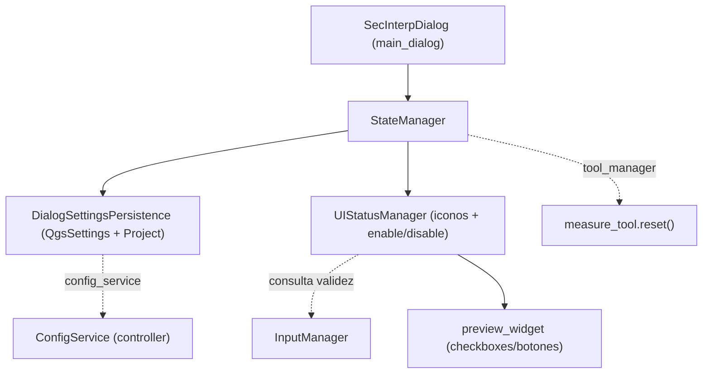

---
tags:
  - secinterp
  - code-walkthrough
  - gui
  - state-manager
aliases:
  - dialog_state_manager.py
  - StateManager
cssclass: secinterp-note
---

# `gui/dialog_state_manager.py`

> [!abstract] Resumen en una línea
> Orquestador de **estado del diálogo**: delega la persistencia en `DialogSettingsPersistence`, el estado visual en `UIStatusManager` y mantiene un registro propio de señales para desconexión segura.

**Ruta**: `gui/dialog_state_manager.py` (117 líneas)
**Clase**: `StateManager`
**Capa**: GUI · Managers
**Tags**: #secinterp #gui #state-manager

---

## 🎯 ¿Por qué existe este archivo?

`main_dialog.py` no debe mezclar `QgsSettings` con iconos de estado. `StateManager` es la **fachada de estado**: agrupa dos responsabilidades que cambian por motivos distintos.

| Problema | Solución |
|----------|----------|
| El diálogo hablaría con `QgsSettings`/`QgsProject` directamente | `DialogSettingsPersistence` encapsula load/save/reset |
| Lógica de `setEnabled` e iconos dispersa | `UIStatusManager` centraliza indicadores y habilitación |
| Señales conectadas sin forma de desconectarlas | `connect_checked()` + `disconnect_signals()` con tracking |
| Tras restaurar ajustes en bloque la UI queda desactualizada | `load_settings()` encadena `update_all()` |

`StateManager` **no contiene lógica de negocio ni QGIS-agnóstica**: solo coordina colaboradores. La validación real vive en `InputManager` + `ProjectValidator` (core).

---

## 🧬 Diagrama de relaciones



Flecha sólida = composición/llamada directa; punteada = colaborador consultado o inyectado.

---

## 📦 Imports — lectura arquitectónica

```python
from __future__ import annotations
import contextlib
from typing import TYPE_CHECKING, Any
from sec_interp.logger_config import get_logger
from .dialog_settings_persistence import DialogSettingsPersistence
from .ui_status_manager import UIStatusManager
if TYPE_CHECKING:
    from sec_interp.gui.main_dialog import SecInterpDialog
```

`TYPE_CHECKING` rompe el ciclo `main_dialog → StateManager → main_dialog`; `contextlib.suppress(TypeError, RuntimeError)` tolera señales Qt ya caídas; `logger` es el único punto de observabilidad del manager.

---

## 🧱 Recorrido del código — `StateManager`

### `__init__(dialog)` — composición

```python
def __init__(self, dialog: SecInterpDialog) -> None:
    self.dialog = dialog
    self._connected_widgets: list[Any] = []
    self.persistence = DialogSettingsPersistence(dialog)
    self.status_manager = UIStatusManager(dialog)
```

Instancia los dos delegados y prepara la lista de señales rastreadas. Recibe el diálogo completo (no contenedores estrechos) porque sus delegados sí necesitan la superficie de widgets.

### Delegación visual (6 métodos)

| Método | Delegado |
|--------|----------|
| `setup_indicators()` / `update_all()` | `status_manager.*` |
| `update_preview_checkbox_states()` | `status_manager.*` |
| `update_button_state()` | `status_manager.*` |
| `update_raster_status()` / `update_section_status()` | `status_manager.*` |

Son **thin wrappers**: el diálogo y `SignalManager` llaman a `StateManager`, no al `UIStatusManager` directamente (punto único de entrada).

### Tracking de señales

```python
def connect_checked(self, widget, signal, slot) -> None:
    signal.connect(slot)
    self._connected_widgets.append((widget, signal, slot))

def disconnect_signals(self) -> None:
    for _widget, signal, slot in self._connected_widgets:
        with contextlib.suppress(TypeError, RuntimeError):
            signal.disconnect(slot)
    self._connected_widgets.clear()
```

`connect_checked` guarda la terna `(widget, signal, slot)` para desconectar **ese slot concreto** sin afectar otras conexiones a la misma señal.

### Persistencia y reset

```python
def load_settings(self) -> None:
    self.persistence.load_settings()
    self.update_all()      # refresca iconos/botones tras restaurar en bloque

def reset_to_defaults(self) -> None:
    self.persistence.reset_pages()
    self.persistence.reset_preview()
    self._reset_tools()
    self.dialog.preview_widget.results_text.append(
        self.dialog.tr("✓ Form reset to default values"))
    self.update_all()
```

`load_settings()` encadena `update_all()` porque la restauración masiva no dispara señales widget a widget.

### `_reset_tools()` — compatibilidad hacia atrás

```python
def _reset_tools(self) -> None:
    if hasattr(self.dialog, "tool_manager"):
        self.dialog.tool_manager.measure_tool.reset()
    if hasattr(self.dialog, "interpretation_manager") and self.dialog.interpretation_manager:
        self.dialog.interpretation_manager.interpretations = []
        self.dialog.interpretation_manager.save_interpretations()
    elif hasattr(self.dialog, "interpretations"):
        self.dialog.interpretations = []
        if hasattr(self.dialog, "_save_interpretations"):
            self.dialog._save_interpretations()
```

Detecta managers por `hasattr`/`getattr`, con ramas de compatibilidad para versiones antiguas del diálogo.

---

## 🏛️ Patrones de diseño presentes

| Patrón | Dónde | Propósito |
|--------|-------|-----------|
| **Facade** | `StateManager` | Una API sobre persistencia + estado visual |
| **Delegation / Composition** | `persistence`, `status_manager` | Responsabilidad única por colaborador |
| **Lazy import (`TYPE_CHECKING`)** | `SecInterpDialog` | Rompe el ciclo de importación |
| **Tracked connections** | `connect_checked` | Evitar fugas de memoria en Qt |
| **Backward compatibility** | `_reset_tools` | Sobrevive a refactors del diálogo |

---

## 🧾 Resumen de la API

| Símbolo | Firma | Uso típico |
|---------|-------|------------|
| `StateManager(dialog)` | `__init__` | Composition root del diálogo |
| `setup_indicators()` / `update_all()` | `-> None` | Cargar iconos / refrescar todo |
| `update_button_state()` / `update_preview_checkbox_states()` | `-> None` | Habilitar botones / checkboxes |
| `load_settings()` / `save_settings()` | `-> None` | Persistencia vía `QgsSettings`/`Project` |
| `reset_to_defaults()` | `-> None` | Reset de páginas + preview + tools |
| `connect_checked(w, s, slot)` / `disconnect_signals()` | `-> None` | Tracking / desconexión tolerante |

---

## 👀 Observaciones y notas

> [!success] Fortalezas
> - Separa **persistencia** de **presentación de estado**, cada una con su dependencia.
> - `load_settings()` garantiza UI consistente vía `update_all()`.

> [!warning] Puntos de atención
> - `connect_checked()` / `_connected_widgets` **no se usan** en el código actual: el cableado real ocurre en `SignalManager`. Es API latente y `disconnect_signals()` desconecta una lista vacía.
> - `_reset_tools()` accede a `measure_tool` sin comprobación anidada: si `tool_manager` existe pero aún no tiene `measure_tool`, lanzaría `AttributeError`.
> - Escribe directamente en `preview_widget.results_text`, acoplando el manager a un widget concreto.

> [!question] Preguntas abiertas
> - ¿Debería eliminarse el tracking propio y confiar por completo en `SignalManager.disconnect_all()`?

---

## 🔗 Notas relacionadas

- [[main_dialog]] — crea el manager y lo usa en dos fases
- [[ui_status_manager]] — delegado visual
- [[signal_manager]] — cablea las señales que este manager expone
- [[input_manager]] — fuente de validez consultada por `UIStatusManager`
- [[config]] — `ConfigService` detrás de la persistencia
- [[Index]] — índice de la bóveda

---

*Nota de la bóveda SecInterp Code Walkthrough — v3.8.0*
