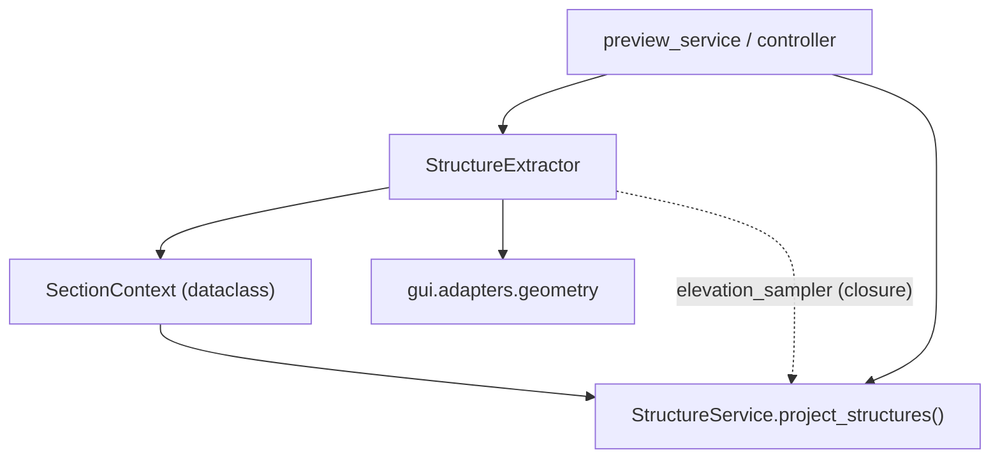

---
tags:
  - secinterp
  - code-walkthrough
  - gui
  - adapters
  - structure
aliases:
  - structure_extractor.py
  - StructureExtractor
  - SectionContext
cssclass: secinterp-note
---

# `gui/adapters/structure_extractor.py`

> [!abstract] Resumen en una línea
> Adapter **Extract** de estructuras: lee la línea de sección, bufferea su geometría, filtra las mediciones estructurales dentro del buffer y muestrea el DEM → primitivas desacopladas para `StructureService`.

**Ruta**: `gui/adapters/structure_extractor.py` (226 líneas)
**Clases**: `StructureExtractor`, `SectionContext`
**Capa**: GUI · Adapters (Extract phase)
**Tags**: #secinterp #gui #adapters #structure

---

## 🎯 ¿Por qué existe este archivo?

| Problema | Solución |
|----------|----------|
| `StructureService` (core) no puede tocar `QgsGeometry`/`QgsFeature` | El adapter lee y convierte todo a tuplas y dicts |
| Hay que saber qué estructuras caen cerca de la línea | `QgsGeometry.buffer(buffer_m, 25)` + `QgsFeatureRequest` con filtro de rectángulo + `intersects()` |
| El core necesita elevaciones para proyectar dips aparentes | `sample_elevation()` se inyecta como closure `elevation_sampler` |
| Los `QVariant` de QGIS no son thread-safe | `_extract_attributes` sanea a `int\|float\|str\|bool\|None` |

> [!important] Frontera Extract
> Este archivo es la única pieza que conoce QGIS para estructuras. `StructureService` recibe un `SectionContext` y un callable `(x, y) -> float`; nunca un raster ni una capa.

---

## 🧬 Diagrama de relaciones



> [!tip] Cómo leer
> Flecha sólida = importa/llama; punteada = callback inyectado en tiempo de ejecución.

---

## 📦 Imports — lectura arquitectónica

```python
from qgis.core import (
    QgsFeature, QgsFeatureRequest, QgsGeometry,
    QgsRaster, QgsRasterLayer, QgsVectorLayer, QgsWkbTypes,
)
```

| # | Observación |
|---|-------------|
| ① | `QgsFeatureRequest` + `QgsGeometry.buffer` = filtrado espacial eficiente (primero bbox, luego intersección real). |
| ② | `QgsRaster` solo se usa para `IdentifyFormat.IdentifyFormatValue` al muestrear el DEM. |
| ③ | No importa nada de `sec_interp.core`: la salida son primitivas puras. |

---

## 🧱 `SectionContext` — el DTO de salida

```python
@dataclass
class SectionContext:
    line_points: list[tuple[float, float]] = field(default_factory=list)
    line_start: tuple[float, float] = (0.0, 0.0)
    line_azimuth: float = 0.0
    structures: list[dict[str, Any]] = field(default_factory=list)
```

| Campo | Rol |
|-------|-----|
| `line_points` | Vértices `(x, y)` de la línea de sección |
| `line_start` | Primer vértice (origen para medir distancias) |
| `line_azimuth` | Rumbo de la sección en grados |
| `structures` | `[{"point": (x, y), "attributes": {...}}]` |

---

## 🧱 `extract_section_and_structures()` — el flujo principal

```python
def extract_section_and_structures(self, line_lyr, struct_lyr, buffer_m) -> SectionContext | None:
    line_geom = self._read_line_geometry(line_lyr)
    if line_geom is None:
        return None
    line_points, line_start, line_azimuth = self.extract_line(line_geom)
    structures = self.detach_structures(struct_lyr, line_geom, buffer_m)
    return SectionContext(line_points=..., line_start=..., line_azimuth=..., structures=...)
```

1. `_read_line_geometry` toma la primera feature y valida que su geometría no sea nula.
2. `extract_line` devuelve vértices + inicio + azimuth.
3. `detach_structures` bufferea y filtra.

Devuelve `None` si la capa de línea no tiene geometría válida.

---

## 🧱 `detach_structures()` — filtrado espacial en dos pasos

```python
buffer_geom = line_geom.buffer(buffer_m, 25)
request = QgsFeatureRequest().setFilterRect(buffer_geom.boundingBox())
for feature in struct_lyr.getFeatures(request):
    if not feature.hasGeometry() or not feature.geometry().intersects(buffer_geom):
        continue
    point = self._feature_point(feature)
    ...
```

| Paso | Detalle |
|------|---------|
| `buffer(m, 25)` | 25 segmentos de aproximación del buffer |
| `setFilterRect(bbox)` | Filtro barato a nivel de proveedor de datos |
| `intersects(buffer_geom)` | Verificación geométrica exacta |
| `_feature_point` | Punto si la geometría es puntual; si no, centroide |

---

## 🧱 `sample_elevation()` — inyectado al core

```python
def sample_elevation(self, raster_lyr, x, y, band_number=1) -> float:
    ...
    ident = raster_lyr.dataProvider().identify(
        QgsPointXY(x, y), QgsRaster.IdentifyFormat.IdentifyFormatValue
    )
    if ident.isValid():
        val = ident.results().get(band_number)
        ...
    return 0.0
```

> [!tip] Patrón callback
> En `preview_service.py:162` y `controller.py:326` se construye:
> ```python
> def elevation_sampler(x: float, y: float) -> float:
>     return extractor.sample_elevation(raster_lyr, x, y, params.band_num)
> ```
> y se pasa a `StructureService.project_structures(...)`. El core nunca ve el raster.

---

## 🧱 Helpers privados

| Método | Responsabilidad |
|--------|-----------------|
| `_read_line_geometry` | Primera feature → `QgsGeometry` o `None` |
| `_extract_line_points` | Vértices de línea simple o multiparte (`asPolyline`/`asMultiPolyline`) |
| `_calculate_azimuth` | `degrees(atan2(dx, dy))`, normalizado a `[0, 360)` |
| `_feature_point` | `asPoint()` o `centroid().asPoint()` |
| `_extract_attributes` | Sanea `QVariant` → `int/float/str/bool/None` |

> [!note] `atan2(dx, dy)` = rumbo
> El orden `(Δx, Δy)` en `atan2` produce un acimut medido desde el norte y en sentido horario, que es justo la convención de brújula. Si es negativo se suma 360.

---

## 🏛️ Patrones de diseño presentes

| Patrón | Dónde | Propósito |
|--------|-------|-----------|
| **Adapter / Bridge** | clase completa | QGIS → primitivas |
| **DTO** | `SectionContext` | Transporte desacoplado hacia core |
| **Callback injection** | `elevation_sampler` | El core no depende del raster |
| **Fail-soft** | `return []` / `return 0.0` | Capas inválidas no rompen el flujo |
| **Two-phase filtering** | bbox + `intersects` | Rendimiento sobre exactitud barata |

---

## 🧾 Resumen de la API

| Símbolo | Firma | Uso |
|---------|-------|-----|
| `SectionContext` | dataclass | Salida del extractor |
| `extract_section_and_structures` | `(line_lyr, struct_lyr, buffer_m) -> SectionContext \| None` | Punto de entrada |
| `extract_line` | `(line_geom) -> (points, start, azimuth)` | Geometría de la sección |
| `detach_structures` | `(struct_lyr, line_geom, buffer_m) -> list[dict]` | Estructuras en buffer |
| `sample_elevation` | `(raster_lyr, x, y, band_number=1) -> float` | Elevación puntual |

---

## 👀 Observaciones y notas

> [!success] Fortalezas
> - Filtrado en dos fases (bbox barato + `intersects` exacto).
> - Salida 100 % primitiva: lista para viajar a un `QgsTask`.
> - `sample_elevation` desacopla el core del raster vía closure.

> [!warning] Puntos de atención
> - El buffer usa **unidades de la capa de línea**; si la línea está en grados, `buffer_m` no son metros.
> - `_extract_attributes` no preserva tipos `datetime` de QGIS (los convierte a `str`).
> - El DEM se muestrea una vez por estructura; en buffers grandes puede ser costoso.

> [!question] Preguntas abiertas
> - ¿Debería cachearse la elevación por estructura para evitar re-muestreos?
> - ¿Conviene validar `buffer_m > 0` de forma explícita, como hace `DrillholeExtractor`?

---

## 🔗 Notas relacionadas

- [[structure_service]] — consume `SectionContext` y el `elevation_sampler`
- [[adapters]] — visión de conjunto de la fase Extract
- [[controller]] — orquesta extracción + servicio
- [[preview_service]] — mismo flujo en el pipeline de preview
- [[domain]] — DTOs del dominio
- [[Index]] — índice de la bóveda

---

*Nota de la bóveda SecInterp Code Walkthrough — v3.8.0*
