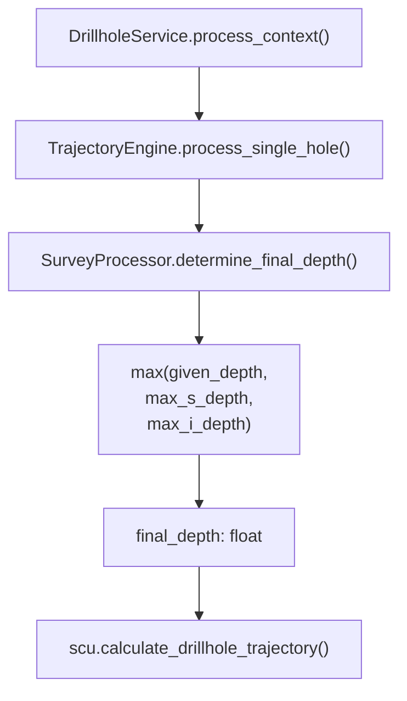

---
tags:
  - secinterp
  - code-walkthrough
  - core
  - drillhole
aliases:
  - survey_processor.py
  - SurveyProcessor
cssclass: secinterp-note
---

# `core/services/drillhole/survey_processor.py`

> [!abstract] Resumen en una línea
> Calcula la **profundidad final** de un sondaje como `max(given_depth, max survey, max interval)` para que ninguna traza quede truncada.

**Ruta**: `core/services/drillhole/survey_processor.py` (15 líneas)
**Clase**: `SurveyProcessor`
**Capa**: Core · Drillhole (100 % QGIS-agnóstico)
**Tags**: #secinterp #core #drillhole

---

## 🎯 ¿Por qué existe este archivo?

El collar declara una profundidad, pero los *surveys* y los intervalos litológicos suelen llegar **más abajo** que ese valor declarado (o el collar no trae profundidad). Si se usara solo `given_depth`, la trayectoria se cortaría antes de tiempo y se perderían intervalos.

| Problema | Solución |
|----------|----------|
| El campo de profundidad del collar es 0 o incompleto | `max_i_depth` de los intervalos como respaldo |
| Un survey desciende más que la profundidad declarada | `max_s_depth` entra en el `max()` |
| Sondajes sin surveys ni intervalos | Defaults a `0.0` para listas vacías |

> [!important] Frontera Core
> Este módulo **no importa nada** salvo `from __future__ import annotations`. Es la definición canónica de lógica pura: sin QGIS, sin Qt, sin estado, testeable sin instalación de QGIS.

---

## 🧬 Diagrama de relaciones



> [!tip] Cómo leer
> Flecha sólida = importa/llama. `SurveyProcessor` es una hoja del árbol: no depende de nadie.

---

## 📦 Imports — lectura arquitectónica

```python
from __future__ import annotations
```

| # | Observación |
|---|-------------|
| ① | Único import posible: anotaciones diferidas. **Cero dependencias** de runtime. |
| ② | La ausencia total de imports es intencional: prueba de que no hay acoplamiento a QGIS ni a `core/domain`. |

---

## 🧱 `determine_final_depth()` — la única operación

```python
def determine_final_depth(
    self, given_depth: float, survey_data: list[tuple], intervals: list[tuple]
) -> float:
    """Determine final depth from given depth, surveys and intervals."""
    max_s_depth = max([s[0] for s in survey_data]) if survey_data else 0.0
    max_i_depth = max([i[1] for i in intervals]) if intervals else 0.0
    return max(given_depth, max_s_depth, max_i_depth)
```

| Parámetro | Rol |
|-----------|-----|
| `given_depth` | Profundidad declarada del collar (`DrillholeProjection.total_depth`). |
| `survey_data` | Lista de `(depth, azimuth, inclination)`; se lee el **índice 0** (depth). |
| `intervals` | Lista de `(from, to, lith)`; se lee el **índice 1** (`to`, el fondo del intervalo). |
| **Retorno** | `float` — el mayor de los tres candidatos. |

### Traza del cálculo

| Fuente | Expresión | Qué representa |
|--------|-----------|----------------|
| Collar | `given_depth` | Profundidad total declarada |
| Survey | `max([s[0] for s in survey_data])` | Estación de medición más profunda |
| Intervalos | `max([i[1] for i in intervals])` | Techo del último intervalo litológico |

> [!warning] Contrato de tuplas implícito
> El método asume posiciones fijas: `s[0]` y `i[1]`. No hay validación de longitud ni de tipos. Si un extractor cambia el orden de las tuplas, el cálculo falla silenciosamente. El contrato real está en `DrillholeContext.survey_data` / `interval_data` (ver [[domain]]).

---

## 🏛️ Patrones de diseño presentes

| Patrón | Dónde | Propósito |
|--------|-------|-----------|
| **Pure Function / Stateless Strategy** | `determine_final_depth` | Cálculo determinista, sin efectos laterales |
| **Guard Defaults** | `if survey_data else 0.0` | Evita `ValueError: max() arg is an empty sequence` |
| **Single Responsibility** | Toda la clase | Solo resuelve la profundidad final |
| **Composition** | Instanciado por `TrajectoryEngine.__init__` | Inyección simple sin contenedor DI |

---

## 🧾 Resumen de la API

| Símbolo | Firma / Hereda | Uso típico |
|---------|----------------|------------|
| `SurveyProcessor` | `class` (sin herencia) | Procesador inyectado en `TrajectoryEngine` |
| `determine_final_depth` | `(given_depth: float, survey_data: list[tuple], intervals: list[tuple]) -> float` | Primer paso de `process_single_hole` |

---

## 👀 Observaciones y notas

> [!success] Fortalezas
> - **Robusto ante vacíos**: las listas vacías degradan a `0.0` sin excepción.
> - **Trivial de testear**: no requiere mocks ni QGIS.
> - **Semántica clara**: el nombre expresa exactamente la regla de negocio.

> [!warning] Puntos de atención
> - Se usan *list comprehensions* dentro de `max()`; con miles de estaciones esto materializa una lista extra (irrelevante a escala de sondaje, pero evitable con `default=0.0`).
> - No valida profundidades negativas ni `NaN`.
> - El contrato posicional de las tuplas no está tipado (`list[tuple]` sin parámetros).

> [!question] Preguntas abiertas
> - ¿Debería migrarse a `max(..., default=0.0)` para eliminar los condicionales?
> - ¿Conviene tipar `list[tuple[float, float, float]]` y `list[tuple[float, float, str]]`?

---

## 🔗 Notas relacionadas

- [[Index]] — índice de la bóveda
- [[trajectory_engine]] — orquesta y llama a este procesador
- [[collar_processor]] — provee `given_depth` vía `DrillholeProjection`
- [[interval_processor]] — usa la misma lista de intervalos
- [[drillhole_service]] — servicio de nivel superior
- [[layer_core_services_drillhole]] — subcapa del pipeline

---

*Nota de la bóveda SecInterp Code Walkthrough — v3.8.0*
