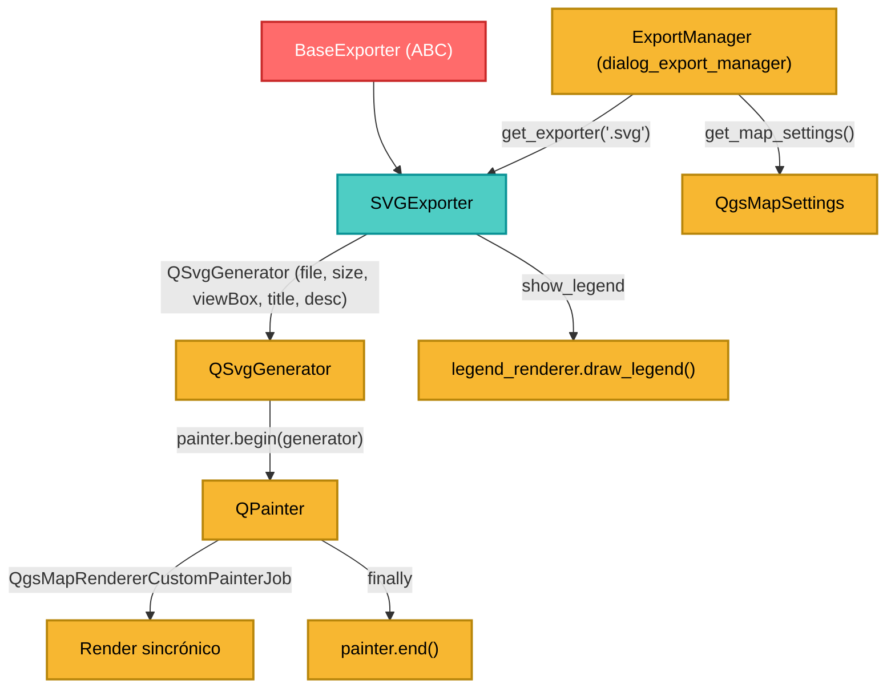

---
tags:
  - secinterp
  - code-walkthrough
  - exporters
  - svg
  - vector
  - render
  - i18n
aliases:
  - svg_exporter.py
  - SVGExporter
cssclass: secinterp-note
---

# `exporters/svg_exporter.py`

> [!abstract] Resumen en una línea
> Exporta un `QgsMapSettings` a **SVG vectorial** con `QSvgGenerator` + `QgsMapRendererCustomPainterJob`, con título y descripción traducibles e incrustados en el XML.

**Ruta**: `exporters/svg_exporter.py` (85 líneas)
**Clase**: `SVGExporter(BaseExporter)`
**Capa**: Exporters (QGIS · Gráfico vectorial)
**Tags**: #secinterp #exporters #svg #vector #render #i18n

---

## 🎯 ¿Por qué existe este archivo?

El SVG es ideal para incrustar la sección en webs, presentaciones o editores vectoriales (Inkscape/Illustrator): texto XML escalable sin pérdida. Además admite **metadatos** (título/descripción) que el plugin genera traducidos.

| Problema | Solución |
|----------|----------|
| Raster pierde nitidez al ampliar | `QSvgGenerator` produce vectores |
| El archivo no tiene contexto embebido | `setTitle()` / `setDescription()` con `QCoreApplication.translate` |
| Viewbox incorrecto → SVG recortado | `setSize(QSize(...))` + `setViewBox(QRectF(0, 0, w, h))` |
| El painter queda abierto si el render falla | `try/finally: painter.end()` |
| Fallo al inicializar el generador | `if not painter.begin(generator): return False` |

> [!important] Nota arquitectónica
> Es el exporter con más **strings de cara al usuario** (`title`, `description`) y el único del paquete que usa `QCoreApplication.translate`. Eso obliga a mantener sus textos en el catálogo i18n del plugin.

---

## 🧬 Diagrama de relaciones



---

## 📦 Imports — lectura arquitectónica

```python
from qgis.core import QgsMapRendererCustomPainterJob
from qgis.PyQt.QtCore import QCoreApplication, QRectF, QSize
from qgis.PyQt.QtGui import QPainter
from qgis.PyQt.QtSvg import QSvgGenerator

from sec_interp.logger_config import get_logger
from .base_exporter import BaseExporter
```

| # | Observación |
|---|-------------|
| ① | `QSvgGenerator` vive en `qgis.PyQt.QtSvg` (módulo QtSvg, no QtGui) |
| ② | `QCoreApplication.translate` habilita i18n de título/descripción |
| ③ | `QgsMapRendererCustomPainterJob` es el mismo job que imagen y PDF |
| ④ | El módulo **no importa `QgsMapSettings`**: el parámetro va sin anotación |

---

## 🧱 `export()` — generación del SVG

```python
def export(self, output_path: Path, map_settings) -> bool:
    try:
        width = self.get_setting("width", 800)
        height = self.get_setting("height", 600)
        title = self.get_setting(
            "title", QCoreApplication.translate("SVGExporter", "Section Interpretation Preview"))
        description = self.get_setting(
            "description",
            QCoreApplication.translate("SVGExporter", "Generated by SecInterp QGIS Plugin"))

        generator = QSvgGenerator()
        generator.setFileName(str(output_path))
        generator.setSize(QSize(width, height))
        generator.setViewBox(QRectF(0, 0, width, height))
        generator.setTitle(title)
        generator.setDescription(description)

        painter = QPainter()
        if not painter.begin(generator):
            return False
        try:
            painter.setRenderHint(QPainter.RenderHint.Antialiasing)

            job = QgsMapRendererCustomPainterJob(map_settings, painter)
            job.start()
            job.waitForFinished()

            show_legend = self.get_setting("show_legend", True)
            legend_renderer = self.get_setting("legend_renderer")
            if legend_renderer and show_legend:
                legend_renderer.draw_legend(painter, QRectF(0, 0, width, height))
            return True
        finally:
            painter.end()
    except Exception:
        logger.exception(f"SVG export failed for {output_path}")
        return False
```

| Setting | Default | Rol |
|---------|---------|-----|
| `width` / `height` | `800` / `600` | Dimensiones del SVG (px) |
| `title` | `"Section Interpretation Preview"` (traducido) | Metadato `<title>` |
| `description` | `"Generated by SecInterp QGIS Plugin"` (traducido) | Metadato `<desc>` |
| `show_legend` | `True` | Activar/desactivar leyenda |
| `legend_renderer` | `None` | Objeto con `draw_legend(painter, rect)` |

> [!tip] `return True` dentro del `try` con `finally`
> El `finally` se ejecuta **antes** de que el valor de retorno se materialice. Así `painter.end()` siempre corre, incluso en el camino de éxito.

> [!warning] `begin()` fallido sin log, y firma sin contrato
> A diferencia de [[pdf_exporter]] (que hace `logger.error`), un `begin()` fallido retorna `False` en silencio. Además `export` omite `layer_name` y no anota `map_settings`: no respeta estrictamente el contrato abstracto.

> [!note] i18n del SVG
> `QCoreApplication.translate("SVGExporter", ...)` registra los literales en el contexto `SVGExporter`. Si se añaden textos nuevos, hay que regenerar los `.ts` (workflow `/i18n-maintenance`).

---

## 🏛️ Patrones de diseño presentes

| Patrón | Dónde | Propósito |
|--------|-------|-----------|
| **Template Method** | `BaseExporter` | Contrato y settings |
| **Strategy** | `SVGExporter` | Estrategia vectorial concreta |
| **Job / Command** | `QgsMapRendererCustomPainterJob` | Render sincrónico |
| **RAII / try-finally** | `painter.end()` | Liberar recurso siempre |
| **Decorator (informal)** | `legend_renderer.draw_legend` | Superpone la leyenda |
| **i18n** | `QCoreApplication.translate` | Textos localizados |

---

## 🧾 Resumen de la API

| Símbolo | Firma / Hereda | Uso típico |
|---------|----------------|------------|
| `SVGExporter` | `class SVGExporter(BaseExporter)` | Exportador SVG |
| `get_supported_extensions()` | `-> [".svg"]` | Validación de extensión |
| `export(output_path, map_settings)` | `-> bool` | Escribe el SVG |
| `get_setting(key, default)` | heredado | Acceso a settings |

---

## 👀 Observaciones y notas

> [!success] Fortalezas
> - **Vectorial y escalable** con metadatos embebidos.
> - **Limpieza garantizada** del painter con `try/finally`.
> - **Título/descripción i18n** desde el primer día y **viewbox coherente**.

> [!warning] Puntos de atención
> - `begin()` fallido **sin log** (inconsistente con PDF).
> - Firma fuera del contrato base (sin `layer_name`, sin tipo en `map_settings`).
> - `except Exception` amplio que silencia errores devolviendo `False`.
> - Render **sincrónico** que bloquea el hilo llamante.
> - `legend_renderer` acopla el exporter a la GUI.
> - Los strings deben regenerarse en `.ts` si cambian; un contexto mal mantenido deja traducciones obsoletas.

> [!question] Preguntas abiertas
> - ¿Añadir `logger.error` cuando `painter.begin()` falla?
> - ¿Unificar los tres exportadores de render (imagen/PDF/SVG) bajo una clase base común con `try/finally`?

---

## 🔗 Notas relacionadas

- [[Index]] — índice de la bóveda
- [[base_exporter]] — contrato abstracto
- [[image_exporter]] / [[pdf_exporter]] — mismo job de render, distinto destino
- [[dialog_export_manager]] — construye `QgsMapSettings` y llama a `export()`
- [[export_package]] — `ExportService.get_map_settings()`
- [[controller]] — flujo de datos del preview

---

*Nota de la bóveda SecInterp Code Walkthrough — v3.8.0*
