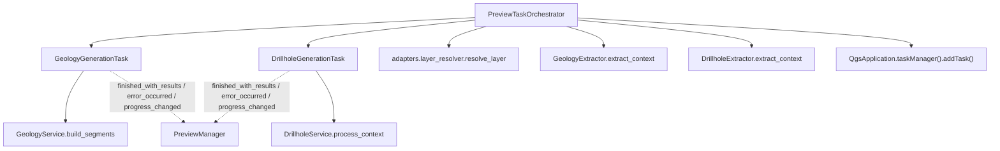

---
tags:
  - secinterp
  - code-walkthrough
  - gui
  - qgstask
  - background
aliases:
  - gui/tasks
  - QgsTask
  - PreviewTaskOrchestrator
cssclass: secinterp-note
---

# `gui/tasks/` + `preview_task_orchestrator.py`

> [!abstract] Resumen en una línea
> Ejecuta la generación de geología y sondajes en **segundo plano** con `QgsTask`, alimentándolos con DTOs desacoplados y emitiendo señales diferidas al hilo principal.

**Ruta**: `gui/tasks/` (`geology_task.py` 101 l., `drillhole_task.py` 107 l.) + `gui/preview_task_orchestrator.py` (158 l.)
**Clases**: `GeologyGenerationTask`, `DrillholeGenerationTask`, `PreviewTaskOrchestrator`
**Capa**: GUI · Tasks
**Tags**: #secinterp #gui #qgstask #background

---

## 🎯 ¿Por qué existe este paquete?

La generación de geología y sondajes puede tardar segundos. Bloquear la UI es inaceptable y tocar QGIS desde un hilo de fondo provoca segfaults.

| Problema | Solución |
|----------|----------|
| No bloquear la interfaz | `QgsTask` registrado en `QgsTaskManager` |
| Nunca pasar `QgsVectorLayer` a un hilo | DTOs desacoplados (`GeologyContext`, `DrillholeContext`) |
| Señales emitidas desde el hilo worker | `QTimer.singleShot(0, ...)` difiere la emisión al bucle de eventos |
| GC prematuro del task en QGIS 4/Qt6 | *Anchoring* en `self._active_tasks` |
| Cancelar trabajo al re-lanzar | `cancel()` + desconexión de señales en `cancel_active_tasks` |

> [!important] Frontera de hilos
> La extracción (QGIS) ocurre en el hilo principal dentro del orquestador; el task solo recibe DTOs y ejecuta matemática pura del core.

---

## 🧬 Diagrama de relaciones



---

## 📦 Imports — lectura arquitectónica

```python
from qgis.core import Qgis, QgsMessageLog, QgsTask, QgsApplication
from qgis.PyQt.QtCore import QTimer, pyqtSignal
from sec_interp.core.domain import DrillholeContext, GeologyContext, GeologyData
from sec_interp.gui.adapters.layer_resolver import resolve_layer
```

| # | Observación |
|---|-------------|
| ① | `QgsTask` es la base; `QgsApplication.taskManager()` es quien realmente encola. |
| ② | `pyqtSignal` define las 3 señales observadas por el manager. |
| ③ | `QTimer` solo se usa para diferir la emisión al hilo principal. |
| ④ | Los DTOs del core cruzan al hilo; las capas QGIS **nunca**. |

---

## 🧱 `geology_task.py` (101 l.) — `GeologyGenerationTask`

```python
class GeologyGenerationTask(QgsTask):
    finished_with_results = pyqtSignal(object)
    error_occurred = pyqtSignal(str)
    progress_changed = pyqtSignal(float)

    def __init__(self, description, context: GeologyContext, service: GeologyService, params):
        super().__init__(description, QgsTask.Flag.CanCancel)
        self.service = service
        self.context = context
        self.params = params
        self.result: GeologyData | None = None
        self.exception: Exception | None = None
```

| Método | Hilo | Qué hace |
|--------|:----:|----------|
| `run()` | worker | `self.service.build_segments(self.context, feedback=self)` |
| `finished(is_successful)` | main | Difiere la emisión con `QTimer.singleShot(0, ...)` o emite `error_occurred` |
| `setProgress(progress)` | worker | `super().setProgress()` + `progress_changed.emit(progress)` |

> [!note] `feedback=self`
> El `QgsTask` ya implementa `isCanceled()` y `setProgress()`; el servicio del core los usa como interfaz de feedback sin saber que es un task.

---

## 🧱 `drillhole_task.py` (107 l.) — `DrillholeGenerationTask`

```python
def run(self) -> bool:
    try:
        self.result = self.service.process_context(self.context, feedback=self)
        count = len(self.result[1]) if self.result and len(self.result) > 1 else 0
        logger.info(f"DrillholeGenerationTask finished with {count} holes")
        return True
    except Exception as e:
        self.exception = e
        return False
```

| Aspecto | Detalle |
|---------|---------|
| Resultado | Tupla `(geol_data_all, drillhole_data_all)`; `result[1]` es la lista de hoyos |
| Fallback | Si `run()` tuvo éxito pero `result is None`, `finished()` usa `([], [])` |
| Errores | `QgsMessageLog.logMessage(..., "SecInterp", Qgis.MessageLevel.Critical)` + `error_occurred` |
| Resto | Idéntico patrón que `GeologyGenerationTask` |

> [!warning] Sobre `finished()`
> Todo el cuerpo está envuelto en `try/except Exception` que loguea como crítico: la UI nunca debería quedar colgada por una excepción en la fase de finalización.

---

## 🧱 `preview_task_orchestrator.py` (158 l.) — `PreviewTaskOrchestrator`

```python
def __init__(self, manager: PreviewManager) -> None:
    self.manager = manager
    self.geology_task: GeologyGenerationTask | None = None
    self.drillhole_task: DrillholeGenerationTask | None = None
    self._active_tasks: list[Any] = []   # ancla para evitar GC (QGIS 4/Qt6)
```

### `start_geology_task(params, service)`

```python
if self.geology_task:
    self.geology_task.cancel()
line_lyr = resolve_layer(params.line_layer)
raster_lyr = resolve_layer(params.raster_layer)
outcrop_lyr = resolve_layer(params.outcrop_layer)
extractor = self.manager.preview_service.controller.geology_extractor
context = extractor.extract_context(line_lyr, raster_lyr, outcrop_lyr,
                                    params.outcrop_name_field, params.band_num)
self.geology_task = GeologyGenerationTask("Geology Preview (Async)", context, service, params)
self._active_tasks.append(self.geology_task)
self.geology_task.finished_with_results.connect(self.manager._on_geology_finished)
self.geology_task.progress_changed.connect(self.manager._on_geology_progress)
self.geology_task.error_occurred.connect(self.manager._on_geology_error)
QgsApplication.taskManager().addTask(self.geology_task)
```

### `start_drillhole_task(params, service, extractor)`

| Paso | Detalle |
|------|---------|
| Resolver capas | línea, collar, survey, interval, raster con `resolve_layer` |
| Construir mappings | `survey_fields_dict` (`id/depth/azim/incl`) y `interval_fields_dict` (`id/from/to/lith`) |
| Extraer contexto | `extractor.extract_context(...)` con los 14 argumentos |
| Crear task | `DrillholeGenerationTask("Drillhole Preview (Async)", ...)` |
| Conectar y encolar | `finished_with_results` / `progress_changed` / `error_occurred` + `addTask` |

### `cancel_active_tasks()` y `remove_task(task)`

```python
def cancel_active_tasks(self) -> None:
    import contextlib
    for task in list(self._active_tasks):
        if task:
            with contextlib.suppress(RuntimeError):
                task.cancel()
            try:
                task.finished_with_results.disconnect()
                task.progress_changed.disconnect()
                task.error_occurred.disconnect()
            except (TypeError, RuntimeError):
                pass
    self._active_tasks.clear()
    self.geology_task = None
    self.drillhole_task = None
```

| Método | Rol |
|--------|-----|
| `cancel_active_tasks` | Cancela, desconecta las 3 señales y limpia las anclas |
| `remove_task` | Quita un task terminado de `_active_tasks` (evita crecimiento) |

> [!tip] Anchoring
> Mantener referencias en `self._active_tasks` evita que Python/QGIS destruya el `QgsTask` antes de que termine, causa clásica de segfaults en Qt6.

> [!note] `gui/tasks/__init__.py`
> Está **vacío** (0 líneas): los tasks se importan por ruta directa (`from .tasks.drillhole_task import ...`). No hay API pública de paquete.

---

## 🏛️ Patrones de diseño presentes

| Patrón | Dónde | Propósito |
|--------|-------|-----------|
| **Worker / Background Task** | ambas clases `QgsTask` | Trabajo pesado fuera de la UI |
| **Orchestrator** | `PreviewTaskOrchestrator` | Encapsula extracción + task + señales |
| **Anchor / Retention** | `_active_tasks` | Evitar GC prematuro del task |
| **Deferred signal** | `QTimer.singleShot(0, ...)` | Emitir desde el hilo correcto |
| **Observer** | `pyqtSignal` × 3 | Desacoplar task de manager |
| **Feedback interface** | `feedback=self` | El core no conoce `QgsTask` |
| **Idempotent cancel** | `contextlib.suppress` + `try/except` | Cancelar es seguro |

---

## 🧾 Resumen de la API

| Símbolo | Firma / Hereda | Uso |
|---------|----------------|-----|
| `GeologyGenerationTask` | `QgsTask` | Genera segmentos geológicos |
| `DrillholeGenerationTask` | `QgsTask` | Genera trazas/intervalos de sondajes |
| `PreviewTaskOrchestrator` | clase | Crea, conecta y encola tasks |
| `start_geology_task` | `(params, service) -> None` | Lanza el task de geología |
| `start_drillhole_task` | `(params, service, extractor) -> None` | Lanza el task de sondajes |
| `cancel_active_tasks` | `() -> None` | Cancela y limpia anclas |
| `remove_task` | `(task) -> None` | Quita un task terminado |
| `finished_with_results` | `pyqtSignal(object)` | Resultado en el hilo principal |
| `error_occurred` | `pyqtSignal(str)` | Mensaje de error |
| `progress_changed` | `pyqtSignal(float)` | Progreso para la barra de UI |

---

## 👀 Observaciones y notas

> [!success] Fortalezas
> - Los tasks reciben DTOs: cero objetos QGIS vivos en el hilo worker.
> - Emisión diferida: se evitan carreras con el render de geología.
> - Anclaje explícito que previene segfaults por GC en Qt6.
> - Cancelación segura e idempotente.

> [!warning] Puntos de atención
> - La extracción de contexto ocurre **en el hilo principal** dentro del orquestador; con capas enormes puede notarse una pausa.
> - El orquestador accede a `manager.preview_service.controller.geology_extractor` (cadena larga de dependencias).
> - `finished()` captura `Exception` genérica y la reporta como crítica: útil, pero puede ocultar la causa si no se revisa el log.
> - `_active_tasks` se limpia por completo en `cancel_active_tasks`; `remove_task` es el mecanismo fino.

> [!question] Preguntas abiertas
> - ¿Debería moverse la extracción pesada también a un task previo?
> - ¿Conviene un único `GenerationTask` genérico parametrizado por servicio?
> - ¿Debería `__init__.py` exponer los tasks para simplificar imports?

---

## 🔗 Notas relacionadas

- [[adapters]] — produce los DTOs que alimentan los tasks
- [[controller]] — core puro que consumen los servicios de los tasks
- [[domain]] — `GeologyContext` / `DrillholeContext`
- [[geology_service]] — `build_segments` invocado en `run()`
- [[drillhole_service]] — `process_context` invocado en `run()`
- [[dialog_preview_manager]] — manager cuyos callbacks reciben las señales
- [[layer_gui_tasks]] — índice de la capa GUI · tasks
- [[Index]] — índice de la bóveda

---

*Nota de la bóveda SecInterp Code Walkthrough — v3.8.0*
