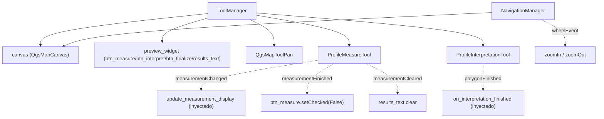

---
tags:
  - secinterp
  - code-walkthrough
  - gui
  - map-tools
aliases:
  - dialog_tool_manager.py
  - ToolManager
  - NavigationManager
cssclass: secinterp-note
---

# `gui/dialog_tool_manager.py`

> [!abstract] Resumen en una línea
> Orquesta las **map tools** del canvas de preview (pan, medición multi-punto, interpretación de polígonos) y expone `NavigationManager` para el zoom con la rueda, inyectando callbacks para desacoplar del diálogo.

**Ruta**: `gui/dialog_tool_manager.py` (203 líneas)
**Clases**: `ToolManager`, `NavigationManager`
**Capa**: GUI · Managers
**Tags**: #secinterp #gui #map-tools

---

## 🎯 ¿Por qué existe este archivo?

El diálogo no debe instanciar `QgsMapToolPan`, `ProfileMeasureTool` ni `ProfileInterpretationTool` inline ni cablear sus señales. Este módulo es el **único dueño** del ciclo de vida de las herramientas.

| Problema | Solución |
|----------|----------|
| Creación dispersa de tools en `main_dialog` | `initialize_tools()` las crea si no vienen inyectadas |
| Señales de tools conectadas sin desconexión | `connect_signals()`/`disconnect_signals()` simétricos e idempotentes |
| `ToolManager` acoplado a `InterpretationManager` | Callback `on_interpretation_finished` inyectado |
| El diálogo formatea métricas de medición | Callback `update_measurement_display` inyectado |
| Zoom con rueda sin dueño claro | `NavigationManager.handle_wheel_event()` |

> [!important] Regla Extract/Present
> El cálculo de métricas vive en `core/utils/geometry_utils/measurement.calculate_polyline_metrics` (core). Aquí solo se **presenta** el resultado en HTML (`results_text.setHtml`).

---

## 🧬 Diagrama de relaciones



Punteadas = señales Qt/callbacks inyectados (bajo acoplamiento). Sólidas = composición.

---

## 📦 Imports — lectura arquitectónica

```python
from __future__ import annotations
import contextlib
from collections.abc import Callable
from typing import Any
from qgis.gui import QgsMapTool, QgsMapToolPan
from .tools.interpretation_tool import ProfileInterpretationTool
from .tools.measure_tool import ProfileMeasureTool
```

`QgsMapToolPan` (Qt/QGIS) se crea aquí; es capa GUI, no core. Las tools concretas se importan de `gui/tools/`. `Callable` tipa los callbacks; `Any` mantiene el desacoplamiento de widgets.

---

## 🧱 Recorrido del código

### `ToolManager.__init__(...)` — inyección

```python
def __init__(self, canvas, preview_widget, translate,
             on_interpretation_finished, update_measurement_display,
             pan_tool=None, measure_tool=None, interpretation_tool=None) -> None:
    self.canvas = canvas
    self.preview_widget = preview_widget
    self.tr = translate
    self.on_interpretation_finished = on_interpretation_finished
    self._update_measurement_display_cb = update_measurement_display
    self.pan_tool = pan_tool
    self.measure_tool = measure_tool
    self.interpretation_tool = interpretation_tool
```

Las tools son **opcionales**: si no se inyectan (tests, fakes), `initialize_tools()` las crea.

### `initialize_tools()` y simetría de señales

```python
def initialize_tools(self) -> None:
    if not self.pan_tool:
        self.pan_tool = QgsMapToolPan(self.canvas)
    if not self.measure_tool:
        self.measure_tool = ProfileMeasureTool(self.canvas)
    if not self.interpretation_tool:
        self.interpretation_tool = ProfileInterpretationTool(self.canvas)
    self.connect_signals()
    self.canvas.setMapTool(self.pan_tool)

def connect_signals(self) -> None:
    self.disconnect_signals()          # ← idempotente
    self.interpretation_tool.polygonFinished.connect(self.on_interpretation_finished)
    self.measure_tool.measurementChanged.connect(self._update_measurement_display_cb)
    self.measure_tool.measurementFinished.connect(
        lambda: self.preview_widget.btn_measure.setChecked(False))
    self.measure_tool.measurementCleared.connect(self.preview_widget.results_text.clear)
```

`disconnect_signals()` espeja las cuatro conexiones con `contextlib.suppress(TypeError, RuntimeError)`.

| Señal | Slot | Efecto |
|-------|------|--------|
| `interpretation_tool.polygonFinished` | `on_interpretation_finished` | Alta de la interpretación |
| `measure_tool.measurementChanged` | `update_measurement_display` | Render de métricas |
| `measure_tool.measurementFinished` | `lambda` | Desmarca `btn_measure` |
| `measure_tool.measurementCleared` | `results_text.clear` | Limpia resultados |

### `toggle_measure_tool(checked)` / `toggle_interpretation_tool(checked)`

```python
def toggle_measure_tool(self, checked: bool) -> None:
    if checked:
        self.measure_tool.reset()
        self.canvas.setMapTool(self.measure_tool)
        self.measure_tool.activate()
        self.preview_widget.btn_finalize.setVisible(True)
        self.canvas.setFocus()
    else:
        self.canvas.setMapTool(self.pan_tool)
        self.pan_tool.activate()
        self.preview_widget.btn_finalize.setVisible(False)
```

`toggle_interpretation_tool` es análogo, pero antes hace `btn_measure.setChecked(False)` para garantizar **una sola tool activa**. `activate_default_tool()` vuelve siempre a pan.

### `update_measurement_display(metrics)` — Present

```python
MIN_POINT_COUNT = 2
if not metrics or metrics.get("point_count", 0) < MIN_POINT_COUNT:
    return
msg = (
    f"<b>{self.tr('Multi-Point Measurement')}</b><br>"
    f"<b>{self.tr('Total Distance')}:</b> {metrics['total_distance']:.2f} m<br>"
    f"<b>{self.tr('Elevation Change')}:</b> {metrics['elevation_change']:+.2f} m<br>"
    f"<b>{self.tr('Average Slope')}:</b> {metrics['avg_slope']:.1f}°"
)
self.preview_widget.results_text.setHtml(msg)
self.preview_widget.results_group.setCollapsed(False)
```

Ignora mediciones con menos de 2 puntos y expande el grupo de resultados.

### `NavigationManager.handle_wheel_event(event)`

```python
def handle_wheel_event(self, event: Any) -> bool:
    if self.canvas.underMouse():
        if event.angleDelta().y() > 0:
            self.canvas.zoomIn()
        else:
            self.canvas.zoomOut()
        event.accept()
        return True
    return False
```

Devuelve `True` si consumió el evento; `False` permite que el `wheelEvent` del diálogo lo reenvíe a Qt.

---

## 🏛️ Patrones de diseño presentes

| Patrón | Dónde | Propósito |
|--------|-------|-----------|
| **Manager / Orchestrator** | `ToolManager` | Único dueño de las tools |
| **Dependency Injection** | `pan_tool=None`, callbacks | Tools y presentación intercambiables |
| **Idempotent wiring** | `connect_signals` → `disconnect_signals` | Re-conexión segura |
| **Callback (Observer)** | `on_interpretation_finished` | Desacople de `InterpretationManager` |
| **State toggle** | `toggle_*` | Una tool activa a la vez |
| **Separate Query** | `NavigationManager` | Aísla la lógica de zoom |

---

## 🧾 Resumen de la API

| Símbolo | Firma | Uso típico |
|---------|-------|------------|
| `ToolManager(...)` | `__init__` | Inyección de canvas/widget/callbacks/tools |
| `initialize_tools()` | `-> None` | Crear tools + conectar + pan por defecto |
| `connect_signals()` / `disconnect_signals()` | `-> None` | Cablear / desconectar (idempotente) |
| `toggle_measure_tool(checked)` | `-> None` | Activar/desactivar medición |
| `toggle_interpretation_tool(checked)` | `-> None` | Activar/desactivar polígono |
| `activate_default_tool()` | `-> None` | Volver a pan |
| `update_measurement_display(metrics)` | `-> None` | Render HTML de métricas |
| `NavigationManager(canvas)` / `handle_wheel_event(event)` | `-> bool` | Zoom in/out con la rueda |

---

## 👀 Observaciones y notas

> [!success] Fortalezas
> - **Inyección total**: tools y callbacks reemplazables en tests.
> - Simetría connect/disconnect e idempotencia real.
> - La presentación de métricas queda separada del cálculo (core).

> [!warning] Puntos de atención
> - `toggle_measure_tool` no comprueba `self.measure_tool is None`: si no se llamó `initialize_tools()`, lanza `AttributeError`.
> - `ProfileMeasureTool.finalize_measurement` crea internamente un `QgsMapToolPan` **y** emite `measurementFinished`, que dispara `toggle_measure_tool(False)` → el canvas puede recibir `setMapTool(pan)` dos veces (redundante, no incorrecto).
> - `update_measurement_display` escribe en widgets concretos: `ToolManager` conoce la estructura del `preview_widget`.

> [!question] Preguntas abiertas
> - ¿Debería `initialize_tools()` ser obligatorio en el constructor para eliminar el estado "tools = None"?

---

## 🔗 Notas relacionadas

- [[main_dialog]] — crea el manager y llama `initialize_tools()`
- [[measure_tool]] — herramienta de medición multi-punto
- [[interpretation_tool]] — herramienta de polígonos
- [[interpretation_manager]] — recibe `polygonFinished`
- [[signal_manager]] — conecta los toggles de los botones
- [[Index]] — índice de la bóveda

---

*Nota de la bóveda SecInterp Code Walkthrough — v3.8.0*
