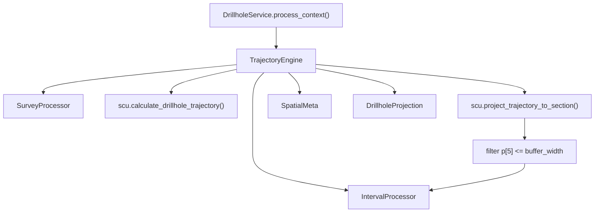

---
tags:
  - secinterp
  - code-walkthrough
  - core
  - drillhole
aliases:
  - trajectory_engine.py
  - TrajectoryEngine
cssclass: secinterp-note
---

# `core/services/drillhole/trajectory_engine.py`

> [!abstract] Resumen en una línea
> Orquesta por sondaje la secuencia **profundidad final → trayectoria 3D → proyección 2D con filtro de buffer → intervalos**, y ensambla el `DrillholeProjection` final.

**Ruta**: `core/services/drillhole/trajectory_engine.py` (111 líneas)
**Clase**: `TrajectoryEngine`
**Capa**: Core · Drillhole (QGIS-agnóstico)
**Tags**: #secinterp #core #drillhole

---

## 🎯 ¿Por qué existe este archivo?

Es el **punto de composición** del pipeline de sondajes. `DrillholeService` no debería conocer los detalles de calcular una trayectoria ni de interpolar intervalos; este motor concentra esa secuencia y devuelve dos DTOs listos para render.

| Problema | Solución |
|----------|----------|
| La secuencia de cálculo está dispersa | `process_single_hole()` la encapsula en 4 pasos |
| Hay que decidir la profundidad antes de trazar | Delega en `SurveyProcessor` |
| La trayectoria 3D debe recortarse al buffer | Filtra `p[5] <= buffer_width` tras proyectar |
| Render/export necesitan metadatos espaciales | `create_drillhole_result()` construye `SpatialMeta` |

> [!important] Frontera Core
> Compone procesadores puros y utilidades puras (`scu`). No importa QGIS; el único acoplamiento es a `core/domain` y `core/utils`.

---

## 🧬 Diagrama de relaciones



> [!tip] Cómo leer: `TE` es un **orquestador**; las flechas salen hacia colaboradores inyectados y funciones puras, ninguna apunta a QGIS.

---

## 📦 Imports — lectura arquitectónica

```python
from sec_interp.core import utils as scu
from sec_interp.core.domain import DrillholeProjection, GeologySegment, SpatialMeta
from sec_interp.core.services.drillhole.interval_processor import IntervalProcessor
from sec_interp.core.services.drillhole.survey_processor import SurveyProcessor
```

| # | Observación |
|---|-------------|
| ① | `scu` aporta la matemática pesada (`calculate_drillhole_trajectory`, `project_trajectory_to_section`). |
| ② | Importa los dos procesadores que compone: **composición explícita**, no service locator. |
| ③ | `SpatialMeta` es el puente 2D/3D del dominio; cero imports de `qgis` / `PyQt`. |

---

## 🧱 `process_single_hole()` — los 4 pasos

```python
def process_single_hole(
    self, hole_id, collar_point, collar_z, given_depth, survey_data,
    intervals, line_points, buffer_width, section_azimuth,
) -> tuple[list[GeologySegment], DrillholeProjection]:
    # 1. Determine Final Depth
    final_depth = self.survey_processor.determine_final_depth(
        given_depth, survey_data, intervals
    )

    # 2. Trajectory and Projection
    trajectory = scu.calculate_drillhole_trajectory(
        collar_point, collar_z, survey_data, section_azimuth, total_depth=final_depth,
    )
    projected_traj = [
        p for p in scu.project_trajectory_to_section(trajectory, line_points)
        if p[5] <= buffer_width
    ]

    # 3. Interpolate Intervals
    hole_geol_data = self.interval_processor.interpolate_hole_intervals(
        projected_traj, intervals, buffer_width
    )

    # 4. Generate results
    hole_proj = self.create_drillhole_result(hole_id, projected_traj, hole_geol_data)

    return hole_geol_data, hole_proj
```

| Paso | Colaborador | Rol |
|------|-------------|-----|
| 1. Profundidad | `SurveyProcessor` | `max(given, surveys, intervals)` |
| 2. Trayectoria + proyección | `scu` | 3D real → 2D perfil, filtrado por buffer |
| 3. Intervalos | `IntervalProcessor` | Geología muestreada sobre `projected_traj` |
| 4. Resultado | `create_drillhole_result` | Ensambla `DrillholeProjection` con `SpatialMeta` |

> [!warning] Índices mágicos
> El filtro `p[5] <= buffer_width` asume que el offset es la **posición 5** de la tupla proyectada. Es un contrato posicional no tipado compartido con `scu`.

---

## 🧱 `create_drillhole_result()` — ensamblado del DTO

```python
def create_drillhole_result(self, hole_id, projected_traj, hole_geol_data, collar_proj=None):
    spatial_points = [
        SpatialMeta(hole_id=str(hole_id), dist_along=p[4], offset=p[5], z=p[3],
                    x_3d=p[1], y_3d=p[2], x_proj=p[6], y_proj=p[7])
        for p in projected_traj
    ]

    if collar_proj:                       # cabecera desde el collar proyectado
        dist, elev, offset, depth = (collar_proj.distance, collar_proj.elevation,
                                     collar_proj.offset, collar_proj.total_depth)
    elif spatial_points:                  # fallback al primer punto; depth = 0.0
        dist, elev, offset, depth = (spatial_points[0].dist_along,
                                     spatial_points[0].z, spatial_points[0].offset, 0.0)
    else:                                 # trayectoria vacía
        dist = elev = offset = depth = 0.0

    return DrillholeProjection(
        hole_id=str(hole_id), distance=dist, elevation=elev, offset=offset,
        total_depth=depth, points_3d=spatial_points, segments=hole_geol_data,
    )
```

| Fuente de cabecera | Cuándo |
|--------------------|--------|
| `collar_proj` | Collar ya proyectado (incluye `total_depth`) |
| Primer `SpatialMeta` | Fallback sin collar; `total_depth = 0.0` |
| Ceros | Trayectoria vacía |

---

## 🏛️ Patrones de diseño presentes

| Patrón | Dónde | Propósito |
|--------|-------|-----------|
| **Orchestrator / Facade** | `process_single_hole` | Oculta la secuencia de 4 pasos |
| **Pipeline / Chain** | Pasos 1→2→3→4 | Flujo de datos unidireccional |
| **DTO Assembly** | `create_drillhole_result` | Agrega `SpatialMeta` + `GeologySegment` |

---

## 🧾 Resumen de la API

| Símbolo | Firma / Hereda | Uso típico |
|---------|----------------|------------|
| `process_single_hole` | `(hole_id, collar_point, collar_z, given_depth, survey_data, intervals, line_points, buffer_width, section_azimuth) -> tuple[list[GeologySegment], DrillholeProjection]` | Procesa un sondaje |
| `create_drillhole_result` | `(hole_id, projected_traj, hole_geol_data, collar_proj=None) -> DrillholeProjection` | Ensambla el DTO final |

---

## 👀 Observaciones y notas

> [!success] Fortalezas
> - **Composición limpia**: cada paso tiene un colaborador claro.
> - **Degradación elegante**: sin collar o sin trayectoria, igual devuelve un DTO válido.

> [!warning] Puntos de atención
> - `create_drillhole_result` accede a `p[1..7]` por índice; un cambio en `scu` rompe el motor silenciosamente.
> - El filtro de buffer se hace aquí, pero `interpolate_hole_intervals` también recibe `buffer_width`: doble responsabilidad sobre el recorte.

> [!question] Preguntas abiertas
> - ¿Debería `projected_traj` ser una lista de `SpatialMeta` desde `scu` y mover el filtro de buffer a un único punto del pipeline?

---

## 🔗 Notas relacionadas

- [[Index]] — índice de la bóveda
- [[drillhole_service]] — lo orquesta por collar
- [[survey_processor]] / [[interval_processor]] — colaboradores inyectados
- [[collar_processor]] — provee `collar_z` y `given_depth`
- [[domain]] — `DrillholeProjection`, `GeologySegment`, `SpatialMeta`
- [[layer_core_services_drillhole]] — subcapa del pipeline

---

*Nota de la bóveda SecInterp Code Walkthrough — v3.8.0*
