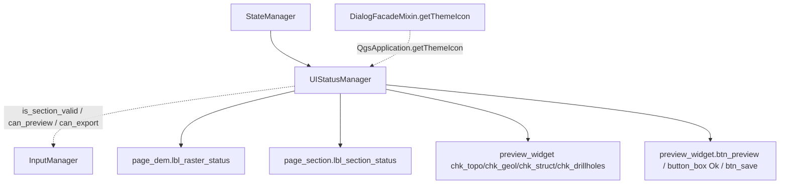

---
tags:
  - secinterp
  - code-walkthrough
  - gui
  - status
aliases:
  - ui_status_manager.py
  - UIStatusManager
cssclass: secinterp-note
---

# `gui/ui_status_manager.py`

> [!abstract] Resumen en una línea
> Traduce la **validez de las entradas** en señales visuales: iconos warning/success en las etiquetas de capa y enable/disable de checkboxes y botones del diálogo.

**Ruta**: `gui/ui_status_manager.py` (85 líneas)
**Clase**: `UIStatusManager`
**Capa**: GUI · Managers
**Tags**: #secinterp #gui #status

---

## 🎯 ¿Por qué existe este archivo?

La lógica de "¿está listo para previsualizar?" no debe estar dispersa en `setEnabled(...)` por todo el diálogo. `UIStatusManager` es la **capa de presentación del estado**: consulta a `InputManager` y aplica el resultado a los widgets.

| Problema | Solución |
|----------|----------|
| `setEnabled` disperso por `main_dialog` | Cuatro métodos centralizados |
| Iconos de validación sin dueño | `setup_indicators()` carga warning/success una vez |
| Checkboxes de capas siempre habilitados | `update_preview_checkbox_states()` los condiciona a la validez |
| Botones que fallan al pulsarse sin datos | `update_button_state()` los deshabilita preventivamente |

> [!important] Nota arquitectónica
> Este manager **solo presenta**: nunca valida por sí mismo. Toda decisión viene de `InputManager` (`is_section_valid`, `can_preview`, `can_export`), que a su vez delega en el core.

---

## 🧬 Diagrama de relaciones



Punteadas = consulta o dependencia de servicio; sólidas = escritura sobre widgets.

---

## 📦 Imports — lectura arquitectónica

```python
from __future__ import annotations
from typing import TYPE_CHECKING
from qgis.PyQt.QtWidgets import QDialogButtonBox
if TYPE_CHECKING:
    from sec_interp.gui.main_dialog import SecInterpDialog  # type: ignore
```

Solo importa `QDialogButtonBox` de Qt (localizar el botón `Ok` por rol). `TYPE_CHECKING` evita el ciclo con `main_dialog`. **No** importa `InputManager` ni core: los consulta vía `self.dialog.input_manager`.

---

## 🧱 Recorrido del código — `UIStatusManager`

### `__init__(dialog)` y `setup_indicators()`

```python
def __init__(self, dialog: SecInterpDialog) -> None:
    self.dialog = dialog
    self._warning_icon = None
    self._success_icon = None

def setup_indicators(self) -> None:
    self._warning_icon = self.dialog.getThemeIcon("mMessageLogCritical.svg")
    self._success_icon = self.dialog.getThemeIcon("mIconSuccess.svg")
    self.update_raster_status()
    self.update_section_status()
```

`getThemeIcon` es un proxy de `DialogFacadeMixin` hacia `QgsApplication.getThemeIcon(name)`, de modo que los iconos respetan el tema activo de QGIS. Hasta `setup_indicators()`, los iconos son `None` y los métodos salen temprano.

### `update_all()` — refresco integral

```python
def update_all(self) -> None:
    self.update_button_state()
    self.update_preview_checkbox_states()
    self.update_raster_status()
    self.update_section_status()
```

Es el punto que invoca `StateManager.update_all()` tras cargar ajustes o resetear.

### `update_preview_checkbox_states()` — habilitar capas

```python
im = self.dialog.input_manager
has_section = im.is_section_valid("section")
has_dem = im.is_section_valid("dem")

pw = self.dialog.preview_widget
pw.chk_topo.setEnabled(has_dem and has_section)
pw.chk_geol.setEnabled(im.is_section_valid("geology") and has_section)
pw.chk_struct.setEnabled(im.is_section_valid("structure") and has_section)
pw.chk_drillholes.setEnabled(im.is_section_valid("drillhole") and has_section)
```

| Checkbox | Condición |
|----------|-----------|
| `chk_topo` | DEM **y** sección válidos |
| `chk_geol` / `chk_struct` / `chk_drillholes` | su capa válida **y** sección |

La sección es transversal: sin línea de corte no tiene sentido mostrar ninguna capa.

### `update_button_state()` — habilitar acciones

```python
im = self.dialog.input_manager
can_preview = im.can_preview()
self.dialog.preview_widget.btn_preview.setEnabled(can_preview)
self.dialog.button_box.button(QDialogButtonBox.StandardButton.Ok).setEnabled(can_preview)
if hasattr(self.dialog, "btn_save"):
    self.dialog.btn_save.setEnabled(im.can_export())
```

`Ok` comparte el gate de preview; `btn_save` (si existe) usa `can_export()`, que exige además la ruta de salida.

### `update_raster_status()` y `update_section_status()`

```python
def update_raster_status(self) -> None:
    if not self._warning_icon:
        return
    im = self.dialog.input_manager
    label = self.dialog.page_dem.lbl_raster_status
    if im.is_section_valid("dem"):
        label.setPixmap(self._success_icon.pixmap(16, 16))
        label.setToolTip(self.dialog.tr("Raster layer selected"))
    else:
        label.setPixmap(self._warning_icon.pixmap(16, 16))
        label.setToolTip(im.get_section_error("dem"))
```

`update_section_status()` es idéntico sobre `page_section.lbl_section_status`. Ambos usan `get_section_error()` como tooltip cuando falta el dato.

---

## 🏛️ Patrones de diseño presentes

| Patrón | Dónde | Propósito |
|--------|-------|-----------|
| **Presenter / MVP** | `UIStatusManager` | Validez → presentación sin validar |
| **Facade (icons)** | `dialog.getThemeIcon` | Iconos del tema QGIS |
| **Guard clause** | `if not self._warning_icon: return` | Evita pintar antes de inicializar |
| **Conditional enablement** | `update_*` | UI consistente con el estado |
| **Delegation** | `StateManager` → aquí | Punto único de entrada |

---

## 🧾 Resumen de la API

| Símbolo | Firma | Uso típico |
|---------|-------|------------|
| `UIStatusManager(dialog)` | `__init__` | Composition |
| `setup_indicators()` | `-> None` | Cargar iconos + estado inicial |
| `update_all()` | `-> None` | Refresco integral |
| `update_preview_checkbox_states()` | `-> None` | Habilitar checkboxes de capas |
| `update_button_state()` | `-> None` | Habilitar preview/Ok/save |
| `update_raster_status()` / `update_section_status()` | `-> None` | Icono de DEM / línea de sección |

---

## 👀 Observaciones y notas

> [!success] Fortalezas
> - Presentación de estado **centralizada** y sin lógica de negocio.
> - Iconos consistentes con el tema de QGIS vía `getThemeIcon`.
> - Guard clauses que evitan trabajar antes de `setup_indicators()`.

> [!warning] Puntos de atención
> - `update_preview_checkbox_states()` llama a `is_section_valid` hasta 4 veces, y cada llamada reconstruye `ValidationParams` en `InputManager` (coste repetido).
> - `chk_interpretations` **no** se gestiona aquí (queda siempre habilitado), a diferencia de los otros cuatro checkboxes.
> - `update_button_state()` asume que el botón `Ok` existe: `button(...).setEnabled(...)` sobre `None` lanzaría `AttributeError`.
> - Depende de nombres de widget concretos (`lbl_raster_status`, `lbl_section_status`, `chk_*`), acoplando el manager a la UI programática.

> [!question] Preguntas abiertas
> - ¿Debería calcularse `ValidationParams` una vez por refresco y pasarse a todas las consultas?

---

## 🔗 Notas relacionadas

- [[state_manager]] — delega aquí el estado visual
- [[input_manager]] — fuente de `is_section_valid`/`can_preview`/`can_export`
- [[main_dialog]] — expone `getThemeIcon` y los widgets
- [[ui_pages]] — páginas con `lbl_*_status`
- [[dialog_mixins]] — `DialogFacadeMixin.getThemeIcon`
- [[Index]] — índice de la bóveda

---

*Nota de la bóveda SecInterp Code Walkthrough — v3.8.0*
