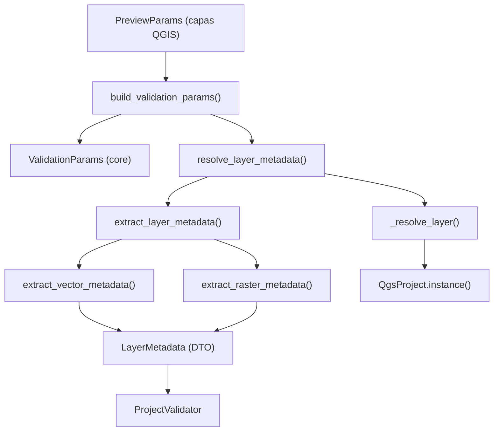

---
tags:
  - secinterp
  - code-walkthrough
  - gui
  - adapters
  - validation
aliases:
  - validation_extractor.py
  - resolve_layer_metadata
  - LayerMetadata
cssclass: secinterp-note
---

# `gui/adapters/validation_extractor.py`

> [!abstract] Resumen en una línea
> Adapter **Extract** de validación: convierte capas QGIS (y referencias del proyecto) en registros `LayerMetadata` desacoplados y arma un `ValidationParams` para el validador puro.

**Ruta**: `gui/adapters/validation_extractor.py` (176 líneas)
**Funciones**: `resolve_layer_metadata`, `extract_layer_metadata`, `extract_vector_metadata`, `extract_raster_metadata`, `build_validation_params`
**Capa**: GUI · Adapters (Extract phase)
**Tags**: #secinterp #gui #adapters #validation

---

## 🎯 ¿Por qué existe este archivo?

| Problema | Solución |
|----------|----------|
| El validador core no puede tocar `QgsVectorLayer` | Se extrae un `LayerMetadata` con primitivas |
| Las referencias de capa pueden ser objeto, ID o nombre | `_resolve_layer` cubre los tres casos |
| Los tipos de campo de QGIS no son portables | `_to_field_type` mapea el `QVariant` a `FieldType` |
| `PreviewParams` guarda capas vivas | `build_validation_params` las sustituye por metadata |

> [!important] Frontera Extract
> Es el puente entre `PreviewParams` (GUI, con capas QGIS) y `ValidationParams` (core, con `LayerMetadata`). El `ProjectValidator` nunca ve QGIS.

---

## 🧬 Diagrama de relaciones



---

## 📦 Imports — lectura arquitectónica

```python
from qgis.core import QgsMapLayer, QgsProject, QgsRasterLayer, QgsVectorLayer, QgsWkbTypes
from sec_interp.core.domain import FieldType
from sec_interp.core.validation.layer_metadata import (
    GEOMETRY_LINE, GEOMETRY_POINT, GEOMETRY_POLYGON, GEOMETRY_UNKNOWN,
    KIND_RASTER, KIND_UNKNOWN, KIND_VECTOR, LayerMetadata,
)
```

| # | Observación |
|---|-------------|
| ① | Importa las **constantes** de tipo del core (`KIND_*`, `GEOMETRY_*`) para no duplicar strings. |
| ② | `_GEOMETRY_MAP` traduce los `QgsWkbTypes.GeometryType` a esos strings agnósticos. |
| ③ | `ValidationParams` se importa **dentro** de `build_validation_params` para evitar import circular. |

---

## 🧱 `_GEOMETRY_MAP` — traducción de tipos

```python
_GEOMETRY_MAP = {
    QgsWkbTypes.GeometryType.PointGeometry: GEOMETRY_POINT,
    QgsWkbTypes.GeometryType.LineGeometry: GEOMETRY_LINE,
    QgsWkbTypes.GeometryType.PolygonGeometry: GEOMETRY_POLYGON,
}
```

> [!note] QGIS → vocabulario propio
> Cualquier tipo no listado (p. ej. `NullGeometry`) cae en `GEOMETRY_UNKNOWN` vía `dict.get(..., GEOMETRY_UNKNOWN)`.

---

## 🧱 `resolve_layer_metadata()` + `_resolve_layer()`

```python
def resolve_layer_metadata(layer_ref: Any) -> LayerMetadata | None:
    layer = _resolve_layer(layer_ref)
    if layer is None:
        return None
    return extract_layer_metadata(layer)

def _resolve_layer(layer_ref: Any) -> QgsMapLayer | None:
    if isinstance(layer_ref, QgsMapLayer):
        return layer_ref
    if not layer_ref:
        return None
    if isinstance(layer_ref, str):
        project = QgsProject.instance()
        layer = project.mapLayer(layer_ref)          # 1. por ID
        if layer is not None:
            return layer
        for lyr in project.mapLayers().values():     # 2. por nombre
            if lyr.name() == layer_ref:
                return lyr
    return None
```

| Entrada | Comportamiento |
|---------|----------------|
| `QgsMapLayer` | Se devuelve tal cual |
| `str` (ID) | `project.mapLayer(ref)` |
| `str` (nombre) | Búsqueda lineal en `project.mapLayers().values()` |
| Falsy / otro tipo | `None` |

> [!tip] Combo resolver + extract
> `resolve_layer_metadata` es el atajo: acepta una referencia cruda y devuelve directamente `LayerMetadata | None`.

---

## 🧱 `extract_layer_metadata()` — dispatch por tipo

```python
def extract_layer_metadata(layer: QgsMapLayer) -> LayerMetadata:
    if isinstance(layer, QgsVectorLayer):
        return extract_vector_metadata(layer)
    if isinstance(layer, QgsRasterLayer):
        return extract_raster_metadata(layer)
    return LayerMetadata(name=layer.name(), is_valid=layer.isValid(), kind=KIND_UNKNOWN)
```

| Rama | Salida |
|------|--------|
| Vector | `extract_vector_metadata` |
| Raster | `extract_raster_metadata` |
| Otro | `LayerMetadata` mínimo con `KIND_UNKNOWN` |

---

## 🧱 Extracción vectorial vs raster

```python
def extract_vector_metadata(layer):
    metadata = LayerMetadata(name=layer.name(), is_valid=layer.isValid(),
                             kind=KIND_VECTOR, feature_count=layer.featureCount())
    if not layer.isValid():
        return metadata
    metadata.geometry_type = _GEOMETRY_MAP.get(
        QgsWkbTypes.geometryType(layer.wkbType()), GEOMETRY_UNKNOWN)
    for f in layer.fields():
        metadata.field_names.append(f.name())
        metadata.field_types[f.name()] = _to_field_type(f.type())
    crs = layer.crs()
    if crs.isValid():
        metadata.crs_authid = crs.authid()
    return metadata
```

| Campo | Vector | Raster |
|-------|:------:|:------:|
| `name`, `is_valid` | ✅ | ✅ |
| `kind` | `vector` | `raster` |
| `feature_count` | ✅ | 0 |
| `geometry_type` | ✅ | — |
| `field_names` / `field_types` | ✅ | — |
| `band_count` | 0 | ✅ |
| `crs_authid` | ✅ (si válido) | ✅ (si válido) |

> [!warning] Salida temprana
> Si `layer.isValid()` es `False`, se devuelve metadata **parcial** (solo nombre/validez/kind); no se intentan leer campos, geometría ni CRS.

---

## 🧱 `build_validation_params()` — de `PreviewParams` a `ValidationParams`

```python
def build_validation_params(params: Any) -> Any:
    from sec_interp.core.validation.project_validator import ValidationParams
    return ValidationParams(
        raster_layer=resolve_layer_metadata(params.raster_layer),
        band_number=params.band_num,
        line_layer=resolve_layer_metadata(params.line_layer),
        buffer_dist=float(params.buffer_dist),
        outcrop_layer=resolve_layer_metadata(params.outcrop_layer),
        ...
        interval_lith=params.interval_lith_field,
    )
```

| Grupo | Campos mapeados |
|-------|-----------------|
| Raster | `raster_layer`, `band_number` |
| Línea | `line_layer`, `buffer_dist` |
| Outcrop | `outcrop_layer`, `outcrop_field` |
| Estructuras | `struct_layer`, `struct_dip_field`, `struct_strike_field`, `dip_scale_factor` |
| Collar | `collar_layer`, `collar_id`, `collar_use_geom`, `collar_x/y` |
| Survey | `survey_layer`, `survey_id/depth/azim/incl` |
| Interval | `interval_layer`, `interval_id/from/to/lith` |

> [!note] Import local
> `ValidationParams` se importa dentro de la función porque `project_validator` importa a su vez módulos del core; el import local rompe el ciclo.

---

## 🏛️ Patrones de diseño presentes

| Patrón | Dónde | Propósito |
|--------|-------|-----------|
| **Adapter** | funciones `extract_*` | QGIS → `LayerMetadata` |
| **Dispatcher** | `extract_layer_metadata` | Vector vs raster vs desconocido |
| **Mapper / dict** | `_GEOMETRY_MAP`, `_to_field_type` | Traducción de vocabularios |
| **Lazy import** | `build_validation_params` | Romper import circular |
| **Null object** | `KIND_UNKNOWN` / `GEOMETRY_UNKNOWN` | Tolerancia a tipos no soportados |

---

## 🧾 Resumen de la API

| Símbolo | Firma | Uso |
|---------|-------|-----|
| `resolve_layer_metadata` | `(layer_ref) -> LayerMetadata \| None` | Resolver + extraer |
| `extract_layer_metadata` | `(layer) -> LayerMetadata` | Dispatch por tipo |
| `extract_vector_metadata` | `(layer) -> LayerMetadata` | Campos, geometría, CRS |
| `extract_raster_metadata` | `(layer) -> LayerMetadata` | Bandas, CRS |
| `build_validation_params` | `(params) -> ValidationParams` | Convertir `PreviewParams` |
| `_resolve_layer` | `(layer_ref) -> QgsMapLayer \| None` | Objeto / ID / nombre |
| `_to_field_type` | `(qvariant_type) -> FieldType` | Tipo de campo |

---

## 👀 Observaciones y notas

> [!success] Fortalezas
> - El core de validación queda 100 % libre de QGIS.
> - Acepta referencias heterogéneas (objeto, ID, nombre).
> - Salida temprana para capas inválidas.

> [!warning] Puntos de atención
> - La búsqueda por nombre es lineal (`O(n)` sobre capas del proyecto); para muchos proyectos conviene cachear.
> - `_to_field_type` depende del valor entero del enum de QGIS; un `FieldType` desalineado cae a `FieldType.NULL`.
> - `build_validation_params` accede a **todos** los atributos de `params`; si `PreviewParams` cambia, este mapeo debe actualizarse.

> [!question] Preguntas abiertas
> - ¿Debería `_resolve_layer` reutilizar `LayerResolver` para beneficiarse de su caché?
> - ¿Conviene validar que `params` tenga los campos esperados antes de mapear?

---

## 🔗 Notas relacionadas

- [[validation]] — consume `LayerMetadata` / `ValidationParams`
- [[adapters]] — visión de conjunto de la fase Extract
- [[domain]] — `FieldType` y tipos del dominio
- [[layer_notification_manager]] — invalida caché al cambiar capas
- [[controller]] — origen de los `PreviewParams`
- [[Index]] — índice de la bóveda

---

*Nota de la bóveda SecInterp Code Walkthrough — v3.8.0*
