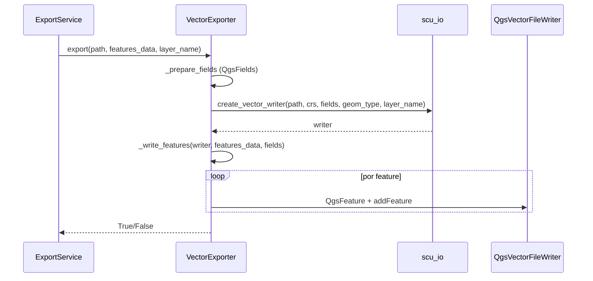

---
tags:
  - secinterp
  - code-walkthrough
  - exporters
  - vector-exporter
  - qgis-writer
aliases:
  - vector_exporter.py
  - VectorExporter
cssclass: secinterp-note
---

# 31 — `exporters/vector_exporter.py`

> [!abstract] Resumen en una línea
> Es el **exporter vectorial genérico** para SHP, GPKG y DXF: prepara campos, crea el `QgsVectorFileWriter` y escribe `QgsFeature`s.

**Ruta**: `exporters/vector_exporter.py` (122 líneas)
**Clase**: `VectorExporter(BaseExporter)`
**Capa**: Exporters
**Tags**: #secinterp #exporters #vector-exporter #qgis-writer

---

## 🎯 ¿Por qué existe este archivo?

Los 3 formatos vectoriales (SHP/GPKG/DXF) comparten el mismo **writer** de QGIS. Este exporter evita código duplicado:

| Manejado aquí | Detalle |
|---------------|---------|
| Campos | `QgsFields` desde `attributes` del primer feature |
| Tipo geométrico | `settings["geometry_type"]` (default `LineString`) |
| CRS | `settings["crs"]` (default `EPSG:4326`) |
| Writer | `scu_io.create_vector_writer` |
| Features | `QgsFeature(fields)` + `writer.addFeature` |

> [!important] Hereda validación de `BaseExporter`
> La seguridad de rutas (`validate_export_path`) ya viene dada.

---

## 🧱 `export()` — flujo

```python
class VectorExporter(BaseExporter):
    def get_supported_extensions(self) -> list[str]:
        return [".shp", ".gpkg", ".dxf"]

    def export(self, output_path: Path, features_data: list[dict[str, Any]], layer_name=None) -> bool:
        if not features_data:
            return False
        try:
            geometry_type = self.get_setting("geometry_type", QgsWkbTypes.Type.LineString)
            crs = self.get_setting("crs", QgsCoordinateReferenceSystem("EPSG:4326"))
            symb_mode = self.get_setting("symbology_export", QgsVectorFileWriter.SymbologyExport.NoSymbology)

            fields = self._prepare_fields(features_data)
            writer = scu_io.create_vector_writer(
                output_path, crs, fields, geometry_type,
                layer_name=layer_name, symbology_export=symb_mode,
            )
            if writer.hasError() != QgsVectorFileWriter.WriterError.NoError:
                logger.error(f"Failed to create writer: {writer.errorMessage()}")
                return False

            self._write_features(writer, features_data, fields)
            del writer
        except Exception:
            logger.exception(f"Vector export failed for {output_path}")
            return False
        else:
            return True
```



---

## 🧱 `_prepare_fields()`

```python
def _prepare_fields(self, features_data: list[dict[str, Any]]) -> QgsFields:
    fields = QgsFields()
    if features_data and "attributes" in features_data[0]:
        first_attrs = features_data[0]["attributes"]
        for key, value in first_attrs.items():
            if isinstance(value, int):
                fields.append(QgsField(key, QMetaType.Type.Int))
            elif isinstance(value, float):
                fields.append(QgsField(key, QMetaType.Type.Double))
            else:
                fields.append(QgsField(key, QMetaType.Type.QString))
    return fields
```

> [!warning] Esquema por primer feature
> Los campos se infieren del **primer** elemento. Si otros features tienen atributos extra, se ignoran. Si el primer feature es atípico, el schema queda incompleto.

---

## 🧱 `_write_features()`

```python
def _write_features(self, writer, features_data, fields):
    for data in features_data:
        feature = QgsFeature(fields)
        if "geometry" in data:
            feature.setGeometry(data["geometry"])
        if "attributes" in data:
            attrs = data["attributes"]
            feature.setAttributes([attrs.get(field.name()) for field in fields])
        writer.addFeature(feature)
```

> [!tip] `layer_name` en `create_vector_writer`
> Para GeoPackage, `layer_name` crea **subcapas** dentro del contenedor (`[SectionName]/`).

---

## 🏛️ Patrones de diseño presentes

| Patrón | Dónde | Propósito |
|--------|-------|-----------|
| **Template Method** | `BaseExporter` | Valida → prepara → escribe |
| **Type inference** | `_prepare_fields` | Infiere `QgsField` por tipo Python |

---

## 🔗 Notas relacionadas

- [[Index]] — índice de la bóveda
- [[base_exporter]] — clase base y factory
- [[dialog_export_manager]] — flujos `export_preview` / `export_data`
- `sec_interp/core/utils/io.py` — `create_vector_writer`

---

*Nota 31 de la bóveda SecInterp Code Walkthrough — v3.8.0*
