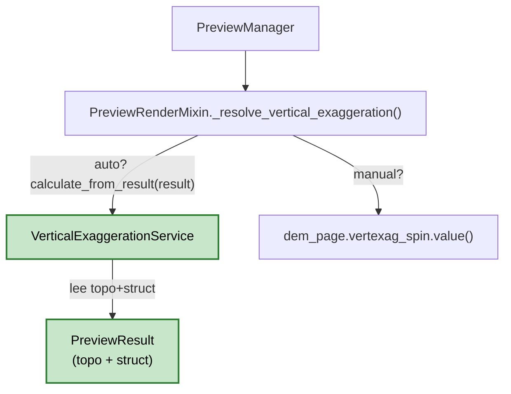

---
tags:
  - secinterp
  - code-walkthrough
  - core
  - vertical-exaggeration
aliases:
  - vertical_exaggeration_service.py
  - VerticalExaggerationService
cssclass: secinterp-note
---

# `core/services/vertical_exaggeration_service.py`

> [!abstract] Resumen en una línea
> Calcula la **exageración vertical adaptativa** de un perfil a partir de su relación de aspecto (rango de elevación vs. distancia) modulada por la densidad estructural; puro `math`, sin dependencias QGIS.

**Ruta**: `core/services/vertical_exaggeration_service.py` (186 líneas)
**Clase**: `VerticalExaggerationService`
**Capa**: Core · Services — ✅ 100% QGIS-agnóstico (stdlib-only)
**Tags**: #secinterp #core #vertical-exaggeration #adaptive

---

## 🎯 ¿Por qué existe este archivo?

La exageración vertical (VE) era un `QgsDoubleSpinBox` manual fijo (`0.1–100`, default `1.0`). Un mismo factor no sirve para todos los perfiles: uno plano (20 m de relieve en 5 km) queda invisible a 1×, y uno empinado queda distorsionado a 10×. Este servicio deriva un VE óptimo de la **geometría del perfil**, con override manual siempre disponible.

| Problema | Solución |
|----------|----------|
| Un VE fijo no se adapta al relieve | Base por relación de aspecto `elev_range/dist_range` |
| Muchas estructuras saturan el perfil | Multiplicador por densidad estructural (`×0.7`) |
| Pocas estructuras pasan desapercibidas | Multiplicador disperso (`×1.3`) |
| VE fuera de rango visual útil | Clamp `[0.5, 20.0]` redondeado a 1 decimal |
| La capa Core no puede depender de QGIS | `math` puro, thread-safe, sin estado |

> [!success] Frontera Core limpia
> A diferencia de otros servicios, este módulo **no importa `qgis`** ni `PyQt`. Es el ejemplo canónico del patrón Extract-then-Compute: recibe `ProfileData`/`StructureData` (tuplas/primitivos) y devuelve `float`.

---

## 🧬 Diagrama de relaciones



> [!tip] Cómo leer
> Solo los nodos verdes viven en `/core`. El servicio ignora geol/drillhole (async) para no causar flicker al re-renderizar (§5.1).

---

## 🧮 Algoritmo

```python
aspect_ratio = elev_range / dist_range
# >0.5 → 1.0   >0.1 → 2.0   >0.02 → 5.0   ≤0.02 → 10.0
density = len(struct) / dist_range          # None si struct vacío
# >0.1 → ×0.7    >0.01 → ×1.0    ≤0.01 → ×1.3
adaptive_ve = round(clamp(base * mult, 0.5, 20.0), 1)
# topo vacío o dist_range == 0 → 1.0 (DEFAULT_VERT_EXAG)
```

| Método | Rol |
|--------|-----|
| `calculate(topo, struct)` | Núcleo puro; entradas primitivas |
| `calculate_from_result(result)` | Wrapper DRY sobre `PreviewResult` (solo `topo`+`struct`) |
| `_aspect_base` / `_density_multiplier` | Helpers privados que mantienen CC ≤ 10 |
| `_clamp` | Acota a `[MIN_VERT_EXAG, MAX_VERT_EXAG]` |

---

## 🏛️ Patrones de diseño presentes

| Patrón | Dónde | Propósito |
|--------|-------|-----------|
| **Service (sin estado)** | `VerticalExaggerationService` | Cálculo puro, reusable y thread-safe |
| **Strategy (Auto/Manual)** | `_resolve_vertical_exaggeration` en GUI | Conmuta servicio vs. spin |
| **Dependency Injection** | `PreviewManager(ve_service=...)` | Testeable sin instanciar el real |
| **Threshold-as-constants** | `ASPECT_*`, `DENSITY_*`, `MULT_*` | Evita magic numbers (ruff PLR2004) |

---

## 🧾 Resumen de la API

| Símbolo | Firma | Uso típico |
|---------|-------|------------|
| `VerticalExaggerationService` | `class` (sin herencia) | Inyectado en `PreviewManager` |
| `calculate` | `(topo: ProfileData \| None, struct: StructureData \| None) -> float` | Test unitario directo |
| `calculate_from_result` | `(result: PreviewResult) -> float` | `_resolve_vertical_exaggeration` |
| `MIN_VERT_EXAG` / `MAX_VERT_EXAG` | `0.5` / `20.0` | Clamp adaptativo |

---

## 👀 Observaciones y notas

> [!success] Fortalezas
> - **100% QGIS-agnóstico**: pasa el gate `test_architecture_boundary` sin allowlist.
> - **Sin estado y thread-safe**: seguro para `QgsTask` en segundo plano.
> - **Decisiones explícitas**: rango adaptativo `[0.5, 20]` separado del manual `[0.1, 100]` (§5.2).

> [!warning] Puntos de atención
> - **Sin interfaz** (`IVerticalExaggerationService`): los consumidores dependen de la clase concreta, aunque la DI suaviza el acoplamiento.
> - **`get_elevation_range()` del DTO no se reutiliza** a propósito (incluye geol/drillhole async); si el DTO ganara un helper `topo+struct`, este servicio podría delegarle el rango.

> [!question] Preguntas abiertas
> - ¿Guardar `applied_vert_exag` en `PreviewResult` para `PreviewReporter`? (plan §5.4)
> - ¿Exponer un `Protocol` en `core/interfaces` para homogeneizar con el resto de servicios?

---

## 🔗 Notas relacionadas

- [[Index]] — índice de la bóveda
- [[preview_service]] — genera el `PreviewResult` que alimenta el cálculo
- [[dialog_preview_manager]] — inyecta el servicio y resuelve Auto/Manual
- [[preview_renderer]] — aplica el VE en el render (`_apply_exaggeration`)
- [[dem_page]] — UI con el toggle Auto/Manual

---

*Nota de la bóveda SecInterp Code Walkthrough — v3.8.0*
