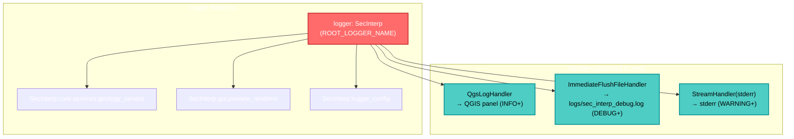

---
tags:
  - secinterp
  - code-walkthrough
  - logging
  - observability
  - thread-safety
aliases:
  - logger_config.py
  - Logger Configuration
cssclass: secinterp-note
---

# 03 — `logger_config.py`

> [!abstract] One-line summary
> Configures the plugin's **centralized logging**: three handlers (QGIS, rotating file, stderr), the `SecInterp.*` hierarchy, and utilities to survive QGIS crashes.

**Path**: `logger_config.py` (220 lines)
**Classes**: `ImmediateFlushFileHandler`, `QgsLogHandler`
**Functions**: `setup_logging`, `get_logger`, `log_critical_operation`
**Layer**: Infrastructure / Entry point
**Tags**: #secinterp #logging #observability #thread-safety

---

## 🎯 Why does this file exist?

QGIS can **crash silently** (C++ segfaults from canvas operations, rubber bands, threads). Python's standard logging **buffers** and loses the last lines — exactly the ones needed to diagnose the crash.

This module solves three problems:

1. **Persistence**: force `fsync()` so the log is on disk **before** the crash.
2. **Visibility**: integrate with the QGIS message panel, not just the console.
3. **Thread safety**: never touch the UI from background threads (avoids segfaults).

> [!important] Project golden rule
> Logging is initialized **first**, before anything else (`setup_logging()` in `SecInterp.__init__`). See [[01 - sec_interp_plugin]].

---

## 🧬 Logging architecture



---

## 🧱 Component 1 — `ImmediateFlushFileHandler`

```python
class ImmediateFlushFileHandler(RotatingFileHandler):
    """File handler that flushes immediately after each write."""

    def emit(self, record: logging.LogRecord) -> None:
        super().emit(record)
        self.flush()
        try:
            if hasattr(self.stream, "fileno"):
                os.fsync(self.stream.fileno())
        except (OSError, AttributeError):
            pass
```

| Feature | Detail |
|---------|--------|
| **Inherits from** | `RotatingFileHandler` (size-based rotation) |
| **Override** | `emit()` for flush + `fsync()` after each record |
| **Tolerance** | Implicit `suppress` via `try/except` if `fsync` fails |
| **Cost** | Slow (synchronous I/O) but **crash-safe** |

> [!tip] Why `os.fsync()`?
> `flush()` empties Python's buffer into the OS, but the OS may keep the data in cache.
> `fsync()` forces a physical write to disk. If QGIS crashes, the log is already persisted.

> [!warning] Performance trade-off
> `fsync()` per line is expensive. It is acceptable because the plugin does not write thousands of logs per second.
> If volume grows, consider a buffer with periodic flush.

---

## 🧱 Component 2 — `QgsLogHandler`

```python
class QgsLogHandler(logging.Handler):
    """Custom logging handler that writes to QGIS message log."""

    def __init__(self, tag: str = "SecInterp") -> None:
        super().__init__()
        self.tag = tag

    def emit(self, record: logging.LogRecord) -> None:
        try:
            from qgis.PyQt.QtCore import QCoreApplication, QThread
            msg = self.format(record)

            # Map Python levels → QGIS levels
            if record.levelno >= logging.ERROR:
                level = Qgis.MessageLevel.Critical
            elif record.levelno >= logging.WARNING:
                level = Qgis.MessageLevel.Warning
            elif record.levelno >= logging.INFO:
                level = Qgis.MessageLevel.Info
            else:
                level = Qgis.MessageLevel.Info

            instance = QCoreApplication.instance()
            if instance and QThread.currentThread() == instance.thread():
                QgsMessageLog.logMessage(msg, self.tag, level)
            else:
                sys.stderr.write(f"[{self.tag}] (BG) {msg}\n")
        except Exception:
            self.handleError(record)
```

### Level mapping

| Python `logging` | QGIS `MessageLevel` |
|------------------|---------------------|
| `ERROR`+ | `Critical` |
| `WARNING` | `Warning` |
| `INFO` | `Info` |
| `DEBUG` | `Info` (QGIS has no Debug) |

> [!important] The thread guard (critical)
> ```python
> if instance and QThread.currentThread() == instance.thread():
>     QgsMessageLog.logMessage(...)   # main thread → safe
> else:
>     sys.stderr.write(f"[{self.tag}] (BG) {msg}\n")  # background thread → stderr
> ```
> **Touching the QGIS UI from a background thread causes segfaults.**
> This handler detects whether it is on the main thread; if not, it redirects to `stderr`.
> This is one of the reasons SecInterp reached **zero threading crashes**.

---

## 🔧 Component 3 — `setup_logging()`

```python
def setup_logging(level: int = logging.DEBUG) -> logging.Logger:
    root_logger = logging.getLogger(ROOT_LOGGER_NAME)

    if not root_logger.handlers:          # idempotent
        root_logger.setLevel(level)

        # 1. QGIS handler (UI)
        qgis_handler = QgsLogHandler(tag=ROOT_LOGGER_NAME)
        qgis_handler.setLevel(logging.INFO)
        qgis_handler.setFormatter(logging.Formatter("%(levelname)s - %(message)s"))
        root_logger.addHandler(qgis_handler)

        # 2. File handler (crash analysis)
        try:
            log_dir = Path(__file__).parent / "logs"
            log_dir.mkdir(exist_ok=True)
            log_file = log_dir / "sec_interp_debug.log"
            file_handler = ImmediateFlushFileHandler(
                log_file, maxBytes=10 * 1024 * 1024, backupCount=5, encoding="utf-8"
            )
            file_handler.setLevel(logging.DEBUG)
            file_handler.setFormatter(logging.Formatter(
                "%(asctime)s | %(levelname)-8s | %(name)s | "
                "%(funcName)s:%(lineno)d | Thread-%(thread)d | %(message)s",
                datefmt="%Y-%m-%d %H:%M:%S",
            ))
            root_logger.addHandler(file_handler)

            # 3. stderr backup
            stderr_handler = logging.StreamHandler(sys.stderr)
            stderr_handler.setLevel(logging.WARNING)
            stderr_handler.setFormatter(file_formatter)
            root_logger.addHandler(stderr_handler)
        except Exception as e:
            QgsMessageLog.logMessage(
                f"Warning: Could not initialize file logging: {e}",
                ROOT_LOGGER_NAME, Qgis.MessageLevel.Warning,
            )

        root_logger.propagate = True

    return root_logger
```

### The three handlers

| # | Handler | Destination | Min level | Format |
|---|---------|-------------|:---------:|--------|
| 1 | `QgsLogHandler` | QGIS message panel | INFO | `LEVEL - message` |
| 2 | `ImmediateFlushFileHandler` | `logs/sec_interp_debug.log` | DEBUG | full timestamp + thread |
| 3 | `StreamHandler(stderr)` | stderr | WARNING | same as file |

### Key details

| Detail | Value | Reason |
|--------|-------|--------|
| **Idempotency** | `if not root_logger.handlers` | Avoids duplicate handlers on re-init |
| **Rotation** | `maxBytes=10MB`, `backupCount=5` | Avoids infinite logs (max ~60MB) |
| **Encoding** | `utf-8` | Supports non-ASCII (names, geology) |
| **Location** | `Path(__file__).parent / "logs"` | Relative to the plugin |
| **Tolerance** | `try/except` around file handler | If disk fails, QGIS+stderr continue |
| **Propagation** | `propagate = True` | Children propagate to root |

> [!note] `ROOT_LOGGER_NAME = "SecInterp"`
> Name of the plugin's root logger. All modules hang from it: `SecInterp.gui.*`, `SecInterp.core.*`.

---

## 🔧 Component 4 — `get_logger()`

```python
def get_logger(name: str | None = None) -> logging.Logger:
    if name is None or name == ROOT_LOGGER_NAME:
        return logging.getLogger(ROOT_LOGGER_NAME)

    full_name = name if name.startswith(ROOT_LOGGER_NAME + ".") else f"{ROOT_LOGGER_NAME}.{name}"
    logger = logging.getLogger(full_name)

    root = logging.getLogger(ROOT_LOGGER_NAME)
    if not root.handlers and name != ROOT_LOGGER_NAME:
        setup_logging()          # auto-init for tests/standalone

    return logger
```

### Typical usage in a module

```python
from sec_interp.logger_config import get_logger

logger = get_logger(__name__)    # → "SecInterp.<module>"
logger.debug("...")
logger.exception("...")          # includes traceback
```

| Feature | Detail |
|---------|--------|
| **Hierarchy** | Prefixes with `SecInterp.` if absent |
| **Auto-init** | If root has no handlers, calls `setup_logging()` |
| **Fallback** | `None` → returns the root |

> [!tip] Why auto-initialize
> It allows using `get_logger` in **tests** or standalone scripts without explicitly calling `setup_logging()`.

---

## 🔧 Component 5 — `log_critical_operation()`

```python
def log_critical_operation(logger: logging.Logger, operation_name: str, **context: Any) -> None:
    msg = f"CRITICAL_OP: {operation_name}"
    if context:
        ctx_str = ", ".join(f"{k}={v}" for k, v in context.items())
        msg += f" | {ctx_str}"

    logger.debug(msg)

    # Write directly to stderr, bypassing ALL buffering
    timestamp = datetime.datetime.now().strftime("%Y-%m-%d %H:%M:%S.%f")[:-3]
    sys.stderr.write(f"[{timestamp}] {msg}\n")
    sys.stderr.flush()

    try:
        if hasattr(sys.stderr, "fileno"):
            os.fsync(sys.stderr.fileno())
    except (OSError, AttributeError):
        pass
```

> [!important] Dual output channel
> Writes through the normal logger **and** directly to `stderr` with `flush()` + `fsync()`.
> It is a "belt and braces" approach for operations that can bring down QGIS (canvas, rubber bands, tools).
> The `CRITICAL_OP:` prefix lets you grep these events in the log.

| When to use | Example |
|-------------|---------|
| Before canvas operations | `log_critical_operation(logger, "rubber_band_clear")` |
| Before activating tools | `log_critical_operation(logger, "tool_activate", tool="measure")` |
| Before manipulating layers | `log_critical_operation(logger, "layer_add", name=...)` |

---

## 🏛️ Design patterns present

| Pattern | Where | Purpose |
|---------|-------|---------|
| **Singleton (implicit)** | `getLogger(ROOT_LOGGER_NAME)` | A single global configuration |
| **Hierarchical Logger** | `SecInterp.*` | Granular per-module control |
| **Decorator/Handler Chain** | 3 handlers on the root | Multiple simultaneous destinations |
| **Fail-safe / Graceful Degradation** | `try/except` in file handler | If disk fails, keep running |
| **Idempotent Init** | `if not root_logger.handlers` | Safe to call multiple times |
| **Thread Guard** | `QThread.currentThread()` | Avoids segfaults from UI-in-thread |

---

## 🧾 API summary

| Symbol | Type | Responsibility |
|--------|------|----------------|
| `ROOT_LOGGER_NAME` | const | `"SecInterp"` |
| `ImmediateFlushFileHandler` | class | Rotation + fsync per line |
| `QgsLogHandler` | class | Python logging → QGIS bridge, thread-safe |
| `setup_logging(level)` | function | Configures the 3 handlers (idempotent) |
| `get_logger(name)` | function | Hierarchical logger with auto-init |
| `log_critical_operation(...)` | function | Maximum-persistence logging |

---

## 👀 Observations and notes

> [!success] Strengths
> - **Anti-crash**: per-line fsync guarantees logs before segfaults.
> - **Thread-safe**: the thread guard avoids the classic QGIS crash from UI-in-background.
> - **Graceful degradation**: if the file fails, QGIS and stderr keep working.
> - **Idempotent**: safe to invoke multiple times.

> [!warning] Points of attention
> - `QgsLogHandler.emit` imports `qgis.PyQt.QtCore` **inside** the method; correct to avoid coupling, but repeated on every log (cacheable).
> - `log_critical_operation` imports `datetime` inside the function (debatable micro-optimization).
> - The default level is `DEBUG`, which in production can generate high volume (mitigated by rotation).
> - The log path (`<plugin>/logs/`) may not be writable in system installs; the `try/except` covers it.

> [!question] Open questions
> - Should the default level be `INFO`, raising to `DEBUG` only in developer mode?
> - Should a configuration flag be exposed to disable the file handler?

---

## 🔗 Related notes

- [[00 - Index]] — vault index
- [[01 - sec_interp_plugin]] — where `setup_logging()` is called
- [[02 - __init__]] — entry point preceding initialization
- [[17 - safe_loader]] — another fault-tolerance pattern

---

*Note 03 of the SecInterp Code Walkthrough vault — v3.8.0*
