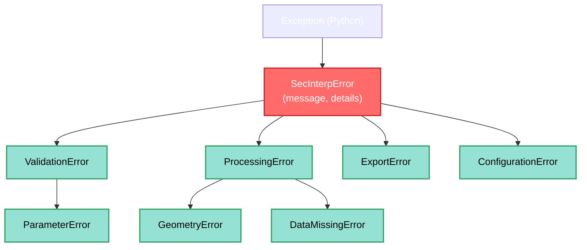
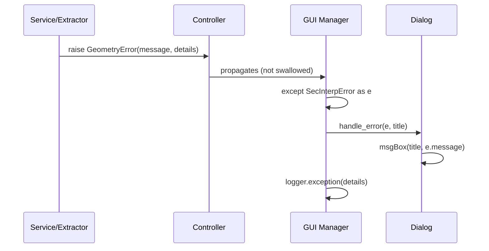

---
tags:
  - secinterp
  - code-walkthrough
  - core
  - exceptions
  - error-handling
aliases:
  - exceptions.py
  - SecInterpError
cssclass: secinterp-note
---

# 12 — `core/exceptions.py`

> [!abstract] One-line summary
> Defines the plugin's **exception hierarchy**: a `SecInterpError` root with message + details and 7 typed subclasses to distinguish validation, processing, geometry, data, and configuration failures.

**Path**: `core/exceptions.py` (52 lines)
**Root class**: `SecInterpError(Exception)`
**Layer**: Core · Domain
**Tags**: #secinterp #core #exceptions #error-handling

---

## 🎯 Why does this file exist?

Without a hierarchy, everything is a generic `ValueError`/`RuntimeError`. This module solves:

| Problem | Hierarchy solution |
|---------|--------------------|
| You can't tell if an error is validation or processing | Specific types (`ValidationError` vs `ProcessingError`) |
| You want to catch only geometry errors | `except GeometryError:` without swallowing the rest |
| Missing context for diagnosis | `details: dict` with layer, field, value |
| Non-translatable messages | `message` goes through `self.tr()` at the raise site |

> [!important] Separation of concerns
> Exceptions **do not show dialogs**. They only carry `message + details`. The UI (`PreviewManager`, `ExportManager`) decides how to present them.

---

## 🧬 Hierarchy



---

## 🧱 Root class — `SecInterpError`

```python
class SecInterpError(Exception):
    """Base class for all SecInterp-specific exceptions."""

    def __init__(self, message: str, details: dict | None = None) -> None:
        super().__init__(message)
        self.message = message
        self.details = details or {}
```

| Attribute | Purpose |
|-----------|---------|
| `message` | Already-translatable text, ready for UI |
| `details` | Optional dict with context (e.g. `{"layer": "geology", "field": "dip"}`) |
| `super().__init__(message)` | Keeps `str(e)` compatibility |

> [!tip] Rich Exception pattern
> `message` for the user + `details` for logs/diagnostics. Example:
> ```python
> raise GeometryError(
>     self.tr("Line geometry is not valid"),
>     {"layer": line_lyr.name()}   # ← diagnostics
> )
> ```

---

## 🧱 Subclasses

| Exception | Parent | When raised | Examples |
|-----------|--------|-------------|----------|
| `ValidationError` | `SecInterpError` | Input validation fails | `PreviewParams.validate()`, `GeologyExtractor` (band < 1) |
| `ParameterError` | `ValidationError` | Invalid service/tool parameter | Survey/extractor params |
| `ProcessingError` | `SecInterpError` | Profile generation fails | `controller._process_topography` without layers |
| `GeometryError` | `ProcessingError` | Null/invalid geometry | `profile_extractor`, `geometry.py` |
| `DataMissingError` | `ProcessingError` | Required data missing | Layer without features, missing field |
| `ExportError` | `SecInterpError` | Disk export fails | `interpretation_3d_exporter`, writer error |
| `ConfigurationError` | `SecInterpError` | Settings/config broken | `ConfigService` |

> [!note] `ParameterError` vs `ValidationError`
> Both are used for params in practice. `ParameterError` is a refinement
> of `ValidationError` to distinguish "service parameter" from "UI input".

> [!important] Catch granularity
> ```python
> try:
>     params.validate()
> except ValidationError as e:      # only validation
>     dlg.handle_error(e, self.tr("Configuration Error"))
> except ProcessingError as e:       # only processing
>     logger.warning(f"Processing failed: {e.message} {e.details}")
> except SecInterpError as e:        # any plugin error
>     dlg.handle_error(e, self.tr("Unexpected Error"))
> except Exception as e:             # non-SecInterp (bug)
>     logger.exception("Unexpected error")
> ```
> See [[10 - controller]] for the 4-level `try` in `_get_and_validate_inputs`.

---

## 🔄 Propagation cycle



> [!tip] Why the core doesn't swallow
> The core **does not know** the UI. It must propagate. The GUI decides whether to show `critical`, `warning`, or just log.

---

## 🏛️ Design patterns present

| Pattern | Where | Purpose |
|---------|-------|---------|
| **Exception Hierarchy** | 7 subclasses | Granular `except` |
| **Rich Exception** | `message + details` | User vs diagnostics |
| **Sentinel Root** | `SecInterpError` | Distinguish own errors vs Python's |

---

## 🧾 API summary

| Symbol | Inherits | Typical use |
|--------|----------|-------------|
| `SecInterpError` | `Exception` | `except SecInterpError` (any plugin error) |
| `ValidationError` | `SecInterpError` | `PreviewParams` / extractor validation |
| `ParameterError` | `ValidationError` | Service parameter |
| `ProcessingError` | `SecInterpError` | Generation failure (controller) |
| `GeometryError` | `ProcessingError` | Invalid geometry |
| `DataMissingError` | `ProcessingError` | Missing data/layer |
| `ExportError` | `SecInterpError` | Export failure |
| `ConfigurationError` | `SecInterpError` | Broken config |

---

## 👀 Observations and notes

> [!success] Strengths
> - Clear, **typed** hierarchy → precise `except`.
> - `details` avoids parsing `str(e)`.
> - Common root simplifies catch-all.

> [!warning] Points of attention
> - `details` is a free `dict[str, Any]` — it could be typed or documented for common keys (`layer`, `field`, `value`).
> - Some subclasses are `pass` (no extra behavior) — correct but add no extra metadata.
> - `ConfigurationError` is barely used; may grow with the settings system.

> [!question] Open questions
> - Should a `code: str` (i18n error code) be added to map to `self.tr()`?
> - Should `details` be normalized with a `ErrorDetails` dataclass?

---

## 🔗 Related notes

- [[00 - Index]] — vault index
- [[10 - controller]] — where these exceptions are raised and propagated
- [[11 - domain]] — `PreviewParams.validate()` (origin of `ValidationError`)
- [[16 - validation]] — validators raising `ValidationError` / `ParameterError`
- [[01 - sec_interp_plugin]] — final handling in the UI

---

*Note 12 of the SecInterp Code Walkthrough vault — v3.8.0*
