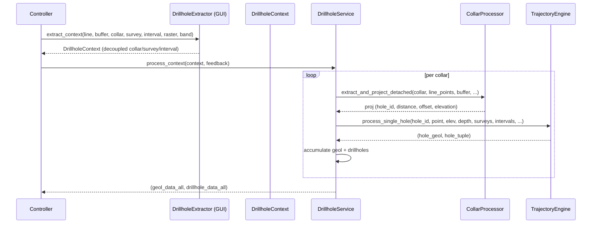

---
tags:
  - secinterp
  - code-walkthrough
  - core
  - drillhole
  - services
aliases:
  - drillhole_service.py
  - DrillholeService
cssclass: secinterp-note
---

# 15 — `core/services/drillhole_service.py`

> [!abstract] One-line summary
> The **drillhole orchestrator** (Compute phase): from a detached `DrillholeContext` it projects collars, computes trajectories, and interpolates intervals — **without touching QGIS**.

**Path**: `core/services/drillhole_service.py` (113 lines)
**Class**: `DrillholeService(IDrillholeService, TranslatableMixin)`
**Interface**: `IDrillholeService` → `process_context(context, feedback=None) -> tuple[list[GeologySegment], list[DrillholeProjection]] | None`
**Layer**: Core · Services
**Tags**: #secinterp #core #drillhole #services

---

## 🎯 Why does this file exist?

Drillholes arrive as **three QGIS tables** (collar, survey, interval). The `DrillholeExtractor` adapter already decoupled them into a `DrillholeContext`. This service **orchestrates** four specialized processors:

| Processor | Role |
|-----------|------|
| `CollarProcessor` | Projects the collar onto the section and filters by buffer |
| `SurveyProcessor` | Normalizes/validates surveys `(depth, azim, incl)` |
| `IntervalProcessor` | Normalizes intervals `(from, to, lith)` |
| `TrajectoryEngine` | Computes the 3D trajectory and 2D projection + geology segmentation |

> [!important] Fully QGIS-agnostic
> It does not import `qgis.*`. It only operates on `DrillholeContext` and delegates to pure processors.

---

## 🧬 Extract → Compute relationship



---

## 🧱 Interface — `IDrillholeService`

```python
class IDrillholeService(ABC):
    @abstractmethod
    def process_context(self, context: DrillholeContext, feedback: Any | None = None) -> Any:
        """Process drillholes from a detached context."""
```

| Parameter | Role |
|-----------|------|
| `context` | Output of `DrillholeExtractor` (no QGIS) |
| `feedback` | `isCanceled()` / `setProgress()` (QgsFeedback) |

---

## 🧱 Service — `__init__` (processor DI)

```python
def __init__(
    self,
    collar_processor: CollarProcessor | None = None,
    survey_processor: SurveyProcessor | None = None,
    interval_processor: IntervalProcessor | None = None,
    data_fetcher: Any | None = None,
    trajectory_engine: TrajectoryEngine | None = None,
) -> None:
    self.collar_processor   = collar_processor or CollarProcessor()
    self.survey_processor   = survey_processor or SurveyProcessor()
    self.interval_processor = interval_processor or IntervalProcessor()
    self.data_fetcher = data_fetcher  # for backward compatibility, unused
    self.trajectory_engine  = trajectory_engine or TrajectoryEngine()
```

> [!tip] Composition
> Each processor is **injectable** (tests mock them). `data_fetcher` is kept only for historic compatibility.

---

## 🧱 `process_context()` — per-collar loop

```python
def process_context(self, context: DrillholeContext, feedback=None):
    geol_data_all: list[GeologySegment] = []
    drillhole_data_all: list[DrillholeProjection] = []
    total = len(context.collar_data)

    for i, collar in enumerate(context.collar_data):
        if feedback and feedback.isCanceled():
            return None

        proj = self.collar_processor.extract_and_project_detached(
            collar, context.line_points, context.buffer_width,
            context.collar_id_field, context.collar_z_field,
            context.collar_depth_field, context.pre_sampled_z,
        )
        if proj:
            hole_id = proj.hole_id
            point = collar.get("point")
            surveys   = context.survey_data.get(hole_id, [])
            intervals = context.interval_data.get(hole_id, [])

            try:
                hole_geol, hole_tuple = self.trajectory_engine.process_single_hole(
                    hole_id, point, proj.elevation, proj.total_depth,
                    surveys, intervals, context.line_points,
                    context.buffer_width, context.section_azimuth,
                )
                geol_data_all.extend(hole_geol)
                drillhole_data_all.append(hole_tuple)
            except (ValueError, TypeError, KeyError) as e:
                logger.exception(self.tr("Data error in hole {0}: {1}").format(hole_id, e))
            except SecInterpError as e:
                logger.exception(self.tr("Processing error in hole {0}: {1}").format(hole_id, e))

        if feedback:
            feedback.setProgress((i / total) * 100)

    return geol_data_all, drillhole_data_all
```

### Step by step

| # | What it does |
|---|--------------|
| 1 | Iterates `collar_data` from the context |
| 2 | `feedback.isCanceled()` → aborts if cancelled |
| 3 | `CollarProcessor` projects and filters by buffer; if `None` (outside buffer), skips |
| 4 | Retrieves `surveys` and `intervals` by `hole_id` |
| 5 | `TrajectoryEngine.process_single_hole` computes the trajectory + geological segments |
| 6 | Per-hole errors are **logged** but don't abort the batch |
| 7 | `setProgress(i/total)` |

> [!important] Per-hole resilience
> If one drillhole has broken data, it is logged and the next one continues. The whole batch is never lost.

---

## 🏛️ Design patterns present

| Pattern | Where | Purpose |
|---------|-------|---------|
| **Facade / Orchestrator** | `process_context` | Coordinates 4 processors |
| **Dependency Injection** | `__init__` | Mockable processors |
| **Pure Strategy (Compute)** | `TrajectoryEngine` | 3D→2D computation without QGIS |
| **Fail-soft** | `try/except` per hole | One bad hole doesn't break the batch |

---

## 🧾 API summary

| Symbol | Signature |
|--------|-----------|
| `IDrillholeService.process_context` | `(context: DrillholeContext, feedback?) -> tuple[geol, drill] | None` |
| `DrillholeService.process_context` | same, with loop, projection, and trajectory |

---

## 👀 Observations and notes

> [!success] Strengths
> - **Minimal** orchestrator (113 lines) and delegating.
> - No QGIS → testable with a fabricated `DrillholeContext`.
> - Resilient per hole + cancellable.

> [!warning] Points of attention
> - `survey_processor` / `interval_processor` are injected but **not used** directly (used internally by `TrajectoryEngine`).
> - `feedback` is `Any`.
> - `data_fetcher` is residual (unused) → historic confusion.

> [!question] Open questions
> - Remove `data_fetcher` or document its deprecation?
> - Expose per-hole metrics (time, points)?

---

## 🔗 Related notes

- [[00 - Index]] — vault index
- [[10 - controller]] — orchestrates `_process_drillholes` (cache + Extract/Compute)
- [[11 - domain]] — `DrillholeContext`, `DrillholeProjection`, `GeologySegment`
- [[25 - adapters]] — `DrillholeExtractor` (context producer)
- `core/services/drillhole/` — `CollarProcessor`, `SurveyProcessor`, `IntervalProcessor`, `TrajectoryEngine`

---

*Note 15 of the SecInterp Code Walkthrough vault — v3.8.0*
